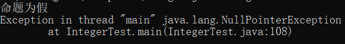

## Java常用类

### 包装类

有时， 需要将 `int` 这样的基本类型转换为对象。 所有的基本类型都冇一个与之对应的类。

`Integer` 类对应基本类型 `int`。通常， 这些类称为包装器。

这些对象包装器类拥有很明显的名字：**Integer**、**Long**、**Float**、**Double**、**Short**、**Byte**、**Character** 和 **Boolean** (前 6 个类派生于公共的超类 **Number**)。对象包装器类是不可变的，即一旦构造了包装器，就不允许更改包装在其中的值。同时， 对象包装器类还是 **final** , 因此不能定义它们的子类。

#### 包装类的继承关系


#### 自动装箱与拆箱

```
当int值赋给Integer对象时，将会自动装箱
Integer i = 3;
Integer i = Integer.valueOf(3);	//装箱过程
这种变换称之为自动装箱
当将一个Integer对象赋给一个int值时，将会自动地拆箱
Integer i = new Integer(3);
int n = i;
int n = i.intValue();	// 拆箱过程
这种变化称之为自动拆箱
```

#### 包装类中的缓存机制

创建包装类对象有两种方式：new 关键字、valueOf()方法

```
    // 包装类中的缓存机制
    Integer num3 = 10;
    Integer num4 = 10;
    Integer num5 = new Integer(20);
    Integer num6 = new Integer(20);
    Integer num7 = 128;
    Integer num8 = 128;
    System.out.println((num3 == num4) + "	" + num3.equals(num4));
    System.out.println((num5 == num6) + "	" + num5.equals(num6));
    System.out.println((num7 == num8) + "	" + num7.equals(num8));
        
result:
true	true
false	true
false	true
```

反编译代码

```
Integer integer = Integer.valueOf(10);
Integer integer1 = Integer.valueOf(10);
Integer integer2 = new Integer(20);
Integer integer3 = new Integer(20);
Integer integer4 = Integer.valueOf(128);
Integer integer5 = Integer.valueOf(128);
System.out.println((new StringBuilder()).append(integer == integer1).append("\t").append(integer.equals(integer1)).toString());
System.out.println((new StringBuilder()).append(integer2 == integer3).append("\t").append(integer2.equals(integer3)).toString());
System.out.println((new StringBuilder()).append(integer4 == integer5).append("\t").append(integer4.equals(integer5)).toString());
```

首先我们查看Integer的valueOf()方法的源码

```
public static Integer valueOf(int i) {
    if (i >= IntegerCache.low && i <= IntegerCache.high)
    	return IntegerCache.cache[i + (-IntegerCache.low)];
    return new Integer(i);
}
```

再查看下Integer内部类IntegerCache的cache数组成员和low、high成员

```
private static class IntegerCache {
        static final int low = -128;
        static final int high;
        static final Integer cache[];

        static {
            // high value may be configured by property
            int h = 127;
            String integerCacheHighPropValue =
                sun.misc.VM.getSavedProperty("java.lang.Integer.IntegerCache.high");
            if (integerCacheHighPropValue != null) {
                try {
                    int i = parseInt(integerCacheHighPropValue);
                    i = Math.max(i, 127);
                    // Maximum array size is Integer.MAX_VALUE
                    h = Math.min(i, Integer.MAX_VALUE - (-low) -1);
                } catch( NumberFormatException nfe) {
                    // If the property cannot be parsed into an int, ignore it.
                }
            }
            high = h;

            cache = new Integer[(high - low) + 1];
            int j = low;
            for(int k = 0; k < cache.length; k++)
                cache[k] = new Integer(j++);

            // range [-128, 127] must be interned (JLS7 5.1.7)
            assert IntegerCache.high >= 127;
        }

        private IntegerCache() {}
    }
```

可以发现，只要Integer类第一次被使用到，Integer的静态内部类就被加载，加载的时候会创建-128到127的Integer对象，同时创建一个数组cache来缓存这些对象。当使用valueOf()方法创建对象时，就直接返回已经缓存的对象，也就是说不会再新建对象；当使用new关键字or使用valueOf()方法创建小于-128大于127的值对象时，就会创建新对象

```
	// 包装类中的缓存机制
    Integer num3 = 10;
    Integer num4 = 10;
    Integer num5 = new Integer(20);
    Integer num6 = new Integer(20);
    Integer num7 = 128;
    Integer num8 = 128;
```

由于num3、num4都小于等于127，它们指向的是同一个缓存的Integer对象，所以用==进行比较的结果是true；num5、num6由于使用new关键字指向的是两个不同的新对象，结果为false；num7、num8虽然是采用自动装箱的方式，但执行valueOf()方法的时候，由于不满足条件i >= IntegerCache.low && i <= IntegerCache.high，而同样新建了两个不同的新对象，结果同样是false

接着我们来看看Integer中的equals方法的实现

```
	public boolean equals(Object obj) {
        if (obj instanceof Integer) {
            return value == ((Integer)obj).intValue();
        }
        return false;
    }
```

可见equals()方法比较的是Integer对象的值，而不是像==一样比较的是对象是否是同一个对象。所以，当需要比较两个Integer对象的值是否相等时，记住要用equals()方法。用==比较的话由于缓存机制的存在，可能产生一些让人困扰的结果。

此外，在8种包装类型中，有缓存区的有Character、Byte、Short、Integer、Long，而且它们的实现方式基本一样，都是-128到127的缓存范围。Boolean虽然没有缓存区，但是因为只有两个值true、false，所以Boolean在成员变量中就创建了两个相应的对象。没有缓存区的只有Float、Double，之所以没有原因很简单，即便是0到1这么小的范围，浮点数也有无数个，使用缓存区缓存它们不具备可能性和实用性

缓存区的存在使得常用的包装类对象可以得到复用，这有利于提升性能。当我们需要创建新对象的时候再new一个，增加了灵活性

#### 包装类的基本操作


#### 包装类的运算

##### 四则运算和位运算

```java
//四则运算、位运算
Integer num9 = 1;
Integer num10 = 2;
Integer num11 = num9 + num10; 
Short num12 = 5;
Integer num13 = num9 + num12;
Long num14 = num9 + 10L;
System.out.println(num9 << 1);	//位运算
System.out.println(num9 +"	"+ num10 +"	"+ num11 +"	"+ num12 +"	"+ num13 +"	"+ num14);

result:
2
1 2 3 5 6 11
```

反编译结果：

```java
Integer integer = Integer.valueOf(1);
Integer integer1 = Integer.valueOf(2);
Integer integer2 = Integer.valueOf(integer.intValue() + integer1.intValue());
Short short1 = Short.valueOf((short)5);
Integer integer3 = Integer.valueOf(integer.intValue() + short1.shortValue());
Long long1 = Long.valueOf((long)integer.intValue() + 10L);
System.out.println(integer.intValue() << 1);
System.out.println((new StringBuilder()).append(integer).append("\t").append(integer1).append("\t").append(integer2).append("\t").append(short1).append("\t").append(integer3).append("\t").append(long1).toString());
```

可以看到 `Integer num11 = num9 + num10;`  这一句被划分为3个步骤：将两个 `Integer` 对象分别进行拆箱；将拆箱得到的两个 `int` 数值相加求其和；将和值进行装箱，从而将 `num11` 指向缓存数组中值为3的 `Integer` 对象

而 `Short num12 = 5; ` 这一句则先将5强制转换成short类型，再将其装箱把值为5的Short对象的引用赋给num12

而 `Integer num13 = num9 + num12; ` 这一句除了 `Integer num11 = num9 + num10;` 的3个步骤，中间还有short+int=int的类型自动提升的过程

而 `Long num14 = num9 + 10L; ` 这一句 `Integer num11 = num9 + num10;` 的3个步骤，中间还有强制类型转换的过程。需要注意的是，如果是 `Long num14 = num9 + num10; ` 的话就会出现类型不匹配的错误，因为num9、num10拆箱之后相加的和是int类型，而Long.valueOf(long)需要的形参是long类型，自然会出错。我们也可以看到，当包装类型对象和基本类型数据进行四则运算的时候，对象是会被拆箱的，然后再按基本类型数据的运算规则进行运算

另外，如果仅仅是打印两个包装类型对象求和的结果，是不会有将和值重新转换成该包装类型的步骤的，如下面所示

```java
System.out.println(num9 + num10);

System.out.println(integer.intValue() + integer1.intValue());
```

这里还需要注意一点，尽管基本类型与自动类型提升/强制类型转换，包装类是没有类似的用法的。下面的做法是错的。

```java
Short num3 = 10;
Integer num4 = num3;	//错误: 不兼容的类型: Short无法转换为Integer
Long num5 = (Long)num4;	//错误: 不兼容的类型: Integer无法转换为Long
Double num6 = num5;	//错误: 不兼容的类型: Long无法转换为Double
```

小结：不同包装类型对象是不能直接转换的，不过有两种途径可以代替：一种是上面讨论的不同包装类对象进行四则运算后赋给某一种类型；另一种就是利用包装类的方法

```java
Integer a = 20;
Long b = a.longValue();
Short c = b.shortValue();
System.out.println(a +"	"+ b +"	"+ c);
```

##### 比较运算和逻辑运算

```java
Integer num9 = 100;
Integer num10 = 200;
Short num11 = 50;
Long num12 = 50L;
System.out.println((num9<num10) +"	"+ (num9<200) +"	"+ (num9<num11) +"	"+ (num9<num12) +"	"+ (num9<10L));
```

反编译结果：

```java
Integer integer = Integer.valueOf(100);
Integer integer1 = Integer.valueOf(200);
Short short1 = Short.valueOf((short)50);
Long long1 = Long.valueOf(50L);
System.out.println((new StringBuilder()).append(integer.intValue() < integer1.intValue()).append("\t").append(integer.intValue() < 200).append("\t").append(integer.intValue() < short1.shortValue()).append("\t").append((long)integer.intValue() < long1.longValue()).append("\t").append((long)integer.intValue() < 10L).toString());
```

可以看到，两个同类型的包装类对象进行比较时比较的其实是各自的基本类型数值，如num9 < num10；两个不同类型的包装类对象进行比较时则在比较基本类型数值之前，会有类型提升or强制类型转换，如num9 < num11，num9 < num12。

当想比较两个对象是否相等时，注意要使用equals()方法，从前面的讨论也知道，使用==的话比较的其实是引用的对象是否同一个，一般不满足我们的需求

```
Integer num13 = new Integer(100);
System.out.println(num9.equals(num13) +"	"+ num9.equals(50));
```

反编译结果：

```
Integer integer2 = new Integer(100);
System.out.println((new StringBuilder()).append(integer.equals(integer2)).append("\t").append(integer.equals(Integer.valueOf(50))).toString());
```

逻辑运算举例：

```
System.out.println(integer.intValue() & 1);
```

反编译结果：

```
System.out.println(integer.intValue() & 1);
```

#### 包装类作为方法的形参、返回值

```
//包装类作为方法的形参、返回值
public static Integer intToInteger(int i) {
	return i;
}  
public static int integerToInt(Integer i) {
	return i;
}
```

反编译结果：

```
public static Integer intToInteger(int i)
{
	return Integer.valueOf(i);
}

public static int integerToInt(Integer integer)
{
	return integer.intValue();
}
```

#### 包装类作为集合的元素

```
//包装类作为集合元素
List list = new ArrayList();
list.add(1);
list.add(new Object());
Iterator it = list.iterator();
while (it.hasNext()) {
	System.out.println(it.next());
}
```

反编译结果：

```
ArrayList arraylist = new ArrayList();
arraylist.add(Integer.valueOf(1));
arraylist.add(new Object());
for(Iterator iterator = arraylist.iterator(); iterator.hasNext(); System.out.println(iterator.next()));
```

可以发现，虽然集合元素要求是对象，add()方法的形参也是对象（public boolean add(E e)），但由于自动装箱，基本数据类型也可以直接加入集合中

```
List<Integer> list = new ArrayList<>();
for (int i=0; i<5; i++) {
	list.add(i);
}
Iterator it = list.iterator();
while (it.hasNext()) {
	System.out.println(it.next());
}
```

反编译结果：

```
ArrayList arraylist = new ArrayList();
for(int i = 0; i < 5; i++)
	arraylist.add(Integer.valueOf(i));

for(Iterator iterator = arraylist.iterator(); iterator.hasNext(); System.out.println(iterator.next()));
```

#### 包装类使用过程中有可能引起空指针异常

```
//注意包装类可能产生的空引用异常
Boolean flag1 = false;
System.out.println(flag1?"命题为真":"命题为假");
Boolean flag2 = null;
System.out.println(flag2?"命题为真":"命题为假");
Boolean flag3 = true;
```

运行结果：



这里只是简单演示空指针异常。平时使用时需要注意这一点，比如当Boolean的对象作为形参时，在方法执行体的头部需要做下null检测。

反编译结果：

```
Boolean boolean1 = Boolean.valueOf(false);
System.out.println(boolean1.booleanValue() ? "\u547D\u9898\u4E3A\u771F" : "\u547D\u9898\u4E3A\u5047");
Boolean boolean2 = null;
System.out.println(boolean2.booleanValue() ? "\u547D\u9898\u4E3A\u771F" : "\u547D\u9898\u4E3A\u5047");
Boolean boolean3 = Boolean.valueOf(true);
```

可见三目运算符的条件表达式的位置一定是boolean值，如果你传入的是Boolean对象，则会自动拆箱转换为boolean值

另外，三目运算符的其他两个表达式位置也是如此，会把包装类对象转换为相应的基本类型对象

#### 为什么需要包装类？有了包装类又为什么要保留基本数据类型？（包装类的优缺点）

##### 为什么需要包装类？

首先，Java语言是一个面向对象的语言，但是Java中的基本数据类型却是不面向对象的，将每个基本数据类型设计一个对应的类进行代表，这种方式增强了Java面向对象的性质。

其次，如果仅仅有基本数据类型，那么在实际使用时将存在很多的不便，很多地方都需要使用对象而不是基本数据类型。比如，在集合类中，我们是无法将int 、double等类型放进去的，因为集合的容器要求元素是Object类型。而包装类型的存在使得向集合中传入数值成为可能，包装类的存在弥补了基本数据类型的不足。

此外，包装类还为基本类型添加了属性和方法，丰富了基本类型的操作。如当我们想知道int取值范围的最小值，我们需要通过运算，如下面所示，但是有了包装类，我们可以直接使用Integer.MAX_VALUE即可。

```
//求int的最大值
int max = 0;
int flag = 1;
for (int i=0; i<31; i++) {
	max += flag;
	flag = flag << 1;
}
System.out.println(max +"	"+ Integer.MAX_VALUE); //2147483647      2147483647
```

##### 为什么要保留基本数据类型？

```
我们都知道在Java语言中，用new关键字创建的对象是存储在堆里的，我们通过栈中的引用来使用这些对象，所以，对象本身来说是比较消耗资源的。对于经常用到的类型，如int等，如果我们每次使用这种变量的时候都需要new一个对象的话，就会比较笨重了。所以，Java提供了基本数据类型，这种数据的变量不需要使用new在堆上创建，而是直接在栈内存中存储，因此会更加高效
```

### Object

`Object` 类是 `Java` 中所有类的始祖， 在 `Java` 中每个类都是由它扩展而来的，子类可以使用 `Object` 的所有方法。但是并不需要这样写： `public class Student extends Object` 


Object 类位于 java.lang 包中，编译时会自动导入，我们创建一个类时，如果没有明确继承一个父类，那么它就会自动继承 Object，成为 Object 的子类。

Object 类可以显示继承，也可以隐式继承，以下两种方式时一样的：

```
显式继承
public class Demo extends Object{

}

隐式继承
public class Demo{

}
```

#### 构造器

```
Object(): 构造一个新对象
```

#### 类的方法

```
protected Object clone() 创建并返回一个对象的拷贝

boolean equals(Object obj) 比较两个对象是否相等

protected void finalize()
当 GC (垃圾回收器)确定不存在对该对象的有更多引用时，由对象的垃圾回收器调用此方法。
Class<?> getClass() 获取对象的运行时对象的类

void notify() 唤醒在该对象上等待的某个线程

void notifyAll() 唤醒在该对象上等待的所有线程

String toString() 返回对象的字符串表示形式

void wait()
让当前线程进入等待状态。直到其他线程调用此对象的 notify() 方法或 notifyAll() 方法。

void wait(long timeout)
让当前线程处于等待(阻塞)状态，直到其他线程调用此对象的 notify() 方法或 notifyAll() 方法，或者超过参数设置的timeout超时时间。

void wait(long timeout, int nanos)
与 wait(long timeout) 方法类似，多了一个 nanos 参数，这个参数表示额外时间（以纳秒为单位，范围是 0-999999）。 所以超时的时间还需要加上 nanos 纳秒。
```

##### clone()

Object clone() 方法用于创建并返回一个对象的拷贝。

clone 方法是浅拷贝，对象内属性引用的对象只会拷贝引用地址，而不会将引用的对象重新分配内存，相对应的深拷贝则会连引用的对象也重新创建。

```
语法：
object.clone()

返回值：
返回一个对象的拷贝。
由于 Object 本身没有实现 Cloneable 接口，所以不重写 clone 方法并且进行调用的话会发生 CloneNotSupportedException 异常。
```

创建 obj1 对象，然后拷贝 obj1 给 obj2，通过 obj2 输出变量的值

```
	public static void demo1() {
        // 声明一个实例对象
        ObjectTest obj1 = new ObjectTest();
        // 初始化变量
        obj1.num = 10;

        System.out.println("obj1.num = " + obj1.num);

        ObjectTest obj2 = new ObjectTest();

        try{
            obj2 = (ObjectTest) obj1.clone();

            System.out.println("obj2.num = " + obj2.num);
        }catch (Exception e) {
            System.out.println("e = " + e);
        }
    }
result:
obj1.num = 10
obj2.num = 10
```

##### equals()

```
public boolean equals(Object obj) {
	return (this == obj);
}
```

`Object` 类中的 `equals` 方法用于检测一个对象是否等于另外一个对象。在 `Object` 类中，这个方法将判断两个对象是否具有相同的引用。如果两个对象具有相同的引用， 它们一定是相等的。

**注意：**如果子类重写了 equals() 方法，就需要重写 hashCode() 方法，比如 String 类就重写了 equals() 方法，同时也重写了 hashCode() 方法。

**Java语言规范要求 `equals` 方法具有以下特性** ：

- 自反性：对于任何非空引用 `x`，`x.equals(x)` 应该返回 `true` 
- 对称性: 对于任何引用 `x` 和 `y`，当且仅当 `y.equals(x)` 返回 `true` ，`x.equals(y)` 也应该返回 `true` 
- 传递性： 对于任何引用 `x` ， `y` 和 `z` ，如果 `x.equals(y)` 返回 `true` ， `y.equals(z)` 返回 `true` ，`x.equals(z)` 也应该返回 `true` 
- 一致性： 如果 `x` 和 `y` 引用的对象没有发生变化，反复调用 `x.equals(y)` 应该返回同样的结果
- 对于任意非空引用 `x` ， `x.equals(null)` 应该返回 `false` 

**重写equals方法的规则** 

```
public boolean equals(Object otherObject){
	if (this == otherObject) return true;//检测this与otherObject是否引用同一个对象
	if (otherObject == null) return false;//检测otherObject是否为null，如果是返回false
	if (getClass() != otherObject.getClass()) return false;//比较this与otherObject是否属于同一个类
	ClassName other = (ClassName)otherObject;//将otherObject转为相应类类型变量
	return field1 == other.field1 &&
			Object.equals(field2, other.field2) &&
			.... ; //对每项成员变量进行比较
}
```

```
语法：
object.equals(Object obj)

参数：
obj：要比较的对象

返回值：
如果两个对象相等返回true，否则返回false
```

```
class Test {
    public static void main(String[] args) {
 
        // Object 类使用 equals() 方法
        // 创建两个对象
        Object obj1 = new Object();
        Object obj2 = new Object();
 
        // 判断 obj1 与 obj2 是否相等
        // 不同对象，内存地址不同，不相等，返回 false
        System.out.println(obj1.equals(obj2)); // false
 
        // obj1 赋值给 obj3
        // String 重写了 equals() 方法
        // 对象引用，内存地址相同，相等，返回 true
        Object obj3 = obj1;
        System.out.println(obj1.equals(obj3)); // true
    }
}
result:
false
true
```

String类重写了equals方法，用于比较两个字符串是否相等

```
class Test {
    public static void main(String[] args) {
 
        // String 类使用 equals() 方法
        // 创建两个对象
        String obj1 = new String();
        String obj2 = new String();
 
        // 判断 obj1 与 obj2 是否相等
        // 初始化的两个对象都为 null，所以是相等，返回 true
        System.out.println(obj1.equals(obj2)); // true
 
        // 给对象赋值
        obj1 = "Runoob";
        obj2 = "Google";
 
        // 判断 obj1 与 obj2 是否相等
        // 两个值不同，内存地址也不同，所以不相等，返回 false
        System.out.println(obj1.equals(obj2)); // false
 
    }
}
result:
true
false
```

##### finalize()

Object finalize() 方法用于实例被垃圾回收器回收的时触发的操作。

当 GC (垃圾回收器) 确定不存在对该对象的有更多引用时，对象的垃圾回收器就会调用这个方法。

```
语法：
protected void finalize()

example:
import java.util.*;
 
class Test extends GregorianCalendar {
    public static void main(String[] args) {
        try {
            // 创建 RunoobTest 对象
            Test cal = new Test();
 
            // 输出当前时间
            System.out.println("" + cal.getTime());
 
            // finalize cal
            System.out.println("Finalizing...");
            cal.finalize();
            System.out.println("Finalized.");
 
        } catch (Throwable ex) {
            ex.printStackTrace();
        }
    }
}

result:
Sun Oct 11 11:36:46 CST 2020
Finalizing...
Finalized.
```

##### getClass()

Object getClass() 方法用于获取对象的运行时对象的类。

```
语法：
object.getClass()

返回值：
返回对象的类

example1：
import java.util.ArrayList;
 
class Test {
    public static void main(String[] args) {
 
    // getClass() with Object
    Object obj1 = new Object();
    System.out.println("obj1 的类为: " + obj1.getClass());
 
    // getClass() with String
    String obj2 = new String();
    System.out.println("obj2 的类为: " + obj2.getClass());
 
    // getClass() with ArrayList
    ArrayList<Integer> obj3 = new ArrayList<>();
    System.out.println("obj3 的类为: " + obj3.getClass());
    }
}
result:
obj1 的类为: class java.lang.Object
obj2 的类为: class java.lang.String
obj3 的类为: class java.util.ArrayList

example2:
	public static void demo2() {
        ObjectTest obj = new ObjectTest();
        System.out.println("obj.getClass() = " + obj.getClass());
    }
result:
obj.getClass() = class usedclass.ObjectTest
```


##### hashCode方法

散列码（ hash code ) 是由对象导出的一个整型值。散列码是没有规律的。

由于 `hashCode` 方法定义在 `Object` 类中， 因此每个对象都有一个默认的散列码，其值为对象的存储地址。

- 理论上对象相同，`hashcode` 一定相同
- `hashcode` 相同，对象不一定相同

```
语法：
object.hashCode()

返回值：
返回对象哈希值，是一个整数，表示在哈希表中的位置

example1：演示hashCode方法的使用
class RunoobTest {
    public static void main(String[] args) {
 
        // Object 使用 hashCode()
        Object obj1 = new Object();
        System.out.println(obj1.hashCode()); 
 
        Object obj2 = new Object();
        System.out.println(obj2.hashCode());
 
        Object obj3 = new Object();
        System.out.println(obj3.hashCode()); 
    }
}
result:
225534817
1878246837
929338653

example2:Sring类和ArrayList类使用hashCode方法
import java.util.ArrayList;
 
class RunoobTest {
    public static void main(String[] args) {
 
        // String 使用 hashCode()
        String str = new String();
        System.out.println(str.hashCode()); // 0
 
        // ArrayList 使用 hashCode()
        ArrayList<Integer> list = new ArrayList<>();
        System.out.println(list.hashCode()); // 1
    }
}
result:
0
1

example3:如果两个对象相等，则它们的哈希值也是相等的
class Test {
    public static void main(String[] args) {
 
        // Object 使用 hashCode()
        Object obj1 = new Object();
 
        // obj1 赋值给 obj2
        Object obj2 = obj1;
 
        // 判断两个对象是否相等
        System.out.println(obj1.equals(obj2)); // true
 
        // 获取 obj1 与 obj2 的哈希值
        System.out.println(obj1.hashCode()); // 225534817 
        System.out.println(obj2.hashCode()); // 225534817
 
    }
}
result:
true
225534817
225534817
```

##### notify()

Object notify() 方法用于唤醒一个在此对象监视器上等待的线程。

如果所有的线程都在此对象上等待，那么只会选择一个线程，选择是任意性的，并在对实现做出决定时发生。

一个线程在对象监视器上等待可以调用 wait() 方法。

notify() 方法只能被作为此对象监视器的所有者的线程来调用。

一个线程要想成为对象监视器的所有者，可以使用以下 3 种方法：

- 执行对象的同步实例方法
- 使用 synchronized 内置锁
- 对于 Class 类型的对象，执行同步静态方法

一次只能有一个线程拥有对象的监视器。

如果当前线程不是此对象监视器的所有者的话会抛出 **IllegalMonitorStateException** 异常。

```
语法：
public final void notify()

example：演示了 notify() 方法的使用


```

##### toString方法

用于返回表示对象值的字符串

```
Object中的toString()
public String toString() {
    return getClass().getName() + "@" + Integer.toHexString(hashCode());
}	
类名@哈希值 = getClass().getName()+'@'+Integer.toHexString(hasCode())//默认格式
```

在自定义类中建议重写 `toString` 方法，用来返回类中的各个属性值

```
public Student{
	private String name;
	private int age;
	
	public String toString() {
        return getClass().getName() + "[name=" + name + ",age=" + age + "]";
    }
}
```

`Class getClass()` : 获取任意对象运行时所属字节码文件对象

`String getName()` : 返回这个类的名字

### Math

Java 的 Math 包含了用于执行基本数学运算的属性和方法，如初等指数、对数、平方根和三角函数。

Math 的方法都被定义为 static 形式，通过 Math 类可以在主函数中直接调用。

```
public class Test {  
    public static void main (String []args)  
    {  
        System.out.println("90 度的正弦值：" + Math.sin(Math.PI/2));  
        System.out.println("0度的余弦值：" + Math.cos(0));  
        System.out.println("60度的正切值：" + Math.tan(Math.PI/3));  
        System.out.println("1的反正切值： " + Math.atan(1));  
        System.out.println("π/2的角度值：" + Math.toDegrees(Math.PI/2));  
        System.out.println(Math.PI);  
    }  
}
result:
90 度的正弦值：1.0
0度的余弦值：1.0
60度的正切值：1.7320508075688767
1的反正切值： 0.7853981633974483
π/2的角度值：90.0
3.141592653589793
```

#### abs()

abs() 返回参数的绝对值。参数可以是 int, float, long, double, short, byte类型。

```
语法：
double abs(double d)
float abs(float f)
int abs(int i)
long abs(long lng)

参数：
任何原生数据类型

返回值：
返回参数的绝对值

example：
public class Test{
    public static void main(String args[]){
        Integer a = -8;
        double d = -100;
        float f = -90f;    
                                               
        System.out.println(Math.abs(a));
        System.out.println(Math.abs(d));    
        System.out.println(Math.abs(f));    
    }
}
result：
8
100.0
90.0
```

#### ceil()

返回大于等于( >= )给定参数的的最小整数，类型为双精度浮点型。

ceil() 方法可对一个数进行上舍入，返回值大于或等于给定的参数，类型为双精度浮点型。

```
语法：
double ceil(double d)

double ceil(float f)

参数：
double或float的原生数据类型

返回值：
返回double类型，返回值大于或等于给定的参数

example：
public class Test{
    public static void main(String args[]){
        double d = 100.675;
        float f = -90;    
 
        System.out.println(Math.ceil(d));
        System.out.println(Math.ceil(f)); 
                     
        System.out.println(Math.floor(d));
        System.out.println(Math.floor(f)); 
    }
}
```

#### floor()

返回小于等于（<=）给定参数的最大整数 

floor() 方法可对一个数进行下舍入，返回给定参数最大的整数，该整数小于或等给定的参数。

```
语法：
double floor(double d)

double floor(float f)

参数：
double 或 float的原生数据类型

返回值：
返回duoble类型数据，小于或等于给定的参数

example：
public class Test{
    public static void main(String args[]){
        double d = 100.675;
        float f = -90;
 
        System.out.println(Math.floor(d));
        System.out.println(Math.floor(f));
 
        System.out.println(Math.ceil(d));
        System.out.println(Math.ceil(f));
    }
}
result：
100.0
-90.0
101.0
-90.0
```

#### rint()

返回与参数最接近的整数。返回类型为double。

```
语法：
double rint(double d)

参数：
double类型数据

返回值：
返回double类型数组，是最接近参数的整数值

example：
public class Test{
    public static void main(String args[]){
        double d = 100.675;
        double e = 100.500;
        double f = 100.200;
 
        System.out.println(Math.rint(d));
        System.out.println(Math.rint(e)); 
        System.out.println(Math.rint(f)); 
    }
}
result：
101.0
100.0
100.0
```

#### round()

它表示**四舍五入**，算法为 **Math.floor(x+0.5)**，即将原来的数字加上 0.5 后再向下取整，所以，Math.round(11.5) 的结果为12，Math.round(-11.5) 的结果为-11

```
语法：
long round(double d)

int round(float f)

参数：
d：double 或 float的原生数据类型
f：float原生数据类型

返回值：
返回一个最接近的int、long型值，方法会指定返回的数据类型

example：
public class Test{
    public static void main(String args[]){
        double d = 100.675;
        double e = 100.500;
        float f = 100;
        float g = 90f;
 
        System.out.println(Math.round(d));
        System.out.println(Math.round(e)); 
        System.out.println(Math.round(f)); 
        System.out.println(Math.round(g)); 
    }
}
result：
101
101
100
90
```

#### min()

min() 方法用于返回两个参数中的最小值。

```
语法：
double min(double arg1, double arg2)
float min(float arg1, float arg2)
int min(int arg1, int arg2)
long min(long arg1, long arg2)

参数：
该方法接受两个原生数据类型作为参数

返回值：
返回两个参数中的最小值

example：
public class Test{
    public static void main(String args[]){
        System.out.println(Math.min(12.123, 12.456));      
        System.out.println(Math.min(23.12, 23.0));  
    }
}
result：
12.123
23.0
```

#### max()

max() 方法用于返回两个参数中的最大值。

```
语法：
double max(double arg1, double arg2)
float max(float arg1, float arg2)
int max(int arg1, int arg2)
long max(long arg1, long arg2)

参数：
该方法接受两个原生数据类型作为参数

返回值：
返回两个参数中的最大值

example：
public class Test{
    public static void main(String args[]){
        System.out.println(Math.max(12.123, 18.456));      
        System.out.println(Math.max(23.12, 23.0));  
    }
}
result：
18.456
23.12
```

#### exp()

exp() 方法用于返回自然数底数e的参数次方。

```
语法：
double exp(double d)

参数：
d：任何原生数据类型

返回值：
返回自然数底数e的参数次方

example：
public class Test{ 
    public static void main(String args[]){
        double x = 11.635;
        double y = 2.76;

        System.out.printf("e 的值为 %.4f%n", Math.E);
        System.out.printf("exp(%.3f) 为 %.3f%n", x, Math.exp(x));  
    }
}
result：
e 的值为 2.7183
exp(11.635) 为 112983.831
```

#### log()

log() 方法用于返回参数的自然数底数的对数值。

```
语法：
double log(double d)

参数：
d：任何原生数据类型

返回值：
返回参数的自然数底数的对数值

example：
public class Test{
    public static void main(String args[]){
        double x = 11.635;
        double y = 2.76;

        System.out.printf("e 的值为 %.4f%n", Math.E);
        System.out.printf("log(%.3f) 为 %.3f%n", x, Math.log(x));
    }
}
result：
e 的值为 2.7183
log(11.635) 为 2.454
```

#### pow()

pow() 方法用于返回第一个参数的第二个参数次方。

```
语法：
double pow(double base, double exponent)

参数：
base：任何原生数据类型
exponent：任何原生数据类型

返回值：
返回第一个参数的第二个参数次方

example：
public class Test{
    public static void main(String args[]){
        double x = 11.635;
        double y = 2.76;

        System.out.printf("e 的值为 %.4f%n", Math.E);
        System.out.printf("pow(%.3f, %.3f) 为 %.3f%n", x, y, Math.pow(x, y));
    }
}
result：
e 的值为 2.7183
pow(11.635, 2.760) 为 874.008
```

#### sqrt()

sqrt() 方法用于返回参数的算术平方根。

```
语法：
double sqrt(double d)

参数：
d：任何原生数据类型

返回值：
返回参数的算数平方根

example：
public class Test{ 
    public static void main(String args[]){
        double x = 11.635;
        double y = 2.76;

        System.out.printf("e 的值为 %.4f%n", Math.E);
        System.out.printf("sqrt(%.3f) 为 %.3f%n", x, Math.sqrt(x));
    }
}
result：
e 的值为 2.7183
sqrt(11.635) 为 3.411
```

#### random()

random() 方法用于返回一个随机数，随机数范围为 0.0 =< Math.random < 1.0。

```
语法：
static double random()

返回值：
返回double值

example：
public class Test{
    public static void main(String args[]){
        System.out.println( Math.random() );
        System.out.println( Math.random() );
    }
}
result:
0.5444085967267008
0.7960235983184115
```

#### 其他函数

```
sin()	求指定double类型参数的正弦值。
cos()	求指定double类型参数的余弦值。
tan()	求指定double类型参数的正切值。
asin()	求指定double类型参数的反正弦值。
acos()	求指定double类型参数的反余弦值。
atan()	求指定double类型参数的反正切值。
atan2()	将笛卡尔坐标转换为极坐标，并返回极坐标的角度值。
toDegrees()	将参数转化为角度。
toRadians()	将角度转换为弧度。
```

### Character

Character 类用于对单个字符进行操作。

Character 类在对象中包装一个基本类型 **char** 的值

```
Character ch = new Character('a');
```

#### 常用方法

```
isLetter()	是否是一个字母
isDigit()	是否是一个数字字符
isWhitespace()	是否是一个空白字符
isUpperCase()	是否是大写字母
isLowerCase()	是否是小写字母
toUpperCase()	指定字母的大写形式
toLowerCase()	指定字母的小写形式
toString()	返回字符的字符串形式，字符串的长度仅为1
```

### Date

java.util 包提供了 Date 类来封装当前的日期和时间。 Date 类提供两个构造函数来实例化 Date 对象。

第一个构造函数使用当前日期和时间来初始化对象。

```
Date()
```

第二个构造函数接收一个参数，该参数是从 1970 年 1 月 1 日起的毫秒数。

```
Date(long millisec)
```

#### 常用方法

```
boolean after(Date date)
若当调用此方法的Date对象在指定日期之后返回true,否则返回false。

boolean before(Date date)
若当调用此方法的Date对象在指定日期之前返回true,否则返回false。

Object clone( )
返回此对象的副本。

int compareTo(Date date)
比较当调用此方法的Date对象和指定日期。两者相等时候返回0。调用对象在指定日期之前则返回负数。调用对象在指定日期之后则返回正数。

int compareTo(Object obj)
若obj是Date类型则操作等同于compareTo(Date) 。否则它抛出ClassCastException。

boolean equals(Object date)
当调用此方法的Date对象和指定日期相等时候返回true,否则返回false。

long getTime( )
返回自 1970 年 1 月 1 日 00:00:00 GMT 以来此 Date 对象表示的毫秒数。

int hashCode( )
返回此对象的哈希码值。
 
void setTime(long time)
用自1970年1月1日00:00:00 GMT以后time毫秒数设置时间和日期。

String toString( )
把此 Date 对象转换为以下形式的 String： dow mon dd hh:mm:ss zzz yyyy 其中： dow 是一周中的某一天 (Sun, Mon, Tue, Wed, Thu, Fri, Sat)。
```

#### 获取当前日期时间

Java中获取当前日期和时间很简单，使用 Date 对象的 toString() 方法来打印当前日期和时间，如下所示

```
import java.util.Date;
  
public class DateDemo {
   public static void main(String[] args) {
       // 初始化 Date 对象
       Date date = new Date();
        
       // 使用 toString() 函数显示日期时间
       System.out.println(date.toString());
   }
}
result:
Mon May 04 09:51:52 CDT 2013
```

#### 日期比较

Java使用以下三种方法来比较两个日期：

- 使用 getTime() 方法获取两个日期（自1970年1月1日经历的毫秒数值），然后比较这两个值。
- 使用方法 before()，after() 和 equals()。例如，一个月的12号比18号早，则 new Date(99, 2, 12).before(new Date (99, 2, 18)) 返回true。
- 使用 compareTo() 方法，它是由 Comparable 接口定义的，Date 类实现了这个接口。

#### 使用SimpleDateFormat格式化日期

SimpleDateFormat 是一个以语言环境敏感的方式来格式化和分析日期的类。SimpleDateFormat 允许你选择任何用户自定义日期时间格式来运行。例如：

```
import  java.util.*;
import java.text.*;
 
public class DateDemo {
   public static void main(String[] args) {
 
      Date dNow = new Date( );
      SimpleDateFormat ft = new SimpleDateFormat ("yyyy-MM-dd hh:mm:ss");
 
      System.out.println("当前时间为: " + ft.format(dNow));
   }
}
result:
当前时间为: 2022-03-06 10:16:34
```

```
SimpleDateFormat ft = new SimpleDateFormat ("yyyy-MM-dd hh:mm:ss");
这一行代码确立了转换的格式，其中 yyyy 是完整的公元年，MM 是月份，dd 是日期，HH:mm:ss 是时、分、秒。

注意:有的格式大写，有的格式小写，例如 MM 是月份，mm 是分；HH 是 24 小时制，而 hh 是 12 小时制。
```

#### 使用printf格式化日期

printf 方法可以很轻松地格式化时间和日期。使用两个字母格式，它以 **%t** 开头并且以下面表格中的一个字母结尾。

```
c:包括全部日期和时间信息		星期六 十月 27 14:21:20 CST 2007
F:"年-月-日"格式				2007-10-27
D:"月/日/年"格式				10/27/07
r:"HH:MM:SS PM"格式（12时制）	02:25:51 下午
T:"HH:MM:SS"格式（24时制）	14:28:16
R:"HH:MM"格式（24时制）		14:28
```

```
example:
import java.util.Date;
 
public class DateDemo {
 
  public static void main(String[] args) {
     // 初始化 Date 对象
     Date date = new Date();
 
     //c的使用  
    System.out.printf("全部日期和时间信息：%tc%n",date);          
    //f的使用  
    System.out.printf("年-月-日格式：%tF%n",date);  
    //d的使用  
    System.out.printf("月/日/年格式：%tD%n",date);  
    //r的使用  
    System.out.printf("HH:MM:SS PM格式（12时制）：%tr%n",date);  
    //t的使用  
    System.out.printf("HH:MM:SS格式（24时制）：%tT%n",date);  
    //R的使用  
    System.out.printf("HH:MM格式（24时制）：%tR",date);  
  }
}
result:
全部日期和时间信息：星期一 九月 10 10:43:36 CST 2012  
年-月-日格式：2012-09-10  
月/日/年格式：09/10/12  
HH:MM:SS PM格式（12时制）：10:43:36 上午  
HH:MM:SS格式（24时制）：10:43:36  
HH:MM格式（24时制）：10:43  
```

#### 解析字符串为时间

SimpleDateFormat 类有一些附加的方法，特别是parse()，它试图按照给定的SimpleDateFormat 对象的格式化存储来解析字符串

```
import java.util.*;
import java.text.*;
  
public class DateDemo {
 
   public static void main(String[] args) {
      SimpleDateFormat ft = new SimpleDateFormat ("yyyy-MM-dd"); 
 
      String input = args.length == 0 ? "1818-11-11" : args[0]; 
 
      System.out.print(input + " Parses as "); 
 
      Date t; 
 
      try { 
          t = ft.parse(input); 
          System.out.println(t); 
      } catch (ParseException e) { 
          System.out.println("Unparseable using " + ft); 
      }
   }
}

result:
$ java DateDemo
1818-11-11 Parses as Wed Nov 11 00:00:00 GMT 1818
$ java DateDemo 2007-12-01
2007-12-01 Parses as Sat Dec 01 00:00:00 GMT 2007
```

#### Java休眠sleep

sleep()使当前线程进入停滞状态（阻塞当前线程），让出CPU的使用、目的是不让当前线程独自霸占该进程所获的CPU资源，以留一定时间给其他线程执行的机会。

你可以让程序休眠一毫秒的时间或者到您的计算机的寿命长的任意段时间。例如，下面的程序会休眠3秒：

```
import java.util.*;
  
public class SleepDemo {
   public static void main(String[] args) {
      try { 
         System.out.println(new Date( ) + "\n"); 
         Thread.sleep(1000*3);   // 休眠3秒
         System.out.println(new Date( ) + "\n"); 
      } catch (Exception e) { 
          System.out.println("Got an exception!"); 
      }
   }
}
result:
Thu Sep 17 10:20:30 CST 2015

Thu Sep 17 10:20:33 CST 2015
```

#### 测量时间

下面的一个例子表明如何测量时间间隔（以毫秒为单位）

```
import java.util.*;
  
public class DiffDemo {
 
   public static void main(String[] args) {
      try {
         long start = System.currentTimeMillis( );
         System.out.println(new Date( ) + "\n");
         Thread.sleep(5*60*10);
         System.out.println(new Date( ) + "\n");
         long end = System.currentTimeMillis( );
         long diff = end - start;
         System.out.println("Difference is : " + diff);
      } catch (Exception e) {
         System.out.println("Got an exception!");
      }
   }
}
result:
Fri Jan 08 09:48:47 CST 2016

Fri Jan 08 09:48:50 CST 2016

Difference is : 3019
```

### String

字符串广泛应用 在 Java 编程中，在 Java 中字符串属于对象，Java 提供了 String 类来创建和操作字符串。

#### 创建字符串

```
String str = "Demo";
```

在代码中遇到字符串常量时，这里的值是 "**Demo**"，编译器会使用该值创建一个 String 对象。

和其它对象一样，可以使用关键字和构造方法来创建 String 对象。

用构造函数创建字符串：

```
String str2=new String("Demo");
```

String 创建的字符串存储在公共池中，而 new 创建的字符串对象在堆上：

```
String s1 = "Demo";              // String 直接创建
String s2 = "Demo";              // String 直接创建
String s3 = s1;                    // 相同引用
String s4 = new String("Demo");   // String 对象创建
String s5 = new String("Demo");   // String 对象创建
```


String 类有 11 种构造方法，这些方法提供不同的参数来初始化字符串，比如提供一个字符数组参数:

```
public class StringDemo{
   public static void main(String args[]){
      char[] helloArray = { 'd', 'e', 'm', 'o'};
      String helloString = new String(helloArray);  
      System.out.println( helloString );
   }
}
result:
demo
```

**注意:**String 类是不可改变的，所以你一旦创建了 String 对象，那它的值就无法改变了）。

如果需要对字符串做很多修改，那么应该选择使用 StringBuffer & StringBuilder 类

#### 字符串长度

用于获取有关对象的信息的方法称为访问器方法。

String 类的一个访问器方法是 length() 方法，它返回字符串对象包含的字符数。

```
public class StringDemo {
    public static void main(String args[]) {
        String site = "www.demo.com";
        int len = site.length();
        System.out.println( "长度 : " + len );
   }
}
result:
12
```

#### 连接字符串

String 类提供了连接两个字符串的方法

```
string1.concat(string2);
返回 string2 连接 string1 的新字符串。也可以对字符串常量使用 concat() 方法
"我的名字是 ".concat("Demo");

更常用的是使用'+'操作符来连接字符串
"Hello," + " Demo" + "!"
result：
"Hello, Demo!"
```

#### 创建格式化字符串

我们知道输出格式化数字可以使用 printf() 和 format() 方法。

String 类使用静态方法 format() 返回一个String 对象而不是 PrintStream 对象。

String 类的静态方法 format() 能用来创建可复用的格式化字符串，而不仅仅是用于一次打印输出

```
System.out.printf("浮点型变量的值为 " +
                  "%f, 整型变量的值为 " +
                  " %d, 字符串变量的值为 " +
                  "is %s", floatVar, intVar, stringVar);
                  
String fs;
fs = String.format("浮点型变量的值为 " +
                   "%f, 整型变量的值为 " +
                   " %d, 字符串变量的值为 " +
                   " %s", floatVar, intVar, stringVar);
```

#### 常用方法

##### charAt()

```
返回指定索引处的char值
源码：
	public char charAt(int index) {
        if ((index < 0) || (index >= value.length)) {
            throw new StringIndexOutOfBoundsException(index);
        }
        return value[index];
    }

example:
	public static void demo1() {
        String str = "Hello World!";
        System.out.println("str.charAt(3) = " + str.charAt(3));
    }
result:
str.charAt(3) = l
```

##### compareTo()

```
按字典顺序比较两个字符串
源码：
	public int compareTo(String anotherString) {
        int len1 = value.length;
        int len2 = anotherString.value.length;
        int lim = Math.min(len1, len2);
        char v1[] = value;
        char v2[] = anotherString.value;

        int k = 0;
        while (k < lim) {
            char c1 = v1[k];
            char c2 = v2[k];
            if (c1 != c2) {
                return c1 - c2;
            }
            k++;
        }
        return len1 - len2;
    }

example：
	public static void demo2() {
        String str1 = "hello";
        String str2 = "hello";
        String str3 = "apple";
        String str4 = "zoo";
        String str5 = "hz";

		// str1 和 str2 字典序完全形同所以最后为str1.length-str2.length = 5-5 = 0
        System.out.println("str1.compareTo(str2) = " + str1.compareTo(str2));
        // str1 和 str3 第一个字符不同，则 h的ASCII码值 - a的ASCII码值 = 104-97 = 7
        System.out.println("str1.compareTo(str3) = " + str1.compareTo(str3));
        System.out.println("str1.compareTo(str4) = " + str1.compareTo(str4));
        System.out.println("str1.compareTo(str5) = " + str1.compareTo(str5));
    }
result：
str1.compareTo(str2) = 0
str1.compareTo(str3) = 7
str1.compareTo(str4) = -18
str1.compareTo(str5) = -21

说明：
如果第一个字符和参数的第一个字符不等，结束比较，返回第一个字符的ASCII码差值。

如果第一个字符和参数的第一个字符相等，则以第二个字符和参数的第二个字符做比较，以此类推,直至不等为止，返回该字符的ASCII码差值。 如果两个字符串不一样长，可对应字符又完全一样，则返回两个字符串的长度差值。
```

##### compareToIgnoreCase()

```
用于按字典顺序比较两个字符串，不考虑大小写

源码：
	public int compare(String s1, String s2) {
            int n1 = s1.length();
            int n2 = s2.length();
            int min = Math.min(n1, n2);
            for (int i = 0; i < min; i++) {
                char c1 = s1.charAt(i);
                char c2 = s2.charAt(i);
                if (c1 != c2) {
                    c1 = Character.toUpperCase(c1);
                    c2 = Character.toUpperCase(c2);
                    if (c1 != c2) {
                        c1 = Character.toLowerCase(c1);
                        c2 = Character.toLowerCase(c2);
                        if (c1 != c2) {
                            // No overflow because of numeric promotion
                            return c1 - c2;
                        }
                    }
                }
            }
            return n1 - n2;
        }
```

##### concat()

```
将指定的字符串参数连接到字符串上。

源码：
	public String concat(String str) {
        if (str.isEmpty()) {
            return this;
        }
        int len = value.length;
        int otherLen = str.length();
        char buf[] = Arrays.copyOf(value, len + otherLen);
        str.getChars(buf, len);
        return new String(buf, true);
    }

example：
	public static void demo3() {
        String str = "hello";
        str = str.concat(" world");
        System.out.println("str = " + str);
    }
result：
str = hello world
```

##### contentEquals()

```
用于将此字符串与指定的 StringBuffer 比较。如字符串与指定 StringBuffer 表示相同的字符序列，则返回 true；否则返回 false。

源码：
	public boolean contentEquals(CharSequence cs) {
        // Argument is a StringBuffer, StringBuilder
        if (cs instanceof AbstractStringBuilder) {
            if (cs instanceof StringBuffer) {
                synchronized(cs) {
                   return nonSyncContentEquals((AbstractStringBuilder)cs);
                }
            } else {
                return nonSyncContentEquals((AbstractStringBuilder)cs);
            }
        }
        // Argument is a String
        if (cs instanceof String) {
            return equals(cs);
        }
        // Argument is a generic CharSequence
        char v1[] = value;
        int n = v1.length;
        if (n != cs.length()) {
            return false;
        }
        for (int i = 0; i < n; i++) {
            if (v1[i] != cs.charAt(i)) {
                return false;
            }
        }
        return true;
    }
    
example：
public class Test {
    public static void main(String args[]) {
        String str1 = "String1";
        String str2 = "String2";
        StringBuffer str3 = new StringBuffer( "String1");

        boolean  result = str1.contentEquals( str3 );
        System.out.println(result);
          
        result = str2.contentEquals( str3 );
        System.out.println(result);
    }
}
result：
true
false
```

##### copyValueOf()

```
public static String copyValueOf(char[] data): 返回指定数组中表示该字符序列的字符串。
public static String copyValueOf(char[] data, int offset, int count): 返回指定数组中表示该字符序列的 字符串。

参数：
data：字符数组
offset：子数组的初始便宜量
count：子数组的长度

返回值：
返回指定数组中表示该字符序列的字符串

源码：
	public static String copyValueOf(char data[]) {
        return new String(data);
    }
    
    public static String copyValueOf(char data[], int offset, int count) {
        return new String(data, offset, count);
    }

example：
public class Test {
    public static void main(String args[]) {
        char[] Str1 = {'h', 'e', 'l', 'l', 'o', ' ', 'r', 'u', 'n', 'o', 'o', 'b'};
        String Str2 = "";
 
        Str2 = Str2.copyValueOf( Str1 );
        System.out.println("返回结果：" + Str2);
 
        Str2 = Str2.copyValueOf( Str1, 2, 6 );
        System.out.println("返回结果：" + Str2);
    }
}
result：
返回结果：hello runoob
返回结果：llo ru
```

##### endWith()

```
测试字符串是否以指定的后缀结束。

语法：
public boolean endsWith(String suffix)

参数：
suffix：指定的后缀

返回值：
如果参数表示的字符序列是此对象表示的字符序列的后缀，则返回 true；否则返回 false。注意，如果参数是空字符串，或者等于此 String 对象（用 equals(Object) 方法确定），则结果为 true

源码：
	public boolean endsWith(String suffix) {
        return startsWith(suffix, value.length - suffix.value.length);
    }
    
    public boolean startsWith(String prefix, int toffset) {
        char ta[] = value;
        int to = toffset;
        char pa[] = prefix.value;
        int po = 0;
        int pc = prefix.value.length;
        // Note: toffset might be near -1>>>1.
        if ((toffset < 0) || (toffset > value.length - pc)) {
            return false;
        }
        while (--pc >= 0) {
            if (ta[to++] != pa[po++]) {
                return false;
            }
        }
        return true;
    }
    
example：
	public static void demo4() {
        String str = "Nice to meet you";

        System.out.println("str.endsWith(\"meet\") = " + str.endsWith("meet"));
        System.out.println("str.endsWith(\"you\") = " + str.endsWith("you"));
    }
result：
str.endsWith("meet") = false
str.endsWith("you") = true
```

##### equals()

```
用于将字符串与指定的对象比较。
String 类中重写了 equals() 方法用于比较两个字符串的内容是否相等。

语法：
public boolean equals(Object anObject)

参数：
anObject：与字符串进行比较的对象

返回值：
如果给定对象与字符串相等，则返回true，否则返回false

源码：
	public boolean equals(Object anObject) {
        if (this == anObject) {
            return true;
        }
        if (anObject instanceof String) {
            String anotherString = (String)anObject;
            int n = value.length;
            if (n == anotherString.value.length) {
                char v1[] = value;
                char v2[] = anotherString.value;
                int i = 0;
                while (n-- != 0) {
                    if (v1[i] != v2[i])
                        return false;
                    i++;
                }
                return true;
            }
        }
        return false;
    }
    
example：
public class Test {
    public static void main(String args[]) {
        String Str1 = new String("demo");
        String Str2 = Str1;
        String Str3 = new String("demo");
        boolean retVal;

        retVal = Str1.equals( Str2 );
        System.out.println("返回值 = " + retVal );

        retVal = Str1.equals( Str3 );
        System.out.println("返回值 = " + retVal );
    }
}
result:
返回值 = true
返回值 = true
```

使用 **==** 和 **equals()** 比较字符串。

String 中 **==** 比较引用地址是否相同，**equals()** 比较字符串的内容是否相同：

```
String s1 = "Hello";              // String 直接创建
String s2 = "Hello";              // String 直接创建
String s3 = s1;                   // 相同引用
String s4 = new String("Hello");  // String 对象创建
String s5 = new String("Hello");  // String 对象创建
 
s1 == s1;         // true, 相同引用
s1 == s2;         // true, s1 和 s2 都在公共池中，引用相同
s1 == s3;         // true, s3 与 s1 引用相同
s1 == s4;         // false, 不同引用地址
s4 == s5;         // false, 堆中不同引用地址
 
s1.equals(s3);    // true, 相同内容
s1.equals(s4);    // true, 相同内容
s4.equals(s5);    // true, 相同内容
```

##### equalsIgnoreCase()

```
用于将字符串与指定的对象比较，不考虑大小写

语法：
public boolean equalsIgnoreCase(String anotherString)

参数：
anObject：与字符串进行比较的对象。

返回值：
如果给定对象与字符串相等，则返回 true，否则返回 false。

源码：
	public boolean equalsIgnoreCase(String anotherString) {
        return (this == anotherString) ? true
                : (anotherString != null)
                && (anotherString.value.length == value.length)
                && regionMatches(true, 0, anotherString, 0, value.length);
    }
    
    public boolean regionMatches(boolean ignoreCase, int toffset,
            String other, int ooffset, int len) {
        char ta[] = value;
        int to = toffset;
        char pa[] = other.value;
        int po = ooffset;
        // Note: toffset, ooffset, or len might be near -1>>>1.
        if ((ooffset < 0) || (toffset < 0)
                || (toffset > (long)value.length - len)
                || (ooffset > (long)other.value.length - len)) {
            return false;
        }
        while (len-- > 0) {
            char c1 = ta[to++];
            char c2 = pa[po++];
            if (c1 == c2) {
                continue;
            }
            if (ignoreCase) {
                // If characters don't match but case may be ignored,
                // try converting both characters to uppercase.
                // If the results match, then the comparison scan should
                // continue.
                char u1 = Character.toUpperCase(c1);
                char u2 = Character.toUpperCase(c2);
                if (u1 == u2) {
                    continue;
                }
                // Unfortunately, conversion to uppercase does not work properly
                // for the Georgian alphabet, which has strange rules about case
                // conversion.  So we need to make one last check before
                // exiting.
                if (Character.toLowerCase(u1) == Character.toLowerCase(u2)) {
                    continue;
                }
            }
            return false;
        }
        return true;
    }
    
example：
public class Test {
    public static void main(String args[]) {
        String Str1 = new String("demo");
        String Str2 = Str1;
        String Str3 = new String("demo");
        String Str4 = new String("DEMO");
        boolean retVal;

        retVal = Str1.equals( Str2 );
        System.out.println("返回值 = " + retVal );

        retVal = Str3.equals( Str4);
        System.out.println("返回值 = " + retVal );

        retVal = Str1.equalsIgnoreCase( Str4 );
        System.out.println("返回值 = " + retVal );
    }
}
result:
返回值 = true
返回值 = false
返回值 = true
```

##### getBytes()

```
getBytes(String charsetName): 使用指定的字符集将字符串编码为 byte 序列，并将结果存储到一个新的 byte 数组中。
getBytes(): 使用平台的默认字符集将字符串编码为 byte 序列，并将结果存储到一个新的 byte 数组中。

语法：
public byte[] getBytes(String charsetName) throws UnsupportedEncodingException

或

public byte[] getBytes()

参数：
charsetName：支持的字符集名称。

返回值：
返回 byte 数组

example：
import java.io.*;
 
public class Test {
    public static void main(String args[]) {
        String Str1 = new String("demo");
 
        try{
            byte[] Str2 = Str1.getBytes();
            System.out.println("返回值：" + Str2 );
            
            Str2 = Str1.getBytes( "UTF-8" );
            System.out.println("返回值：" + Str2 );
            
            Str2 = Str1.getBytes( "ISO-8859-1" );
            System.out.println("返回值：" + Str2 );
        } catch ( UnsupportedEncodingException e){
            System.out.println("不支持的字符集");
        }
    }
}
result：
返回值：[B@7852e922
返回值：[B@4e25154f
返回值：[B@70dea4e
```

##### getChars()

```
将字符从字符串复制到目标字符数组

语法：
public void getChars(int srcBegin, int srcEnd, char[] dst,  int dstBegin)

参数：
srcBegin：字符串中要复制的第一个字符的索引
srcEnd：字符串中要复制的最后一个字符之后的索引
dst：目标数组
dstBegin：目标数组中的起始偏移量

返回值：
没有返回值，但会抛出IndexOutOfBoundsException异常

example：
public class Test {
    public static void main(String args[]) {
        String Str1 = new String("www.runoob.com");
        char[] Str2 = new char[6];

        try {
            Str1.getChars(4, 10, Str2, 0);
            System.out.print("拷贝的字符串为：" );
            System.out.println(Str2 );
        } catch( Exception ex) {
            System.out.println("触发异常...");
        }
    }
}
result：
拷贝的字符串为：runoob
```

##### hashCode()

```
用于返回字符串的哈希码。
字符串对象的哈希码根据以下公式计算：
s[0]*31^(n-1) + s[1]*31^(n-2) + ... + s[n-1]
使用 int 算法，这里 s[i] 是字符串的第 i 个字符的 ASCII 码，n 是字符串的长度，^ 表示求幂。空字符串的哈希值为 0。

语法：
public int hashCode()

返回值：
返回对象的哈希码值

源码：
	public int hashCode() {
        int h = hash;
        if (h == 0 && value.length > 0) {
            char val[] = value;

            for (int i = 0; i < value.length; i++) {
                h = 31 * h + val[i];
            }
            hash = h;
        }
        return h;
    }

example：
	public static void demo5() {
        String str = "demo";
        System.out.println("str.hashCode() = " + str.hashCode());
    }
result：
str.hashCode() = 3079651
```

##### indexOf()

- **public int indexOf(int ch):** 返回指定字符在字符串中第一次出现处的索引，如果此字符串中没有这样的字符，则返回 -1。
- **public int indexOf(int ch, int fromIndex):** 返回从 fromIndex 位置开始查找指定字符在字符串中第一次出现处的索引，如果此字符串中没有这样的字符，则返回 -1。
- **int indexOf(String str):** 返回指定字符在字符串中第一次出现处的索引，如果此字符串中没有这样的字符，则返回 -1。
- **int indexOf(String str, int fromIndex):** 返回从 fromIndex 位置开始查找指定字符在字符串中第一次出现处的索引，如果此字符串中没有这样的字符，则返回 -1。

```
语法：
public int indexOf(int ch )

public int indexOf(int ch, int fromIndex)

int indexOf(String str)

int indexOf(String str, int fromIndex)

参数：
ch：字符，Unicode 编码。
fromIndex：开始搜索的索引位置，第一个字符是 0 ，第二个是 1 ，以此类推。
str：要搜索的子字符串。
```


```
example1：查找字符串，或字符 Unicode 编码在字符串出现的位置:
public class Main {
    public static void main(String args[]) {
        String string = "aaa456ac";  
        //查找指定字符是在字符串中的下标。在则返回所在字符串下标；不在则返回-1.  
        System.out.println(string.indexOf("b")); // indexOf(String str); 返回结果：-1，"b"不存在  
 
        // 从第四个字符位置开始往后继续查找，包含当前位置  
        System.out.println(string.indexOf("a",3));//indexOf(String str, int fromIndex); 返回结果：6  
 
        //（与之前的差别：上面的参数是 String 类型，下面的参数是 int 类型）参考数据：a-97,b-98,c-99  
 
        // 从头开始查找是否存在指定的字符  
        System.out.println(string.indexOf(99));//indexOf(int ch)；返回结果：7  
        System.out.println(string.indexOf('c'));//indexOf(int ch)；返回结果：7  
 
        //从fromIndex查找ch，这个是字符型变量，不是字符串。字符a对应的数字就是97。  
        System.out.println(string.indexOf(97,3));//indexOf(int ch, int fromIndex); 返回结果：6  
        System.out.println(string.indexOf('a',3));//indexOf(int ch, int fromIndex); 返回结果：6  
    }
}
result：
-1
6
7
7
6
6

example2：指定子字符串在字符串中第一次出现处的索引，从指定的索引开始。
	public static void demo6() {
        String str = "www.sougou.com";
        String str1 = "sougou";
        String str2 = "com";

        System.out.print("查找字符o第一次出现的位置");
        System.out.println(str.indexOf('o'));
        System.out.print("从第8个位置开始，查找字符o第一次出现的位置");
        System.out.println(str.indexOf('o', 8));
        System.out.print("子字符串 str1 第一次出现的位置:" );
        System.out.println( str.indexOf( str1 ));
        System.out.print("从第八个位置开始搜索子字符串 str1 第一次出现的位置 :" );
        System.out.println( str.indexOf( str1, 8 ));
        System.out.print("子字符串 str2 第一次出现的位置 :" );
        System.out.println(str.indexOf( str2 ));
    }
result:
查找字符o第一次出现的位置5
从第8个位置开始，查找字符o第一次出现的位置8
子字符串 str1 第一次出现的位置:4
从第八个位置开始搜索子字符串 str1 第一次出现的位置 :-1
子字符串 str2 第一次出现的位置 :11
```

##### intern()

```
返回字符串对象的规范化表示形式
它遵循以下规则：对于任意两个字符串 s 和 t，当且仅当 s.equals(t) 为 true 时，s.intern() == t.intern() 才为 true。

语法：
public String intern()

返回值：
一个字符串，内容与此字符串相同，但一定取自具有唯一字符串的池。

example：
	public static void demo7() {
        String str1 = new String("www.baidu.com");
        String str2 = new String("WWW.BAIDU.COM");

        System.out.print("规范表示:" );
        System.out.println(str1.intern());

        System.out.print("规范表示:" );
        System.out.println(str2.intern());
    }
result：
规范表示:www.baidu.com
规范表示:WWW.BAIDU.COM
```

##### lastIndexOf()

- **public int lastIndexOf(int ch):** 返回指定字符在此字符串中最后一次出现处的索引，如果此字符串中没有这样的字符，则返回 -1。
- **public int lastIndexOf(int ch, int fromIndex):** 返回指定字符在此字符串中最后一次出现处的索引，从指定的索引处开始进行反向搜索，如果此字符串中没有这样的字符，则返回 -1。
- **public int lastIndexOf(String str):** 返回指定子字符串在此字符串中最右边出现处的索引，如果此字符串中没有这样的字符，则返回 -1。
- **public int lastIndexOf(String str, int fromIndex):** 返回指定子字符串在此字符串中最后一次出现处的索引，从指定的索引开始反向搜索，如果此字符串中没有这样的字符，则返回 -1。

```
语法：
public int lastIndexOf(int ch)

public int lastIndexOf(int ch, int fromIndex)

public int lastIndexOf(String str)

public int lastIndexOf(String str, int fromIndex)

参数：
ch： 字符
fromIndex：开始搜索的索引位置
str：要搜素的子字符串

返回值：指定子字符串在字符串最后一次出现处的索引值
```

##### length()

```
返回字符串的长度。
空字符串的长度返回 0。

语法：
public int length()

返回值：
返回字符串长度

源码：
	public int length() {
        return value.length;
    }
    
example：
    public static void demo8() {
        String str = "www.baidu.com";
        String str2 = "demo";

        System.out.println("str.length() = " + str.length());
        System.out.println("str2.length() = " + str2.length());
    }
result：
str.length() = 13
str2.length() = 4
```

##### matchs()

```
用于检测字符串是否匹配给定的正则表达式。
调用此方法的 str.matches(regex) 形式与以下表达式产生的结果完全相同
Pattern.matches(regex, str)

语法：
public boolean matches(String regex)

参数：
regex：匹配字符串的正则表达式

返回值：
在字符串匹配给定的正则表达式时，返回 true。

源码：
	public boolean matches(String regex) {
        return Pattern.matches(regex, this);
    }

example：
public class Test {
    public static void main(String args[]) {
        String Str = new String("www.baidu.com");

        System.out.print("返回值 :" );
        System.out.println(Str.matches("(.*)baidu(.*)"));
        
        System.out.print("返回值 :" );
        System.out.println(Str.matches("(.*)google(.*)"));

        System.out.print("返回值 :" );
        System.out.println(Str.matches("www(.*)"));
    }
}
result:
返回值 :true
返回值 :false
返回值 :true
```

##### regionMatches()

```
用于检测两个字符串在一个区域内是否相等。

语法：
public boolean regionMatches(int toffset,
                             String other,
                             int ooffset,
                             int len)

public boolean regionMatches(boolean ignoreCase,
                             int toffset,
                             String other,
                             int ooffset,
                             int len)

参数：
ignoreCase：如果为true，则比较字符时忽略大小写
toffset：此字符串中子区域的起始偏移量
other：字符串参数
ooffset：字符串参数中子区域的起始偏移量
len：要比较的字符数

返回值：
如果字符串的指定子区域匹配字符串参数的指定子区域，则返回 true；否则返回 false。是否完全匹配或考虑大小写取决于 ignoreCase 参数。

example：
public class Test {
    public static void main(String args[]) {
        String str1 = new String("www.baidu.com");
        String str2 = new String("baidu");
        String str3 = new String("BAIDU");

        System.out.print("返回值 :" );
        System.out.println(str1.regionMatches(4,  , 0, 5));

        System.out.print("返回值 :" );
        System.out.println(str1.regionMatches(4, str3, 0, 5));

        System.out.print("返回值 :" );
        System.out.println(str1.regionMatches(true, 4, str3, 0, 5));
    }
}
result:
返回值 :true
返回值 :false
返回值 :true
```

##### replace()

```
通过用 newChar 字符替换字符串中出现的所有 searchChar 字符，并返回替换后的新字符串。

语法：
public String replace(char searchChar, char newChar)    

参数：
searchChar：原字符
newChar：新字符

返回值：
替换后生成的新字符串

源码：
	public String replace(char oldChar, char newChar) {
        if (oldChar != newChar) {
            int len = value.length;
            int i = -1;
            char[] val = value; /* avoid getfield opcode */

            while (++i < len) {
                if (val[i] == oldChar) {
                    break;
                }
            }
            if (i < len) {
                char buf[] = new char[len];
                for (int j = 0; j < i; j++) {
                    buf[j] = val[j];
                }
                while (i < len) {
                    char c = val[i];
                    buf[i] = (c == oldChar) ? newChar : c;
                    i++;
                }
                return new String(buf, true);
            }
        }
        return this;
    }

example：
public class Main {
    public static void main(String args[]) {
        String str = new String("google");

        System.out.print("返回值 :" );
        System.out.println(str.replace('o', 'T'));

        System.out.print("返回值 :" );
        System.out.println(str.replace('l', 'D'));
    }
}
result:
返回值 :gTTgle
返回值 :googDe
```

##### replaceAll()

```
replaceAll() 方法使用给定的参数 replacement 替换字符串所有匹配给定的正则表达式的子字符串。

语法：
public String replaceAll(String regex, String replacement)

参数：
regex：匹配此字符串的正则表达式
replacement：用来替换每个匹配项的字符串

返回值：
成功则返回替换的字符串，失败则返回原始字符串

example：
public class Test {
    public static void main(String args[]) {
        String Str = new String("www.google.com");
        System.out.print("匹配成功返回值 :" );
        System.out.println(Str.replaceAll("(.*)google(.*)", "baidu" ));
        System.out.print("匹配失败返回值 :" );
        System.out.println(Str.replaceAll("(.*)taobao(.*)", "baidu" ));
    }
}
result：
匹配成功返回值 :baidu
匹配失败返回值 :www.google.com
```

##### replaceFirst()

```
使用给定的参数 replacement 替换字符串第一个匹配给定的正则表达式的子字符串

语法：
public String replaceFirst(String regex,
                           String replacement)

参数：
regex：匹配此字符串的正则表达式。
replacement：用来替换第一个匹配项的字符串。

返回值：
成功则返回替换的字符串，失败则返回原始字符串。

exmaple：
public class Test {
    public static void main(String args[]) {
        String str = new String("hello demo，I am demo。");

        System.out.print("返回值 :" );
        System.out.println(str.replaceFirst("demo", "google" ));
        System.out.print("返回值 :" );
        System.out.println(str.replaceFirst("(.*)demo(.*)", "google" ));
    }
}
result：返回值 :hello google，I am from demo。
返回值 :google
```

##### split()

```
split() 方法根据匹配给定的正则表达式来拆分字符串。

注意： . 、 $、 | 和 * 等转义字符，必须得加 \\。

注意：多个分隔符，可以用 | 作为连字符。

语法：
public String[] split(String regex, int limit)

参数：
regex：正则表达式分隔符
limit：分隔的份数

返回值：
字符串数组

example：
public class Test {
    public static void main(String args[]) {
        String str = new String("Welcome-to-Demo");
 
        System.out.println("- 分隔符返回值 :" );
        for (String retval: str.split("-")){
            System.out.println(retval);
        }
 
        System.out.println("");
        System.out.println("- 分隔符设置分割份数返回值 :" );
        for (String retval: str.split("-", 2)){
            System.out.println(retval);
        }
 
        System.out.println("");
        String str2 = new String("www.demo.com");
        System.out.println("转义字符返回值 :" );
        for (String retval: str2.split("\\.", 3)){
            System.out.println(retval);
        }
 
        System.out.println("");
        String str3 = new String("acount=? and uu =? or n=?");
        System.out.println("多个分隔符返回值 :" );
        for (String retval: str3.split("and|or")){
            System.out.println(retval);
        }
    }
}
result：
- 分隔符返回值 :
Welcome
to
demo

- 分隔符设置分割份数返回值 :
Welcome
to-demo

转义字符返回值 :
www
demo
com

多个分隔符返回值 :
acount=? 
 uu =? 
 n=?
```

##### startWith()

```
用于检测字符串是否以指定的前缀开始

语法：
public boolean startsWith(String prefix, int toffset)

public boolean startsWith(String prefix)

参数：
prefix：前缀
toffset：字符串中开始查找的位置

返回值：
如果字符串以指定的前缀开始，则返回 true；否则返回 false。

example：
public class Test {
    public static void main(String args[]) {
        String str = new String("www.demo.com");
 
        System.out.print("返回值 :" );
        System.out.println(str.startsWith("www") );
 
        System.out.print("返回值 :" );
        System.out.println(str.startsWith("demo") );
 
        System.out.print("返回值 :" );
        System.out.println(str.startsWith("demo", 4) );
    }
}
result:
返回值 :true
返回值 :false
返回值 :true
```

##### subSequence()

```
返回一个新的字符序列，它是此序列的一个子序列。

语法：
public CharSequence subSequence(int beginIndex, int endIndex)

参数：
beginIndex：起始索引（包括）
endIndex：结束索引（不包括）

返回值：
返回一个新的字符序列，它是此序列的一个子序列。

example：
public class Test {
    public static void main(String args[]) {
         String Str = new String("www.baidu.com");

         System.out.print("返回值 :" );
         System.out.println(Str.subSequence(4, 9) );
    }
}
result：
返回值 :baidu
```

##### substring()

```
返回字符串的子字符串。

语法：
public String substring(int beginIndex)

public String substring(int beginIndex, int endIndex)

参数：
beginIndex：起始索引（包括），索引从0开始
endIndex：结束索引（不包括）

返回值：子字符串

example：
public class RunoobTest {
    public static void main(String args[]) {
        String Str = new String("This is text");
 
        System.out.print("返回值 :" );
        System.out.println(Str.substring(4) );
 
        System.out.print("返回值 :" );
        System.out.println(Str.substring(4, 10) );
    }
}
result：
返回值 : is text
返回值 : is te
```


##### toCharArray()

```
将字符串转换为字符数组。

语法：
public char[] toCharArray()

返回值：
字符数组

example：
public class Test {
    public static void main(String args[]) {
        String str = new String("www.baidu.com");

        System.out.print("返回值 :" );
        System.out.println( str.toCharArray() );
    }
}
result：
返回值 :www.baidu.com
```

##### toLowerCase()

```
将字符串转换为小写。

语法：
public String toLowerCase()

public String toLowerCase(Locale locale)

返回值：
转换为小写的字符串

example：
public class Test {
    public static void main(String args[]) {
        String Str = new String("WWW.BAIDU.COM");

        System.out.print("返回值 :" );
        System.out.println( Str.toLowerCase() );
    }
}
result:
返回值：www.baidu.com
```

##### toUpperCase()

```
将字符串转换为小写。

语法：
public String toUpperCase()

public String toUpperCase(Locale locale)

返回值：
字符转换为大写后的字符串

example：
public class Test {
    public static void main(String args[]) {
        String Str = new String("WWW.baidu.COM");

        System.out.print("返回值 :" );
        System.out.println( Str.toUpperCase() );
    }
}
resul:
返回值：www.BAIDU.com
```

##### toString()

```
返回此对象本身（它已经是一个字符串）

语法：
public String toString()

返回值：
字符串本身

example：
public class Test {
    public static void main(String args[]) {
        String str = new String("WWW.BAIDU.COM");

        System.out.print("返回值 :" );
        System.out.println( str.toString() );
    }
}
result:
WWW.BAIDU.COM
```

##### trim()

```
用于删除字符串的头尾空白符

语法：
public String trim()

返回值：
删除头尾空白字符的字符串

example：
public class Test {
    public static void main(String args[]) {
        String str = new String("    www.baidu.com    ");
        System.out.print("原始值 :" );
        System.out.println( str );

        System.out.print("删除头尾空白 :" );
        System.out.println( str.trim() );
    }
}
原始值 :    www.baidu.com    
删除头尾空白 :www.baidu.com
```

##### valueOf()

- **valueOf(boolean b):** 返回 boolean 参数的字符串表示形式。.
- **valueOf(char c):** 返回 char 参数的字符串表示形式。
- **valueOf(char[] data):** 返回 char 数组参数的字符串表示形式。
- **valueOf(char[] data, int offset, int count):** 返回 char 数组参数的特定子数组的字符串表示形式。
- **valueOf(double d):** 返回 double 参数的字符串表示形式。
- **valueOf(float f):** 返回 float 参数的字符串表示形式。
- **valueOf(int i):** 返回 int 参数的字符串表示形式。
- **valueOf(long l):** 返回 long 参数的字符串表示形式。
- **valueOf(Object obj):** 返回 Object 参数的字符串表示形式。

##### contains()

```
用于判断字符串中是否包含指定的字符或字符串。

语法：
public boolean contains(CharSequence chars)

参数：
chars：要判断的字符或字符串

返回值：
如果包含指定的字符或字符串返回 true，否则返回 false。

example：
public class Main {
    public static void main(String[] args) {
        String myStr = "Demo";
        System.out.println(myStr.contains("De"));
        System.out.println(myStr.contains("m"));
        System.out.println(myStr.contains("s"));
    }
}
result:
true
true
false
```

##### isEmpty()

```
用于判断字符串是否为空。

语法：
public boolean isEmpty()

返回值：
如果字符串为空返回 true，否则返回 false。
字符串通过 length() 方法计算字符串长度，如果返回 0，即为空字符串。

源码：
	public boolean isEmpty() {
        return value.length == 0;
    }

example：
public class Main {
    public static void main(String[] args) {
        String myStr1 = "Demo";  
        String myStr2 = "";        // 空字符串
        String myStr3 = "    ";    // 多个空格，length() 不为 0 
        System.out.println("myStr1 是否为空：" + myStr1.isEmpty());
        System.out.println("myStr2 是否为空：" + myStr2.isEmpty());
        System.out.println("myStr3 长度：" + myStr3.length());
        System.out.println("myStr3 是否为空：" + myStr3.isEmpty());
    }
}
result：
myStr1 是否为空：false
myStr2 是否为空：true
myStr3 长度：4
myStr3 是否为空：false
```

### StringBuffer&StringBuilder

当对字符串进行修改的时候，需要使用 StringBuffer 和 StringBuilder 类。

和 String 类不同的是，StringBuffer 和 StringBuilder 类的对象能够被多次的修改，并且不产生新的未使用对象。


在使用 StringBuffer 类时，每次都会对 StringBuffer 对象本身进行操作，而不是生成新的对象，所以如果需要对字符串进行修改推荐使用 StringBuffer。

StringBuilder 类在 Java 5 中被提出，它和 StringBuffer 之间的最大不同在于 StringBuilder 的方法不是线程安全的（不能同步访问）。

由于 StringBuilder 相较于 StringBuffer 有速度优势，所以多数情况下建议使用 StringBuilder 类。

```
example:
public class Test{
    public static void main(String args[]){
        StringBuilder sb = new StringBuilder(10);
        sb.append("Demo..");
        System.out.println(sb);  
        sb.append("!");
        System.out.println(sb); 
        sb.insert(6, "Java");
        System.out.println(sb); 
        sb.delete(5,6);
        System.out.println(sb);  
    }
}
result:
Demo..
Demo..!
Demo..Java!
DemoJava!
```

然而在应用程序要求线程安全的情况下，则必须使用 StringBuffer 类。

```
example:
public class Test{
  public static void main(String args[]){
    StringBuffer sBuffer = new StringBuffer();
    sBuffer.append("www");
    sBuffer.append(".baidu");
    sBuffer.append(".com");
    System.out.println(sBuffer);  
  }
}
result:
www.baidu.com
```

#### 主要方法

##### append(String s)

```
将指定的字符串追加到此字符序列。

example:
	public static void demo10() {
        StringBuffer sb = new StringBuffer();
        sb.append("hello");
        System.out.println("sb = " + sb);
    }
result:
sb = hello
```

##### reverse()

```
将此字符序列用其反转形式取代

example:
	public static void demo11() {
        StringBuffer sb = new StringBuffer("hello");
        sb.reverse();
        System.out.println("sb = " + sb);
    }
result:
sb = olleh
```

##### delete(int start, int end)

```
移除此序列的子字符串中的字符。

example:
	public static void demo12() {
        StringBuffer sb = new StringBuffer("hello");
        sb.delete(1,2);
        System.out.println("sb = " + sb);
    }
result:
sb = hllo
```

##### insert(int offset, int i)

```
将 int 参数的字符串表示形式插入此序列中。

example:
	public static void demo13() {
        StringBuffer sb = new StringBuffer("hello");
        StringBuffer sb2 = new StringBuffer("hello");
        sb.insert(1, 2);
        sb2.insert(1, "!!");
        System.out.println("sb = " + sb);
        System.out.println("sb2 = " + sb2);
    }
result:
sb = h2ello
sb2 = h!!ello
```

##### insert(int offset, String str)

```
将 str 参数的字符串插入此序列中。

example:
	public static void demo13() {
        StringBuffer sb = new StringBuffer("hello");
        StringBuffer sb2 = new StringBuffer("hello");
        sb.insert(1, 2);
        sb2.insert(1, "!!");
        System.out.println("sb = " + sb);
        System.out.println("sb2 = " + sb2);
    }
result:
sb = h2ello
sb2 = h!!ello
```

##### replace(int start, int end, String str)

```
使用给定 String 中的字符替换此序列的子字符串中的字符。

example:
	public static void demo14() {
        StringBuffer sb = new StringBuffer("hello");
        sb.replace(2,4, "!!");
        System.out.println("sb = " + sb);
    }
result:
sb = he!!o
```

#### 其他方法

```
int capacity()
返回当前容量。

char charAt(int index)
返回此序列中指定索引处的 char 值。

void ensureCapacity(int minimumCapacity)
确保容量至少等于指定的最小值。

void getChars(int srcBegin, int srcEnd, char[] dst, int dstBegin)
将字符从此序列复制到目标字符数组 dst。

int indexOf(String str)
返回第一次出现的指定子字符串在该字符串中的索引。

int indexOf(String str, int fromIndex)
从指定的索引处开始，返回第一次出现的指定子字符串在该字符串中的索引。

int lastIndexOf(String str)
返回最右边出现的指定子字符串在此字符串中的索引。

int lastIndexOf(String str, int fromIndex)
返回 String 对象中子字符串最后出现的位置。

int length()
 返回长度（字符数）。
 
void setCharAt(int index, char ch)
将给定索引处的字符设置为 ch。

void setLength(int newLength)
设置字符序列的长度。

CharSequence subSequence(int start, int end)
返回一个新的字符序列，该字符序列是此序列的子序列。

String substring(int start)
返回一个新的 String，它包含此字符序列当前所包含的字符子序列。

String substring(int start, int end)
返回一个新的 String，它包含此序列当前所包含的字符子序列。

String toString()
返回此序列中数据的字符串表示形式。
```

### Calendar

我们现在已经能够格式化并创建一个日期对象了，但是我们如何才能设置和获取日期数据的特定部分呢，比如说小时，日，或者分钟? 我们又如何在日期的这些部分加上或者减去值呢? 答案是使用Calendar 类。

Calendar类的功能要比Date类强大很多，而且在实现方式上也比Date类要复杂一些。

Calendar类是一个抽象类，在实际使用时实现特定的子类的对象，创建对象的过程对程序员来说是透明的，只需要使用getInstance方法创建即可。

#### 创建一个代表系统当前日期的Calendar对象

```
Calendar c = Calendar.getInstance();//默认是当前日期
```

#### 创建一个指定日期的Calendar对象

```
使用Calendar类代表特定的时间，需要首先创建一个Calendar的对象，然后再设定该对象中的年月日参数来完成

//创建一个代表2009年6月12日的Calendar对象
Calendar c1 = Calendar.getInstance();
c1.set(2009, 6 - 1, 12);
```

#### Calendar类对象字段类型

```
Calendar类中用以下这些常量表示不同的意义
Calendar.YEAR	年份
Calendar.MONTH	月份
Calendar.DATE	日期
Calendar.DAY_OF_MONTH	日期，和上面的字段意义完全相同
Calendar.HOUR	12小时制的小时
Calendar.HOUR_OF_DAY	24小时制的小时
Calendar.MINUTE	分钟
Calendar.SECOND	秒
Calendar.DAY_OF_WEEK	星期几
```

#### Calendar类对象信息的设置

```
Set:
Calendar c1 = Calendar.getInstance();

public final void set(int year,int month,int date)
c1.set(2009, 6, 12);//把Calendar对象c1的年月日分别设这为：2009、6、12

利用字段类型设置
如果只设定某个字段，例如日期的值，则可以使用如下set方法：
public void set(int field,int value)

把 c1对象代表的日期设置为10号，其它所有的数值会被重新计算
c1.set(Calendar.DATE,10);

把c1对象代表的年份设置为2008年，其他的所有数值会被重新计算
c1.set(Calendar.YEAR,2008);
```

```
Add:
Calendar c1 = Calendar.getInstance();

把c1对象的日期加上10，也就是c1也就表示为10天后的日期，其它所有的数值会被重新计算
c1.add(Calendar.DATE, 10);

把c1对象的日期减去10，也就是c1也就表示为10天前的日期，其它所有的数值会被重新计算
c1.add(Calendar.DATE, -10);
```

#### Calendar类对象信息的获得

```
Calendar c1 = Calendar.getInstance();
// 获得年份
int year = c1.get(Calendar.YEAR);
// 获得月份
int month = c1.get(Calendar.MONTH) + 1;
// 获得日期
int date = c1.get(Calendar.DATE);
// 获得小时
int hour = c1.get(Calendar.HOUR_OF_DAY);
// 获得分钟
int minute = c1.get(Calendar.MINUTE);
// 获得秒
int second = c1.get(Calendar.SECOND);
// 获得星期几（注意（这个与Date类是不同的）：1代表星期日、2代表星期1、3代表星期二，以此类推）
int day = c1.get(Calendar.DAY_OF_WEEK);
```

### GregorianCalendar

Calendar类实现了公历日历，GregorianCalendar是Calendar类的一个具体实现。

Calendar 的getInstance（）方法返回一个默认用当前的语言环境和时区初始化的GregorianCalendar对象。GregorianCalendar定义了两个字段：AD和BC。这是代表公历定义的两个时代。

下面列出GregorianCalendar对象的几个构造方法：

```
GregorianCalendar()
在具有默认语言环境的默认时区内使用当前时间构造一个默认的 GregorianCalendar。

GregorianCalendar(int year, int month, int date)
在具有默认语言环境的默认时区内构造一个带有给定日期设置的 GregorianCalendar

GregorianCalendar(int year, int month, int date, int hour, int minute)
为具有默认语言环境的默认时区构造一个具有给定日期和时间设置的 GregorianCalendar。

GregorianCalendar(int year, int month, int date, int hour, int minute, int second)
为具有默认语言环境的默认时区构造一个具有给定日期和时间设置的 GregorianCalendar。
  
GregorianCalendar(Locale aLocale)
在具有给定语言环境的默认时区内构造一个基于当前时间的 GregorianCalendar。

GregorianCalendar(TimeZone zone)
在具有默认语言环境的给定时区内构造一个基于当前时间的 GregorianCalendar。

GregorianCalendar(TimeZone zone, Locale aLocale)
 在具有给定语言环境的给定时区内构造一个基于当前时间的 GregorianCalendar。
```

#### 常用方法

```
void add(int field, int amount)
根据日历规则，将指定的（有符号的）时间量添加到给定的日历字段中。

protected void computeFields()
转换UTC毫秒值为时间域值

protected void computeTime()
覆盖Calendar ，转换时间域值为UTC毫秒值

boolean equals(Object obj)
比较此 GregorianCalendar 与指定的 Object。

int get(int field)
获取指定字段的时间值

int getActualMaximum(int field)
返回当前日期，给定字段的最大值

int getActualMinimum(int field)
返回当前日期，给定字段的最小值

int getGreatestMinimum(int field)
返回此 GregorianCalendar 实例给定日历字段的最高的最小值。

Date getGregorianChange()
获得格里高利历的更改日期。

int getLeastMaximum(int field)
返回此 GregorianCalendar 实例给定日历字段的最低的最大值

int getMaximum(int field)
返回此 GregorianCalendar 实例的给定日历字段的最大值。

Date getTime()
获取日历当前时间。

long getTimeInMillis()
获取用长整型表示的日历的当前时间

TimeZone getTimeZone()
获取时区。

int getMinimum(int field)
返回给定字段的最小值。

int hashCode()
重写hashCode.

boolean isLeapYear(int year)
确定给定的年份是否为闰年。

void roll(int field, boolean up)
在给定的时间字段上添加或减去（上/下）单个时间单元，不更改更大的字段。

void set(int field, int value)
用给定的值设置时间字段。

void set(int year, int month, int date)
设置年、月、日的值。

void set(int year, int month, int date, int hour, int minute)
设置年、月、日、小时、分钟的值。

void set(int year, int month, int date, int hour, int minute, int second)
设置年、月、日、小时、分钟、秒的值。

void setGregorianChange(Date date)
设置 GregorianCalendar 的更改日期。

void setTime(Date date)
用给定的日期设置Calendar的当前时间。

void setTimeInMillis(long millis)
用给定的long型毫秒数设置Calendar的当前时间。

void setTimeZone(TimeZone value)
用给定时区值设置当前时区。

String toString()
返回代表日历的字符串。
```

```
example:
import java.util.*;
  
public class GregorianCalendarDemo {
 
   public static void main(String[] args) {
      String months[] = {
      "Jan", "Feb", "Mar", "Apr",
      "May", "Jun", "Jul", "Aug",
      "Sep", "Oct", "Nov", "Dec"};
      
      int year;
      // 初始化 Gregorian 日历
      // 使用当前时间和日期
      // 默认为本地时间和时区
      GregorianCalendar gcalendar = new GregorianCalendar();
      // 显示当前时间和日期的信息
      System.out.print("Date: ");
      System.out.print(months[gcalendar.get(Calendar.MONTH)]);
      System.out.print(" " + gcalendar.get(Calendar.DATE) + " ");
      System.out.println(year = gcalendar.get(Calendar.YEAR));
      System.out.print("Time: ");
      System.out.print(gcalendar.get(Calendar.HOUR) + ":");
      System.out.print(gcalendar.get(Calendar.MINUTE) + ":");
      System.out.println(gcalendar.get(Calendar.SECOND));
      
      // 测试当前年份是否为闰年
      if(gcalendar.isLeapYear(year)) {
         System.out.println("当前年份是闰年");
      }
      else {
         System.out.println("当前年份不是闰年");
      }
   }
}

result:
Date: Apr 22 2009
Time: 11:25:27
当前年份不是闰年
```

### Scanner

java.util.Scanner 是 Java5 的新特征，我们可以通过 Scanner 类来获取用户的输入。

下面是创建 Scanner 对象的基本语法：

```
Scanner s = new Scanner(System.in);
```

#### 使用next方法

```
import java.util.Scanner; 
 
public class ScannerDemo {
    public static void main(String[] args) {
        Scanner scan = new Scanner(System.in);
        // 从键盘接收数据
 
        // next方式接收字符串
        System.out.println("next方式接收：");
        // 判断是否还有输入
        if (scan.hasNext()) {
            String str1 = scan.next();
            System.out.println("输入的数据为：" + str1);
        }
        scan.close();
    }
}
result:
$ javac ScannerDemo.java
$ java ScannerDemo
next方式接收：
demo com
输入的数据为：demo
```

可以看到 com 字符串并未输出，接下来我们看 nextLine

#### 使用nextLine方法

```
import java.util.Scanner;
 
public class ScannerDemo {
    public static void main(String[] args) {
        Scanner scan = new Scanner(System.in);
        // 从键盘接收数据
 
        // nextLine方式接收字符串
        System.out.println("nextLine方式接收：");
        // 判断是否还有输入
        if (scan.hasNextLine()) {
            String str2 = scan.nextLine();
            System.out.println("输入的数据为：" + str2);
        }
        scan.close();
    }
}
result:
$ javac ScannerDemo.java
$ java ScannerDemo
nextLine方式接收：
demo com
输入的数据为：demo com
```

#### next() 与 nextLine() 区别

```
next():
1、一定要读取到有效字符后才可以结束输入。
2、对输入有效字符之前遇到的空白，next() 方法会自动将其去掉。
3、只有输入有效字符后才将其后面输入的空白作为分隔符或者结束符。
4.next() 不能得到带有空格的字符串。

nextLine()：
1、以Enter为结束符,也就是说 nextLine()方法返回的是输入回车之前的所有字符。
2、可以获得空白。
```

如果要输入 int 或 float 类型的数据，在 Scanner 类中也有支持，但是在输入之前最好先使用 hasNextXxx() 方法进行验证，再使用 nextXxx() 来读取：

```
import java.util.Scanner;
 
public class ScannerDemo {
    public static void main(String[] args) {
        Scanner scan = new Scanner(System.in);
        // 从键盘接收数据
        int i = 0;
        float f = 0.0f;
        System.out.print("输入整数：");
        if (scan.hasNextInt()) {
            // 判断输入的是否是整数
            i = scan.nextInt();
            // 接收整数
            System.out.println("整数数据：" + i);
        } else {
            // 输入错误的信息
            System.out.println("输入的不是整数！");
        }
        System.out.print("输入小数：");
        if (scan.hasNextFloat()) {
            // 判断输入的是否是小数
            f = scan.nextFloat();
            // 接收小数
            System.out.println("小数数据：" + f);
        } else {
            // 输入错误的信息
            System.out.println("输入的不是小数！");
        }
        scan.close();
    }
}
result:
$ javac ScannerDemo.java
$ java ScannerDemo
输入整数：12
整数数据：12
输入小数：1.2
小数数据：1.2
```

以下实例我们可以输入多个数字，并求其总和与平均数，每输入一个数字用回车确认，通过输入非数字来结束输入并输出执行结果

```
import java.util.Scanner;
 
class RunoobTest {
    public static void main(String[] args) {
        System.out.println("请输入数字：");
        Scanner scan = new Scanner(System.in);
 
        double sum = 0;
        int m = 0;
 
        while (scan.hasNextDouble()) {
            double x = scan.nextDouble();
            m = m + 1;
            sum = sum + x;
        }
 
        System.out.println(m + "个数的和为" + sum);
        System.out.println(m + "个数的平均值是" + (sum / m));
        scan.close();
    }
}
result:
$ javac ScannerDemo.java
$ java ScannerDemo
请输入数字：
12
23
15
21.4
end
4个数的和为71.4
4个数的平均值是17.85
```

