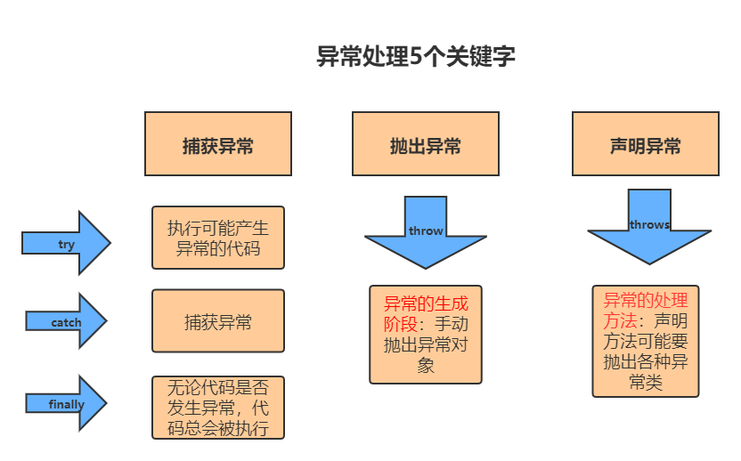
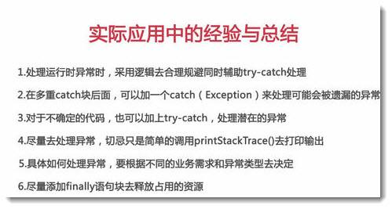

## Java异常处理

### 异常概述

异常是程序中的一些错误，但并不是所有的错误都是异常，并且错误有时候是可以避免的。

比如说，你的代码少了一个分号，那么运行出来结果是提示是错误 java.lang.Error；如果你用System.out.println(11/0)，那么你是因为你用0做了除数，会抛出 java.lang.ArithmeticException 的异常。

异常发生的原因有很多，通常包含以下几大类：

- 用户输入了非法数据。
- 要打开的文件不存在。
- 网络通信时连接中断，或者JVM内存溢出。

这些异常有的是因为用户错误引起，有的是程序错误引起的，还有其它一些是因为物理错误引起的。要理解Java异常处理是如何工作的，你需要掌握以下三种类型的异常：

- **检查性异常：**最具代表的检查性异常是用户错误或问题引起的异常，这是程序员无法预见的。例如要打开一个不存在文件时，一个异常就发生了，这些异常在编译时不能被简单地忽略。
- **运行时异常：** 运行时异常是可能被程序员避免的异常。与检查性异常相反，运行时异常可以在编译时被忽略。
- **错误：** 错误不是异常，而是脱离程序员控制的问题。错误在代码中通常被忽略。例如，当栈溢出时，一个错误就发生了，它们在编译也检查不到的。

#### 检查异常

##### 什么是检查异常？

就是编译器要求你必须处置的异常。不知道你编程的时候有没有遇到过，你写的某段代码，编译器要求你必须要对这段代码try...catch，或者throws exception，如果你遇见过，没错，这就是检查异常，也就是说，你代码还没运行呢，编译器就会检查你的代码，会不会出现异常，要求你对可能出现的异常必须做出相应的处理。

javac强制要求程序员为这样的异常做预备处理工作（使用try...catch...finally或者throws）。在方法中要么用try-catch语句捕获它并处理，要么用throws子句声明抛出它，否则编译不会通过。这样的异常一般是由程序的运行环境导致的。因为程序可能被运行在各种未知的环境下，而程序员无法干预用户如何使用他编写的程序，于是程序员就应该为这样的异常时刻准备着。如SQLException , IOException,ClassNotFoundException 等。

比如:我们调用日期格式化类解析字符串的时候;

##### 怎样处理检查异常？

- 继续抛出消极的方法，一直可以抛到jvm虚拟机来处理，就是通过throws Exception抛出
- 用 try...catch捕获

注意：对于检查的异常必须处理，必须捕获或者必须抛出

##### 检查异常有哪些呢？

除了RuntimeException与其子类，以及错误（Error），其他的都是检查异常（绝对的大家族）。

#### 非检查异常

##### 什么是非检查异常？

编译器不要求强制处置的异常，虽然你有可能出现错误，但是编译器不会在编译的时候检查，没必要，也不可能。

javac在编译时，不会提示和发现这样的异常，不要求在程序处理这些异常。所以如果愿意，我们可以编写代码处理（使用try...catch...finally）这样的异常，也可以不处理

对于这些异常，我们应该修正代码，而不是去通过异常处理器处理。这样的异常发生的原因多半是代码写的有问题。如除0错误ArithmeticException，错误的强制类型转换错误ClassCastException，数组索引越界ArrayIndexOutOfBoundsException，使用了空对象NullPointerException等等

##### 对非检查的异常怎样处理？

- 用try...catch捕获
- 继续抛出
- 不处理
- 通过代码处理

一般我们是通过代码处理的，因为你很难判断会出什么问题，而且有些异常你也无法运行时处理，比如空指针，需要人手动的去查找。

而且，捕捉异常并处理的代价远远大于直接抛出

##### 为什么有非检查异常？

你想想非检查异常都有哪些？NullPointerException，IndexOutOfBoundsException，VirtualMachineError等，这些异常你编译的时候检查吗？再说了，明明可以运行时检查，都在编译的时候检查，你写的代码还能看吗？而且有些异常只能在运行时才能检查出来，比如空指针，堆溢出等。

##### 非检查异常有哪些？

RuntimeException与其子类，以及错误（Error）。

### Exception类层次

所有的异常类是从 java.lang.Exception 类继承的子类。

Exception 类是 Throwable 类的子类。除了Exception类外，Throwable还有一个子类Error 。

Java 程序通常不捕获错误。错误一般发生在严重故障时，它们在Java程序处理的范畴之外。

Error 用来指示运行时环境发生的错误。

例如，JVM 内存溢出。一般地，程序不会从错误中恢复。

异常类有两个主要的子类：IOException 类和 RuntimeException 类。


### Java内置异常类

Java 语言定义了一些异常类在 java.lang 标准包中。

标准运行时异常类的子类是最常见的异常类。由于 java.lang 包是默认加载到所有的 Java 程序的，所以大部分从运行时异常类继承而来的异常都可以直接使用。

Java 根据各个类库也定义了一些其他的异常，下面列出了 Java 的非检查性异常。

```
ArithmeticException	当出现异常的运算条件时，抛出此异常。例如，一个整数"除以零"时，抛出此类的一个实例。

ArrayIndexOutOfBoundsException	用非法索引访问数组时抛出的异常。如果索引为负或大于等于数组大小，则该索引为非法索引。

ArrayStoreException	试图将错误类型的对象存储到一个对象数组时抛出的异常。

ClassCastException	当试图将对象强制转换为不是实例的子类时，抛出该异常。

IllegalArgumentException	抛出的异常表明向方法传递了一个不合法或不正确的参数。

IllegalMonitorStateException	抛出的异常表明某一线程已经试图等待对象的监视器，或者试图通知其他正在等待对象的监视器而本身没有指定监视器的线程。

IllegalStateException	在非法或不适当的时间调用方法时产生的信号。换句话说，即 Java 环境或 Java 应用程序没有处于请求操作所要求的适当状态下。

IllegalThreadStateException	线程没有处于请求操作所要求的适当状态时抛出的异常。

IndexOutOfBoundsException	指示某排序索引（例如对数组、字符串或向量的排序）超出范围时抛出。

NegativeArraySizeException	如果应用程序试图创建大小为负的数组，则抛出该异常。

NullPointerException	当应用程序试图在需要对象的地方使用 null 时，抛出该异常

NumberFormatException	当应用程序试图将字符串转换成一种数值类型，但该字符串不能转换为适当格式时，抛出该异常。

SecurityException	由安全管理器抛出的异常，指示存在安全侵犯。

StringIndexOutOfBoundsException	此异常由 String 方法抛出，指示索引或者为负，或者超出字符串的大小。

UnsupportedOperationException	当不支持请求的操作时，抛出该异常。
```

下面列出了 Java 定义在 java.lang 包中的检查性异常类。

```
ClassNotFoundException	应用程序试图加载类时，找不到相应的类，抛出该异常。

CloneNotSupportedException	当调用 Object 类中的 clone 方法克隆对象，但该对象的类无法实现 Cloneable 接口时，抛出该异常。

IllegalAccessException	拒绝访问一个类的时候，抛出该异常。

InstantiationException	当试图使用 Class 类中的 newInstance 方法创建一个类的实例，而指定的类对象因为是一个接口或是一个抽象类而无法实例化时，抛出该异常。

InterruptedException	一个线程被另一个线程中断，抛出该异常。

NoSuchFieldException	请求的变量不存在

NoSuchMethodException	请求的方法不存在
```

### 异常方法

```
public String getMessage()
返回关于发生的异常的详细信息。这个消息在Throwable 类的构造函数中初始化了。

public Throwable getCause()
返回一个 Throwable 对象代表异常原因。

public String toString()
返回此 Throwable 的简短描述。

public void printStackTrace()
将此 Throwable 及其回溯打印到标准错误流。

public StackTraceElement [] getStackTrace()
返回一个包含堆栈层次的数组。下标为0的元素代表栈顶，最后一个元素代表方法调用堆栈的栈底。

public Throwable fillInStackTrace()
用当前的调用栈层次填充Throwable 对象栈层次，添加到栈层次任何先前信息中。
```

### 捕获异常

使用 try 和 catch 关键字可以捕获异常。try/catch 代码块放在异常可能发生的地方。

try/catch代码块中的代码称为保护代码，使用 try/catch 的语法如下：

```
try{
   // 程序代码
}catch(ExceptionName e1){
   //catch 块
}
```

catch 语句包含要捕获异常类型的声明。当保护代码块中发生一个异常时，try 后面的 catch 块就会被检查。

如果发生的异常包含在 catch 块中，异常会被传递到该 catch 块，这和传递一个参数到方法是一样。

```
example:
// 文件名 : ExcepTest.java
import java.io.*;
public class ExcepTest{
 
   public static void main(String args[]){
      try{
         int a[] = new int[2];
         System.out.println("Access element three :" + a[3]);
      }catch(ArrayIndexOutOfBoundsException e){
         System.out.println("Exception thrown  :" + e);
      }
      System.out.println("Out of the block");
   }
}
result:
Exception thrown  :java.lang.ArrayIndexOutOfBoundsException: 3
Out of the block
```

### 多重捕获块

一个 try 代码块后面跟随多个 catch 代码块的情况就叫多重捕获。

多重捕获块的语法如下所示：

```
try{
   // 程序代码
}catch(异常类型1 异常的变量名1){
  // 程序代码
}catch(异常类型2 异常的变量名2){
  // 程序代码
}catch(异常类型3 异常的变量名3){
  // 程序代码
}
语法解释：
		try：
			捕获异常的第一步是用try{…}语句块选定捕获异常的范围，将可能出现异常的代码放在try语句块中。
			如果发生异常，则尝试去匹配catch块，catch块可以有多个（因为try块可以出现多个不同类型异常）;
			如果执行完try不管有没有发生异常，则接着去执行finally块和finally后面的代码（如果有的话）。			
		catch (Exceptiontype e)：
			在catch语句块中是对异常对象进行处理的代码。每个try语句块可以伴随一个或多个catch语句，用于处理可能产生的不同类型的异常对象。
			每一个catch块用于捕获并处理一个特定的异常，或者这异常类型的子类。Java可以将多个异常声明在一个catch中。 catch(Exception1 | Exception2 | Exception3 e)
			catch后面的括号定义了异常类型和异常参数。如果异常与之匹配且是最先匹配到的，则虚拟机将使用这个catch块来处理异常。
			在catch块中可以使用这个块的异常参数来获取异常的相关信息。异常参数是这个catch块中的局部变量，其它块不能访问。与其它对象一样，可以访问一个异常对象的成员变量或调用它的方法。
				①、getMessage() 获取异常信息，返回字符串。
				②、printStackTrace() 获取异常类名和异常信息，以及异常出现在程序中的位置。返回值void。
			如果当前try块中发生的异常在后续的所有catch中都没捕获到，则先去执行finally，然后到这个函数的外部caller中去匹配异常处理器。
			如果try中没有发生异常，则所有的catch块将被忽略。
			注意：如果明确知道产生的是何种异常，可以用该异常类作为catch的参数；也可以用其父类作为catch的参数。比如：可以用 ArithmeticException 类作为参数的地方，就可以用RuntimeException类作为参数，或者用所有异常的父类Exception类作为参数。但不能是与ArithmeticException类无关的异常，如NullPointerException（catch中的语句将不会执行）。
 
		finally：
			finally块通常是可选的。捕获异常的最后一步是通过finally语句为异常处理提供一个统一的出口，使得在控制流转到程序的其它部分以前，能够对程序的状态作统一的管理。
			不论在try代码块中是否发生了异常事件，catch语句是否执行，catch语句是否有异常，catch语句中是否有return，finally块中的语句都会被执行。
			一个try至少要有一个catch块，否则， 至少要有1个finally块。但是finally不是用来处理异常的，finally不会捕获异常。
			finally主要做一些清理工作，如流的关闭，数据库连接的关闭等。
```

上面的代码段包含了 3 个 catch块。

可以在 try 语句后面添加任意数量的 catch 块。

如果保护代码中发生异常，异常被抛给第一个 catch 块。

如果抛出异常的数据类型与 ExceptionType1 匹配，它在这里就会被捕获。

如果不匹配，它会被传递给第二个 catch 块。

如此，直到异常被捕获或者通过所有的 catch 块。

```
example:
try {
    file = new FileInputStream(fileName);
    x = (byte) file.read();
} catch(FileNotFoundException f) { // Not valid!
    f.printStackTrace();
    return -1;
} catch(IOException i) {
    i.printStackTrace();
    return -1;
}
```

**Tips** 

try块中的局部变量和catch块中的局部变量（包括异常变量），以及finally中的局部变量，他们之间不可共享使用。

每一个catch块用于处理一个异常。异常匹配是按照catch块的顺序从上往下寻找的，只有第一个匹配的catch会得到执行。匹配时，不仅运行精确匹配，也支持父类匹配，因此，如果同一个try块下的多个catch异常类型有父子关系，应该将子类异常放在前面，父类异常放在后面，这样保证每个catch块都有存在的意义

### throws/throw关键字

如果一个方法没有捕获到一个检查性异常，那么该方法必须使用 throws 关键字来声明。throws 关键字放在方法签名的尾部。

throws是另一种处理异常的方式，它不同于try...catch...finally，throws仅仅是将函数中可能出现的异常向调用者声明，而自己则不具体处理。

throws声明：如果一个方法内部的代码会抛出检查异常（checked exception），而方法自己又没有完全处理掉或并不能确定如何处理这种异常，则javac保证你必须在方法的签名上使用throws关键字声明这些可能抛出的异常，表明该方法将不对这些异常进行处理，而由该方法的调用者负责处理，否则编译不通过。

在方法声明中用throws语句可以声明抛出异常的列表，throws后面的异常类型可以是方法中产生的异常类型，也可以是它的父类

Java异常类对象除在程序执行过程中出现异常时由系统自动生成并抛出，也可根据需要使用人工创建并抛出。

首先要生成异常类对象，然后通过throw语句实现抛出操作(提交给Java运行环境)

程序员也可以通过throw语句手动显式的抛出一个异常。throw语句的后面可以抛出的异常必须是Throwable或其子类的实例。下面的语句在编译时将会产生语法错误

```
throw new String("你抛我试试.");
```

 throw 语句必须写在函数中，执行throw 语句的地方就是一个异常抛出点，它和由JRE自动形成的异常抛出点没有任何差别。

也可以使用 throw 关键字抛出一个异常，无论它是新实例化的还是刚捕获到的。

下面方法的声明抛出一个 RemoteException 异常：

```
import java.io.*;
public class className
{
  public void deposit(double amount) throws RemoteException
  {
    // Method implementation
    throw new RemoteException();
  }
  //Remainder of class definition
}
```

一个方法可以声明抛出多个异常，多个异常之间用逗号隔开。

例如，下面的方法声明抛出 RemoteException 和 InsufficientFundsException：

```
import java.io.*;
public class className
{
   public void withdraw(double amount) throws RemoteException,
                              InsufficientFundsException
   {
       // Method implementation
   }
   //Remainder of class definition
}
```

#### throws和throw的区别

```
throw是语句抛出一个异常
语法：throw (异常对象) throw e;
throws是方法可能抛出异常的声明。(用在声明方法时，表示该方法可能要抛出异常)
语法：public void func() throws Exception1, Exception2{
}

throw语句用在方法体内，表示抛出异常，由方法体内的语句处理。
throws出现在方法函数头，表示在抛出异常，由该方法的调用者来处理。

throws主要是声明这个方法会抛出这种类型的异常，使它的调用者知道要捕获这个异常。
throw是具体向外抛异常的动作，所以它是抛出一个异常实例。

throws说明你有那个可能，倾向。
throw的话，那就是你把那个倾向变成真实的了。
```

两者都是消极处理异常的方式（这里的消极并不是说这种方式不好），只是抛出或者可能抛出异常，但是不会由函数去处理异常，真正的处理异常由函数的上层调用处理。



### finally关键字

finally 关键字用来创建在 try 代码块后面执行的代码块。

无论是否发生异常，finally 代码块中的代码总会被执行。

在 finally 代码块中，可以运行清理类型等收尾善后性质的语句。

finally 代码块出现在 catch 代码块最后，语法如下：

```
try{
  // 程序代码
}catch(异常类型1 异常的变量名1){
  // 程序代码
}catch(异常类型2 异常的变量名2){
  // 程序代码
}finally{
  // 程序代码
}
```

```
example:
public class ExcepTest{
  public static void main(String args[]){
    int a[] = new int[2];
    try{
       System.out.println("Access element three :" + a[3]);
    }catch(ArrayIndexOutOfBoundsException e){
       System.out.println("Exception thrown  :" + e);
    }
    finally{
       a[0] = 6;
       System.out.println("First element value: " +a[0]);
       System.out.println("The finally statement is executed");
    }
  }
}
result:
Exception thrown  :java.lang.ArrayIndexOutOfBoundsException: 3
First element value: 6
The finally statement is executed
```

**Tips** 

- catch 不能独立于 try 存在。
- 在 try/catch 后面添加 finally 块并非强制性要求的。
- try 代码后不能既没 catch 块也没 finally 块。
- try, catch, finally 块之间不能添加任何代码。
- 在 try块中即便有return，break，continue等改变执行流的语句，finally也会执行。
- finally中的return 会覆盖 try 或者catch中的返回值

建议：

不要在finally中使用return

不要在finally中抛出异常

减轻finally的任务，不要在finally中做一些其它的事情，finally块仅仅用来释放资源是最合适的。

将尽量将所有的return写在函数的最后面，而不是try ... catch ... finally中。

### try-with-resources

JDK7 之后，Java 新增的 **try-with-resource** 语法糖来打开资源，并且可以在语句执行完毕后确保每个资源都被自动关闭 。

JDK7 之前所有被打开的系统资源，比如流、文件或者 Socket 连接等，都需要被开发者手动关闭，否则会造成资源泄露将。

```
try (resource declaration) {
  // 使用的资源
} catch (ExceptionType e1) {
  // 异常块
}
```

以上的语法中 try 用于声明和实例化资源，catch 用于处理关闭资源时可能引发的所有异常。

**注意：**try-with-resources 语句关闭所有实现 AutoCloseable 接口的资源。

```
import java.io.*;

public class RunoobTest {

    public static void main(String[] args) {
    String line;
        try(BufferedReader br = new BufferedReader(new FileReader("test.txt"))) {
            while ((line = br.readLine()) != null) {
                System.out.println("Line =>"+line);
            }
        } catch (IOException e) {
            System.out.println("IOException in try block =>" + e.getMessage());
        }
    }
}
result:
IOException in try block =>test.txt (No such file or directory)
```

以上实例中，我们实例一个 BufferedReader对象从 test.txt 文件中读取数据。

在 try-with-resources 语句中声明和实例化 BufferedReader 可确语句执行完毕后实例资源，不需要考虑 try 语句是正常执行还是抛出异常。

如果发生异常，可以使用 catch 来处理异常。

再看下不使用 **try-with-resources** 而改成 **finally** 来关闭资源，整体代码量多了很多，而且更复杂繁琐了：

```
import java.io.*;

class RunoobTest {
    public static void main(String[] args) {
        BufferedReader br = null;
        String line;

        try {
            System.out.println("Entering try block");
            br = new BufferedReader(new FileReader("test.txt"));
            while ((line = br.readLine()) != null) {
            System.out.println("Line =>"+line);
            }
        } catch (IOException e) {
            System.out.println("IOException in try block =>" + e.getMessage());
        } finally {
            System.out.println("Entering finally block");
            try {
                if (br != null) {
                    br.close();
                }
            } catch (IOException e) {
                System.out.println("IOException in finally block =>"+e.getMessage());
            }
        }
    }
}
result:
Entering try block
IOException in try block =>test.txt (No such file or directory)
Entering finally block
```

### try-with-resources处理多个资源

try-with-resources 语句中可以声明多个资源，方法是使用分号 **;**  分隔各个资源：

```
import java.io.*;
import java.util.*;
class RunoobTest {
    public static void main(String[] args) throws IOException{
        try (Scanner scanner = new Scanner(new File("testRead.txt"));
            PrintWriter writer = new PrintWriter(new File("testWrite.txt"))) {
            while (scanner.hasNext()) {
                writer.print(scanner.nextLine());
            }
        }
    }
}
```

以上实例使用 Scanner 对象从 testRead.txt 文件中读取一行并将其写入新的 testWrite.txt 文件中。

多个声明资源时，**try-with-resources** 语句以相反的顺序关闭这些资源。 在本例中，PrintWriter 对象先关闭，然后 Scanner 对象关闭。

### 声明自定义异常

在 Java 中你可以自定义异常。编写自己的异常类时需要记住下面的几点。

- 所有异常都必须是 Throwable 的子类。
- 如果希望写一个检查性异常类，则需要继承 Exception 类。
- 如果你想写一个运行时异常类，那么需要继承 RuntimeException 类。

按照国际惯例，自定义的异常应该总是包含如下的构造函数：

- 一个无参构造器
- 一个带有String参数的构造函数，并传递给父类的构造函数。
- 一个带有String参数和Throwable参数，并都传递给父类构造函数
- 一个带有Throwable 参数的构造函数，并传递给父类的构造函数

```
example:
public class IOException extends Exception {
    static final long serialVersionUID = 7818375828146090155L;
 
    public IOException() {
        super();
    }
 
    public IOException(String message) {
        super(message);
    }
 
    public IOException(String message, Throwable cause) {
        super(message, cause);
    }
 
    public IOException(Throwable cause) {
        super(cause);
    }
}
```

可以像下面这样定义自己的异常类：

```
class MyException extends Exception{
}
```

只继承Exception 类来创建的异常类是检查性异常类。

下面的 InsufficientFundsException 类是用户定义的异常类，它继承自 Exception。

一个异常类和其它任何类一样，包含有变量和方法。

```
example:实例是一个银行账户的模拟，通过银行卡的号码完成识别，可以进行存钱和取钱的操作
// 文件名InsufficientFundsException.java
import java.io.*;
 
//自定义异常类，继承Exception类
public class InsufficientFundsException extends Exception
{
  //此处的amount用来储存当出现异常（取出钱多于余额时）所缺乏的钱
  private double amount;
  public InsufficientFundsException(double amount)
  {
    this.amount = amount;
  } 
  public double getAmount()
  {
    return amount;
  }
}
```

为了展示如何使用我们自定义的异常类，

在下面的 CheckingAccount 类中包含一个 withdraw() 方法抛出一个 InsufficientFundsException 异常

```
// 文件名称 CheckingAccount.java
import java.io.*;
 
//此类模拟银行账户
public class CheckingAccount
{
  //balance为余额，number为卡号
   private double balance;
   private int number;
   public CheckingAccount(int number)
   {
      this.number = number;
   }
  //方法：存钱
   public void deposit(double amount)
   {
      balance += amount;
   }
  //方法：取钱
   public void withdraw(double amount) throws
                              InsufficientFundsException
   {
      if(amount <= balance)
      {
         balance -= amount;
      }
      else
      {
         double needs = amount - balance;
         throw new InsufficientFundsException(needs);
      }
   }
  //方法：返回余额
   public double getBalance()
   {
      return balance;
   }
  //方法：返回卡号
   public int getNumber()
   {
      return number;
   }
}
```

下面的 BankDemo 程序示范了如何调用 CheckingAccount 类的 deposit() 和 withdraw() 方法

```
//文件名称 BankDemo.java
public class BankDemo
{
   public static void main(String [] args)
   {
      CheckingAccount c = new CheckingAccount(101);
      System.out.println("Depositing $500...");
      c.deposit(500.00);
      try
      {
         System.out.println("\nWithdrawing $100...");
         c.withdraw(100.00);
         System.out.println("\nWithdrawing $600...");
         c.withdraw(600.00);
      }catch(InsufficientFundsException e)
      {
         System.out.println("Sorry, but you are short $"
                                  + e.getAmount());
         e.printStackTrace();
      }
    }
}
result:
Depositing $500...

Withdrawing $100...

Withdrawing $600...
Sorry, but you are short $200.0
InsufficientFundsException
        at CheckingAccount.withdraw(CheckingAccount.java:25)
        at BankDemo.main(BankDemo.java:13)
```

### 通用异常

在Java中定义了两种类型的异常和错误。

- **JVM(Java虚拟机)异常：** 由 JVM 抛出的异常或错误。例如：NullPointerException 类，ArrayIndexOutOfBoundsException 类，ClassCastException 类。
- **程序级异常：** 由程序或者API程序抛出的异常。例如 IllegalArgumentException 类，IllegalStateException 类。



### 异常堆栈

当异常抛出后，我们可以通过异常堆栈追踪程序的运行轨迹，以便我们更好的 `DEBUG` 。

```
public class Demo4 {
    public static void method1() {
        method2();
    }

    public static void method2() {
        throw new NullPointerException();
    }

    public static void main(String[] args) {
        try{
            method1();
        } catch (Exception e) {
            // 打印堆栈轨迹
            e.printStackTrace();
        }
    }
}

打印结果：
java.lang.NullPointerException
	at Demo4.method2(Demo4.java:10)
	at Demo4.method1(Demo4.java:6)
	at Demo4.main(Demo4.java:15)
```

通过上面的异常堆栈轨迹，在对比我们方法的调用过程，可以得出异常信息中首先打印的是距离抛出异常最近的语句，接着是调用该方法的方法，一直到最开始被调用的方法。 **从下往上看** ，就可以得出程序运行的轨迹。