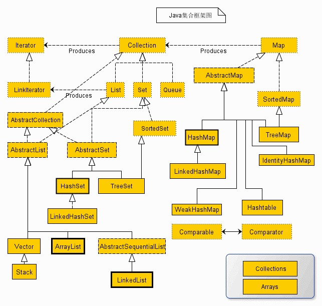
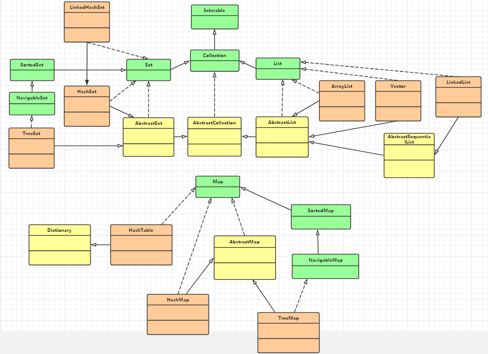
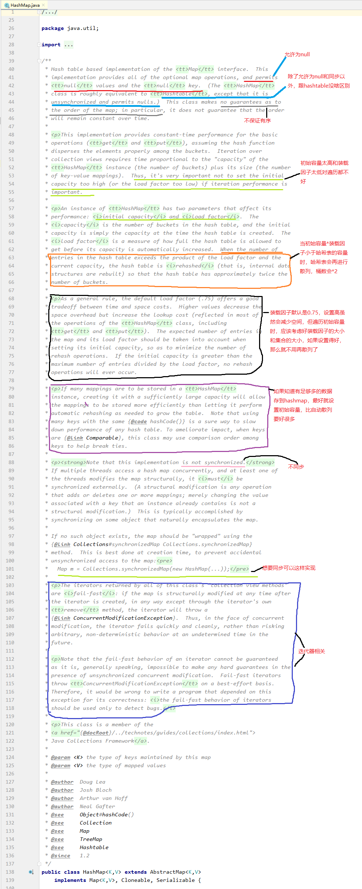
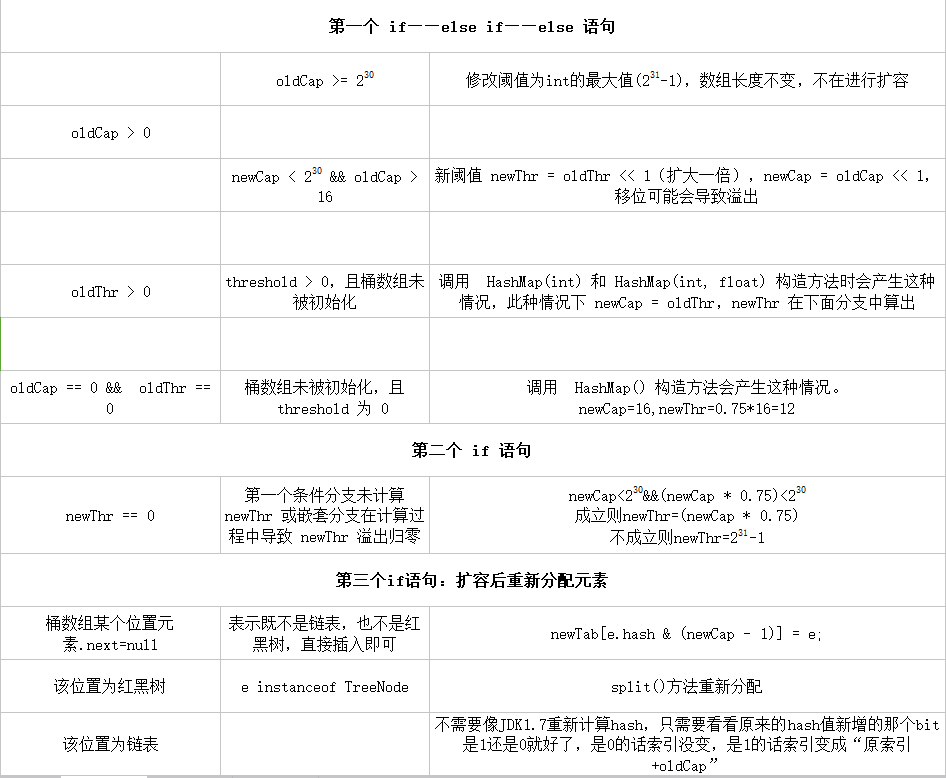

## Java集合

### 概述

集合可以看作是一种容器，用来存储 **对象** 信息。集合就是“由若干个确定的元素所构成的整体”。

集合框架被设计成要满足以下几个目标。

- 该框架必须是高性能的。基本集合（动态数组，链表，树，哈希表）的实现也必须是高效的。
- 该框架允许不同类型的集合，以类似的方式工作，具有高度的互操作性。
- 对一个集合的扩展和适应必须是简单的。



从上面的集合框架图可以看到，Java 集合框架主要包括两种类型的容器，一种是集合（Collection），存储一个元素集合，另一种是图（Map），存储键/值对映射。

### 集合的分类

集合框架是一个用来代表和操纵集合的统一架构。所有的集合框架都包含如下内容：

- **接口：**是代表集合的抽象数据类型。例如 Collection、List、Set、Map 等。之所以定义多个接口，是为了以不同的方式操作集合对象
- **实现（类）：**是集合接口的具体实现。从本质上讲，它们是可重复使用的数据结构，例如：ArrayList、LinkedList、HashSet、HashMap。
- **算法：**是实现集合接口的对象里的方法执行的一些有用的计算，例如：搜索和排序。这些算法被称为多态，那是因为相同的方法可以在相似的接口上有着不同的实现。

除了集合，该框架也定义了几个 Map 接口和类。Map 里存储的是键/值对。尽管 Map 不是集合，但是它们完全整合在集合中。


Java标准库自带的`java.util `包提供了集合类：`Collection `，它是除`Map` 外所有其他集合类的根接口。Java的`java.util `包主要提供了以下三种类型的集合：

- `List` ：一种有序列表的集合，例如，按索引排列的`Student` 的`List` ；
- `Set `：一种保证没有重复元素的集合，例如，所有无重复名称的`Student `的`Set` ；
- `Map` ：一种通过键值（key-value）查找的映射表集合，例如，根据`Student `的`name `查找对应`Student `的`Map` 。

Java集合的设计有几个特点：一是实现了接口和实现类相分离，例如，有序表的接口是`List` ，具体的实现类有`ArrayList` ，`LinkedList` 等，二是支持泛型，我们可以限制在一个集合中只能放入同一种数据类型的元素，例如：

```
List<String> list = new ArrayList<>(); // 只能放入String类型
```

最后，Java访问集合总是通过统一的方式——迭代器（Iterator）来实现，它最明显的好处在于无需知道集合内部元素是按什么方式存储的。由于Java的集合设计非常久远，中间经历过大规模改进，我们要注意到有一小部分集合类是遗留类，不应该继续使用：

- `Hashtable` ：一种线程安全的`Map `实现；
- `Vector` ：一种线程安全的`List `实现；
- `Stack` ：基于`Vector` 实现的`LIFO` 的栈。

还有一小部分接口是遗留接口，也不应该继续使用：

- `Enumeration<E>` ：已被 `Iterator<E>` 取代。



### 数组和集合的区别

- 长度的区别
  - 数组的长度固定
  - 集合的长度可变
- 内容不同
  - 数组存储的是同一种类型的元素
  - 集合可以存储不同类型的元素（但是我们一般不这么做）
- 元素的数据类型
  - 数组可以存储基本数据类型,也可以存储引用类型
  - 集合只能存储引用类型(你存储的是简单的int，它会自动装箱成Integer)

### 集合接口

```
Collection 接口
Collection 是最基本的集合接口，一个 Collection 代表一组 Object，即 Collection 的元素, Java不提供直接继承自Collection的类，只提供继承于的子接口(如List和set)。
Collection 接口存储一组不唯一，无序的对象。

List 接口
List接口是一个有序的 Collection，使用此接口能够精确的控制每个元素插入的位置，能够通过索引(元素在List中位置，类似于数组的下标)来访问List中的元素，第一个元素的索引为 0，而且允许有相同的元素。
List 接口存储一组不唯一，有序（插入顺序）的对象。

Set
Set 具有与 Collection 完全一样的接口，只是行为上不同，Set 不保存重复的元素。
Set 接口存储一组唯一，无序的对象。

SortedSet
继承于Set保存有序的集合。

Map
Map 接口存储一组键值对象，提供key（键）到value（值）的映射。

Map.Entry
描述在一个Map中的一个元素（键/值对）。是一个 Map 的内部接口。

SortedMap
继承于 Map，使 Key 保持在升序排列。

Enumeration
这是一个传统的接口和定义的方法，通过它可以枚举（一次获得一个）对象集合中的元素。这个传统接口已被迭代器取代。
```

### 集合实现类

```
AbstractCollection 
实现了大部分的集合接口。

AbstractList 
继承于AbstractCollection 并且实现了大部分List接口。

AbstractSequentialList 
继承于 AbstractList ，提供了对数据元素的链式访问而不是随机访问。

LinkedList
该类实现了List接口，允许有null（空）元素。主要用于创建链表数据结构，该类没有同步方法，如果多个线程同时访问一个List，则必须自己实现访问同步，解决方法就是在创建List时候构造一个同步的List。例如：
List list=Collections.synchronizedList(newLinkedList(...));
LinkedList 查找效率低。

ArrayList
该类也是实现了List的接口，实现了可变大小的数组，随机访问和遍历元素时，提供更好的性能。该类也是非同步的,在多线程的情况下不要使用。ArrayList 增长当前长度的50%，插入删除效率低。

AbstractSet 
继承于AbstractCollection 并且实现了大部分Set接口。

HashSet
该类实现了Set接口，不允许出现重复元素，不保证集合中元素的顺序，允许包含值为null的元素，但最多只能一个。

LinkedHashSet
具有可预知迭代顺序的 Set 接口的哈希表和链接列表实现。

TreeSet
该类实现了Set接口，可以实现排序等功能。

AbstractMap 
实现了大部分的Map接口。

HashMap
HashMap 是一个散列表，它存储的内容是键值对(key-value)映射。
该类实现了Map接口，根据键的HashCode值存储数据，具有很快的访问速度，最多允许一条记录的键为null，不支持线程同步。

TreeMap
继承了AbstractMap，并且使用一颗树。

WeakHashMap
继承AbstractMap类，使用弱密钥的哈希表。

LinkedHashMap
继承于HashMap，使用元素的自然顺序对元素进行排序.

IdentityHashMap
继承AbstractMap类，比较文档时使用引用相等。
```

java.util包中定义的类

```
Vector
该类和ArrayList非常相似，但是该类是同步的，可以用在多线程的情况，该类允许设置默认的增长长度，默认扩容方式为原来的2倍。

Stack
栈是Vector的一个子类，它实现了一个标准的后进先出的栈。

Dictionary
Dictionary 类是一个抽象类，用来存储键/值对，作用和Map类相似。

Hashtable
Hashtable 是 Dictionary(字典) 类的子类，位于 java.util 包中。

Properties
Properties 继承于 Hashtable，表示一个持久的属性集，属性列表中每个键及其对应值都是一个字符串。

BitSet
一个Bitset类创建一种特殊类型的数组来保存位值。BitSet中数组大小会随需要增加。
```


### Collection的由来及功能

- 集合可以存储多个元素,但我们 **对多个元素也有不同的需求** 
- - 多个元素,不能有相同的
  - 多个元素,能够按照某个规则排序
- 针对不同的需求：java就提供了很多集合类，多个集合类的数据结构不同。但是，结构不重要，重要的是 **能够存储东西,能够判断,获取** 
- 把集合 **共性的内容不断往上提取** ,最终形成集合的继承体系---->Collection

#### Collection的基本功能

- 添加功能
  - `boolean add(E e)` 向集合中添加一个元素
  - `boolean addAll(Collectiobn c)` 向集合中添加一个集合对象
- 删除功能
  - `void clear()` 移除集合内的所有元素
  - `boolean remove(Object o)` 从集合内移除一个元素
  - `boolean removeAll(Collection c)` 移除一个集合的元素，只要一个元素被移除了，就返回 `true` 
- 判断功能
  - `boolean contains(Object o)` 判断集合内是否包含该元素
  - `boolean containsAll(Collection c)` 判断集合是否包含指定集合 `c` ，只有包含集合 `c` 的所有元素，才返回 `true` 
  - `boolean isEmpty()` 判断集合是否为空
- 获取功能
  - `Iteratoe<E> iteratoe()` 迭代器，主要用于遍历集合内的元素，不需要知道集合的结构
- 长度功能
  - `int size()` 返回集合内元素的个数
- 交集功能
  - `boolean retainAll(Collection c)` 移除当前集合内部包含集合 `c` 的所有元素。集合A和集合B做交集，最终的结果保留在集合A，返回值表示A的结果是否发生变化

```
package collection;

import java.util.*;

public class Demo {
    public static void main(String[] args) {
        // 以ArrayList为例，测试Collection的方法
        List<Integer> list  = new ArrayList<>();
        List<Integer> list1 = new ArrayList<>();
        List<Integer> list2 = new ArrayList<>();
        //向list中添加元素
        list.add(1);
        list.add(2);
        list.add(17);
        list.add(38);
        //向list1中添加元素
        list1.add(100);
        list1.add(101);
        //向list2中添加元素
        list2.add(1);
        list2.add(99);
        //向list中添加集合list1
        list.addAll(list1);
        System.out.println("打印集合list的所有元素");
        //打印此时集合list的元素
        display(list);
        System.out.println("------------------");
        System.out.println("移除集合list中的元素1");
        //移除元素1
        list.remove(new Integer(1));
        display(list);
        System.out.println("------------------");
        //移除集合list2的元素
        list.removeAll(list2);
        display(list);
        System.out.println("------------------");
        System.out.println("list2集合清除前");
        display(list2);
        list2.clear();
        System.out.println("list2集合清除后");
        display(list2);
        System.out.println("list2集合是否为空 -> " + list2.isEmpty());
        //向list2中添加元素
        list2.add(1);
        list2.add(99);
        System.out.println("------------------");
        System.out.println("集合list是否包含元素2 -> " + list.contains(2));
        System.out.println("集合list是否包含集合list1 -> " + list.containsAll(list1));
        System.out.println("集合list是否包含集合list2 -> " + list.containsAll(list2));
        System.out.println("集合list的元素个数 -> " + list.size());
        display(list);
        System.out.println("------------");
        display(list1);
        System.out.println("集合list和list1的交集 -> " + list.retainAll(list1));
        System.out.println("此时集合list中的元素");
        display(list);
    }

    /**
     * 声明一个方法，用于List集合的遍历
     * @param list  需要遍历的集合
     */
    public static void display(List list) {
        // 声明一个迭代器对象，用来遍历使用
        Iterator it = list.iterator();
        // 判断集合中是否有下一个元素
        while (it.hasNext()) {
            // 如果有，输出该元素
            System.out.println(it.next());
        }
    }

}
```

### 迭代器Iteartor

迭代器是遍历集合的一种方式。迭代器是依赖于集合而存在的。

Iterator 是 Java 迭代器最简单的实现，ListIterator 是 Collection API 中的接口， 它扩展了 Iterator 接口。

`Iterator` 是一个接口，我们在 `Collection` 中没有找到对应的方法，那么我们去其子类查看，在 `ArrayList` 中找到，在 `ArrayList` 内部是以内部类的形式实现的。

主要包含以下三个方法

- hasNext()：用于检测集合中是否还有元素。
- next()：会返回迭代器的下一个元素，并且更新迭代器的状态
- remove()：将迭代器返回的元素删除。

我们 **遍历集合(Collection)的元素都可以使用Iterator** ，至于它的具体实现是以内部类的方式实现的！


```
// 声明一个迭代器对象，用来遍历使用
Iterator it = list.iterator();
// 判断集合中是否有下一个元素
while (it.hasNext()) {
    // 如果有，输出该元素
    System.out.println(it.next());
}
```

#### 获取一个迭代器

集合想获取一个迭代器可以使用 iterator() 方法:

```
// 引入 ArrayList 和 Iterator 类
import java.util.ArrayList;
import java.util.Iterator;

public class RunoobTest {
    public static void main(String[] args) {

        // 创建集合
        ArrayList<String> sites = new ArrayList<String>();
        sites.add("Google");
        sites.add("Runoob");
        sites.add("Taobao");
        sites.add("Zhihu");

        // 获取迭代器
        Iterator<String> it = sites.iterator();

        // 输出集合中的第一个元素
        System.out.println(it.next());
    }
}
result:
Google
```

#### 循环集合元素

让迭代器 it 逐个返回集合中所有元素最简单的方法是使用 while 循环：

```
while(it.hasNext()) {
    System.out.println(it.next());
}

example:
// 引入 ArrayList 和 Iterator 类
import java.util.ArrayList;
import java.util.Iterator;

public class RunoobTest {
    public static void main(String[] args) {

        // 创建集合
        ArrayList<String> sites = new ArrayList<String>();
        sites.add("Google");
        sites.add("Runoob");
        sites.add("Taobao");
        sites.add("Zhihu");

        // 获取迭代器
        Iterator<String> it = sites.iterator();

        // 输出集合中的所有元素
        while(it.hasNext()) {
            System.out.println(it.next());
        }
    }
}
result:
Google
Runoob
Taobao
Zhihu
```

#### 删除元素

要删除集合中的元素可以使用 remove() 方法。

```
example:删除集合中小于 10 的元素
// 引入 ArrayList 和 Iterator 类
import java.util.ArrayList;
import java.util.Iterator;

public class RunoobTest {
    public static void main(String[] args) {
        ArrayList<Integer> numbers = new ArrayList<Integer>();
        numbers.add(12);
        numbers.add(8);
        numbers.add(2);
        numbers.add(23);
        Iterator<Integer> it = numbers.iterator();
        while(it.hasNext()) {
            Integer i = it.next();
            if(i < 10) {  
                it.remove();  // 删除小于 10 的元素
            }
        }
        System.out.println(numbers);
    }
}
result:
[12, 23]
```

#### 遍历ArrayList

```
import java.util.*;
 
public class Test{
 public static void main(String[] args) {
     List<String> list=new ArrayList<String>();
     list.add("Hello");
     list.add("World");
     list.add("HAHAHAHA");
     //第一种遍历方法使用 For-Each 遍历 List
     for (String str : list) {            //也可以改写 for(int i=0;i<list.size();i++) 这种形式
        System.out.println(str);
     }
 
     //第二种遍历，把链表变为数组相关的内容进行遍历
     String[] strArray=new String[list.size()];
     list.toArray(strArray);
     for(int i=0;i<strArray.length;i++) //这里也可以改写为  for(String str:strArray) 这种形式
     {
        System.out.println(strArray[i]);
     }
     
    //第三种遍历 使用迭代器进行相关遍历
     
     Iterator<String> ite=list.iterator();
     while(ite.hasNext())//判断下一个元素之后有值
     {
         System.out.println(ite.next());
     }
 }
}
三种方法都是用来遍历ArrayList集合，第三种方法是采用迭代器的方法，该方法可以不用担心在遍历的过程中会超出集合的长度。
```

#### 遍历Map

```
import java.util.*;
 
public class Test{
     public static void main(String[] args) {
      Map<String, String> map = new HashMap<String, String>();
      map.put("1", "value1");
      map.put("2", "value2");
      map.put("3", "value3");
      
      //第一种：普遍使用，二次取值
      System.out.println("通过Map.keySet遍历key和value：");
      for (String key : map.keySet()) {
       System.out.println("key= "+ key + " and value= " + map.get(key));
      }
      
      //第二种
      System.out.println("通过Map.entrySet使用iterator遍历key和value：");
      Iterator<Map.Entry<String, String>> it = map.entrySet().iterator();
      while (it.hasNext()) {
       Map.Entry<String, String> entry = it.next();
       System.out.println("key= " + entry.getKey() + " and value= " + entry.getValue());
      }
      
      //第三种：推荐，尤其是容量大时
      System.out.println("通过Map.entrySet遍历key和value");
      for (Map.Entry<String, String> entry : map.entrySet()) {
       System.out.println("key= " + entry.getKey() + " and value= " + entry.getValue());
      }
    
      //第四种
      System.out.println("通过Map.values()遍历所有的value，但不能遍历key");
      for (String v : map.values()) {
       System.out.println("value= " + v);
      }
     }
}
```

### Collection下的常用集合

从上面已经可以看到了，`Collection` 主要学习集合的类型两种： **Set和List** !

- `List`  **有序(存储顺序和取出顺序一致),可重复** 
- `Set` **无序，元素唯一** 

#### List常用子类

- ArrayList
  - 底层数据结构是数组。线程不安全。查询快，增删慢。效率高
- LinkedList
  - 底层数据结构是链表。线程不安全。查询慢，增删快。效率高
- Vector
  - 底层数据结构是数组。线程安全。查询快，增删慢。效率低

#### Set常用子类

- HashSet
  - 底层数据结构是哈希表(是一个元素为链表的数组)。通用的存储数据的集合
- TreeSet
  - 底层数据结构是红黑树(一个自平衡的二叉树)。保证元素的排序方法
- LinkedHashSet
  - 底层数据结构是链表和哈希表。主要功能用于保证FIFO即有序的集合(先进先出)

#### Set和List的区别

-  Set 接口实例存储的是无序的，不重复的数据。List 接口实例存储的是有序的，可以重复的元素。
- Set检索效率低下，删除和插入效率高，插入和删除不会引起元素位置改变 **<实现类有HashSet,TreeSet>**。
- List和数组类似，可以动态增长，根据实际存储的数据的长度自动增长List的长度。查找元素效率高，插入删除效率低，因为会引起其他元素位置改变 **<实现类有ArrayList,LinkedList,Vector>** 。

### Map

`Map` 我们称之为映射，一个 `key` 对应一个 `value` 

`Map` 集合将键映射到值的对象，一个映射不能包含重复的键，每个键最多只能映射到一个值。

#### Map 和 Collection的区别

- Map集合存储元素是成对出现的，Map的键是唯一的，值是可以重复的。
- Collection集合存储的元素是单独出现的，Collection的儿子Set是唯一的，List是可重复的

注意：

- Map集合的数据结构针对键有效，跟值无关
- Collection集合的数据结构针对元素有效

#### Map的基本功能

- 添加功能
  - `V put(K key, V value)` 添加元素。如果键是第一次存储，就直接存储元素，返回 `null` ，如果键不是第一个存储，就用值把以前的值替换掉，返回以前的值
- 删除功能
  - `void clear()` 移除所有的键值对元素
  - `V remove(Object key)` 根据键删除值，并把值返回
- 判断功能
  - `boolean containsKey(Object key)` 判断集合是否包含指定的键
  - `boolean containsValue(Object value)` 判断集合是否包含指定的值
  - `boolean isEmpty()` 判断集合是否为空
- 获取功能
  - `Set<Map.Entry<K, V>> entrySet()` 返回的是键值对对象集合
  - `V get(Object key)` 根据键获取值
  - `Set<K> keySet()` 获取集合中所有的键的集合
  - `Collection<V> values()` 获取集合中所有值的集合
- 长度功能
  - `int size()` 返回集合中键值对的对数

### Map下的常用集合

- HashMap
  - 无序。方法不同步。线程不安全。效率高。允许null值。
- TreeMap
  - 有序
- HashTable
  - 无序。方法同步。线程安全。效率低。不允许null值
- LinkedHashMap
- ConcurrentHashMap

### 如何使用比较器

TreeSet和TreeMap的按照排序顺序来存储元素. 然而，这是通过比较器来精确定义按照什么样的排序顺序。

这个接口可以让我们以不同的方式来排序一个集合。

```
使用 Java Comparator
这里通过实例列出Comparator接口提供的所有方法
```

### 散列表介绍

无论是Set还是Map，我们会发现都会有对应的--> **Hash** Set, **Hash** Map

首先我们也先得 **回顾一下数据和链表** ：

- 链表和数组都可以按照人们的意愿来排列元素的次序，他们可以说是 **有序** 的(存储的顺序和取出的顺序是一致的)
- 但同时，这会带来缺点： **想要获取某个元素，就要访问所有的元素，直到找到为止。** 
- 这会让我们消耗很多的时间在里边，遍历访问元素~

而还有另外的一些存储结构： **不在意元素的顺序，能够快速的查找元素的数据** 

- 其中就有一种非常常见的： **散列表** 

#### 散列表的工作原理

散列表 **为每个对象计算出一个整数，称为散列码** 。根据这些计算出来的 **整数(散列码)保存在对应的位置上** ！

在Java中，散列表用的是链表数组实现的，**每个列表称之为桶** 。

一个桶上可能会 **遇到被占用的情况(hashCode散列码相同，就存储在同一个位置上)** ，这种情况是无法避免的，这种现象称之为： **散列冲突** 

- 此时需要 **用该对象与桶上的对象进行比较，看看该对象是否存在桶子上了** ~如果存在，就不添加了，如果不存在则添加到桶子上
- 当然了，如果hashcode函数设计得足够好，桶的数目也足够，这种比较是很少的~
- 在 **JDK1.8** 中， **桶满时** 会从 **链表变成平衡二叉树** 

如果散列表太满， **是需要对散列表再散列，创建一个桶数更多的散列表，并将原有的元素插入到新表中，丢弃原来的表** ~

- 装填因子(load factor) **决定了何时** 对散列表再散列~
- 装填因子默认为0.75，如果表中 **超过了75%的位置** 已经填入了元素，那么这个表就会用 **双倍的桶数** 自动进行再散列

### 红黑树介绍

上面散列表中已经提过了：如果桶数满的时候，JDK8是将 **链表转成红黑树** 的~。并且，我们的TreeSet、TreeMap底层都是红黑树来实现的。

红黑树就是一种平衡树，它可以 **保证二叉树基本符合矮矮胖胖(均衡)的结构** 

红黑树为了保持平衡，还有制定一些约束，遵守这些约束的才能叫做红黑树：

1. 红黑树是二叉搜索树。
2. **根节点是黑色** 
3. **每个叶子节点都是黑色的空节点（NIL节点）** 
4. **每个红色节点的两个子节点都是黑色。(从每个叶子到根的所有路径上不能有两个连续的红色节点)**
5. **从任一节点到其每个叶子的所有路径都包含相同数目的黑色节点(每一条树链上的黑色节点数量（称之为“黑高”）必须相等)** 

### List

List集合的三个子类：

- ArrayList
  - 底层数据结构是数组。线程不安全
- LinkedList
  - 底层数据结构是链表。线程不安全
- Vector
  - 底层数据结构是数组。线程安全

#### ArrayList

首先，我们来讲解的是 `ArrayList` 集合，它是我们用得非常非常多的一个集合~

ArrayList 类是一个可以动态修改的数组，与普通数组的区别就是它是没有固定大小的限制，我们可以添加或删除元素。

ArrayList 继承了 AbstractList ，并实现了 List 接口。


ArrayList 类位于 java.util 包中，使用前需要引入它，语法格式如下：

```java
import java.util.ArrayList; // 引入 ArrayList 类

ArrayList<E> objectName =new ArrayList<>();　 // 初始化
```

- **E**: 泛型数据类型，用于设置 objectName 的数据类型，**只能为引用数据类型**。
- **objectName**: 对象名。

ArrayList 是一个数组队列，提供了相关的添加、删除、修改、遍历等功能。

##### ArrayList属性

首先，我们来看一下 `ArrayList` 的属性：

```
	/**
     * Default initial capacity. 
     * 默认的初始化容量为10
     */
    private static final int DEFAULT_CAPACITY = 10;

    /**
     * Shared empty array instance used for empty instances.
     * 在初始化ArrayList实例时，指定容量为0时，返回该空数组。
     */
    private static final Object[] EMPTY_ELEMENTDATA = {};

    /**
     * Shared empty array instance used for default sized empty instances. We
     * distinguish this from EMPTY_ELEMENTDATA to know how much to inflate when
     * first element is added.
     * 在初始化ArrayList时，该数组是默认返回的
     */
    private static final Object[] DEFAULTCAPACITY_EMPTY_ELEMENTDATA = {};

    /**
     * The array buffer into which the elements of the ArrayList are stored.
     * The capacity of the ArrayList is the length of this array buffer. Any
     * empty ArrayList with elementData == DEFAULTCAPACITY_EMPTY_ELEMENTDATA
     * will be expanded to DEFAULT_CAPACITY when the first element is added.
     * 保存添加到ArrayList中的元素，当第一次添加元素时，数组将自动扩容为DEFAULT_CAPACITY大小
     */
    transient Object[] elementData; // non-private to simplify nested class access

    /**
     * The size of the ArrayList (the number of elements it contains).
     * ArrayList的实际长度
     * @serial
     */
    private int size;
```

根据上面我们可以清晰的发现： **ArrayList底层其实就是一个数组** ，ArrayList中有 **扩容** 这么一个概念，正因为它扩容，所以它能够 **实现“动态”增长** 

##### ArrayList构造函数

```
/**
     * Constructs an empty list with the specified initial capacity.
     *
     * @param  initialCapacity  the initial capacity of the list
     * @throws IllegalArgumentException if the specified initial capacity
     *         is negative
     */
     初始化时手动输入要初始化的容量
    public ArrayList(int initialCapacity) {
        if (initialCapacity > 0) {
        	当输入的容量大于0时，会动态创建该数组为当前容量
            this.elementData = new Object[initialCapacity];
        } else if (initialCapacity == 0) {
        	等于0时，则返回预定义的EMPTY_ELEMENTDATA
            this.elementData = EMPTY_ELEMENTDATA;
        } else {
            throw new IllegalArgumentException("Illegal Capacity: "+
                                               initialCapacity);
        }
    }

    /**
     * Constructs an empty list with an initial capacity of ten.
     */
    public ArrayList() {
    	初始化时，不指定大小，则返回DEFAULTCAPACITY_EMPTY_ELEMENTDATA该数组
        this.elementData = DEFAULTCAPACITY_EMPTY_ELEMENTDATA;
    }

    /**
     * Constructs a list containing the elements of the specified
     * collection, in the order they are returned by the collection's
     * iterator.
     *
     * @param c the collection whose elements are to be placed into this list
     * @throws NullPointerException if the specified collection is null
     */
    public ArrayList(Collection<? extends E> c) {
        elementData = c.toArray();
        if ((size = elementData.length) != 0) {
            // c.toArray might (incorrectly) not return Object[] (see 6260652)
            if (elementData.getClass() != Object[].class)
                elementData = Arrays.copyOf(elementData, size, Object[].class);
        } else {
            // replace with empty array.
            this.elementData = EMPTY_ELEMENTDATA;
        }
    }
```

##### add方法

add方法可以说是ArrayList比较重要的方法了，我们来总览一下：

```
/**
     * Appends the specified element to the end of this list.
     *
     * @param e element to be appended to this list
     * @return <tt>true</tt> (as specified by {@link Collection#add})
     */
    public boolean add(E e) { 直接添加元素
        ensureCapacityInternal(size + 1);  // Increments modCount!!
        elementData[size++] = e;
        return true;
    }

    /**
     * Inserts the specified element at the specified position in this
     * list. Shifts the element currently at that position (if any) and
     * any subsequent elements to the right (adds one to their indices).
     *
     * @param index index at which the specified element is to be inserted
     * @param element element to be inserted
     * @throws IndexOutOfBoundsException {@inheritDoc}
     */
    public void add(int index, E element) { 将元素添加到指定index的位置上
        rangeCheckForAdd(index);

        ensureCapacityInternal(size + 1);  // Increments modCount!!
        System.arraycopy(elementData, index, elementData, index + 1,
                         size - index);
        elementData[index] = element;
        size++;
    }
```

##### add(E e) 

步骤

- 检查是否需要扩容
- 插入元素

```
public boolean add(E e) {
	容量+1，会进行判断是否需要增加
    ensureCapacityInternal(size + 1);  // Increments modCount!!
    elementData[size++] = e;
	return true;
}
```

该方法很短，我们可以根据方法名就猜到他是干了什么：

- 确认list容量，尝试容量加1，看看有无必要
- 添加元素

```
	private static int calculateCapacity(Object[] elementData, int minCapacity) {
        if (elementData == DEFAULTCAPACITY_EMPTY_ELEMENTDATA) {
            return Math.max(DEFAULT_CAPACITY, minCapacity);
        }
        return minCapacity;
    }得到最小的资源，不浪费资源

    private void ensureCapacityInternal(int minCapacity) {
        ensureExplicitCapacity(calculateCapacity(elementData, minCapacity));
    }

    private void ensureExplicitCapacity(int minCapacity) {
        modCount++;

        // overflow-conscious code
        如果需要的最小长度比数组的长度要大，就需要进行扩容(当添加第11个元素时，minCapacity为11，数组长度为10，那么就要扩容了)
        if (minCapacity - elementData.length > 0)
            grow(minCapacity);
    }
    
 	private void grow(int minCapacity) {
        // overflow-conscious code
        int oldCapacity = elementData.length;
        int newCapacity = oldCapacity + (oldCapacity >> 1);//相当于扩容1.5倍
        if (newCapacity - minCapacity < 0)
            newCapacity = minCapacity;
        if (newCapacity - MAX_ARRAY_SIZE > 0)
            newCapacity = hugeCapacity(minCapacity);
        // minCapacity is usually close to size, so this is a win:
        elementData = Arrays.copyOf(elementData, newCapacity);
        //扩容结束，调用copyOf()方法
    }
```

##### add(int index, E element)

步骤：

- 检查角标
- 空间检查，如果有需要进行扩容
- 插入元素

```
	public void add(int index, E element) {
        rangeCheckForAdd(index);// 检查是否越界，越界则抛出异常
		
        ensureCapacityInternal(size + 1);  // Increments modCount!!
        System.arraycopy(elementData, index, elementData, index + 1,
                         size - index);
        elementData[index] = element;
        size++;
    }
```

```java
example:
import java.util.ArrayList;

public class Test {
    public static void main(String[] args) {
        ArrayList<String> sites = new ArrayList<String>();
        sites.add("Google");
        sites.add("Demo");
        sites.add("Taobao");
        sites.add("Weibo");
        System.out.println(sites);
    }
}
result:
[Google, Runoob, Taobao, Weibo]
```

##### get方法

- 检查角标
- 返回元素

```
	public E get(int index) {
        rangeCheck(index);

        return elementData(index);
    }
    //检查角标
    private void rangeCheck(int index) {
        if (index >= size)
            throw new IndexOutOfBoundsException(outOfBoundsMsg(index));
    }
    // 返回元素
    E elementData(int index) {
        return (E) elementData[index];
    }
```

```
example:
import java.util.ArrayList;

public class Test {
    public static void main(String[] args) {
        ArrayList<String> sites = new ArrayList<String>();
        sites.add("Google");
        sites.add("Demo");
        sites.add("Taobao");
        sites.add("Weibo");
        System.out.println(sites.get(1));  // 访问第二个元素
    }
}
result:
Demo
```

注意：数组的索引值从 0 开始。

##### set方法

步骤：

- 检查角标
- 替代元素
- 返回旧值

```
public E set(int index, E element) {
        rangeCheck(index);

        E oldValue = elementData(index);
        elementData[index] = element;
        return oldValue;
    }
```

```
example:
import java.util.ArrayList;

public class Test {
    public static void main(String[] args) {
        ArrayList<String> sites = new ArrayList<String>();
        sites.add("Google");
        sites.add("Demo");
        sites.add("Taobao");
        sites.add("Weibo");
        sites.set(2, "Wiki"); // 第一个参数为索引位置，第二个为要修改的值
        System.out.println(sites);
    }
}
result:
[Google, Demo, Wiki, Weibo]
```

##### remove方法

步骤：

- 检查角标
- 删除元素
- 计算出需要移动的个数，并移动
- 设置为null，让Gc回收

```
public E remove(int index) {
        rangeCheck(index);

        modCount++;
        E oldValue = elementData(index);
		// 计算移除该元素后，需要数组左移动的个数
        int numMoved = size - index - 1;
        if (numMoved > 0)
            System.arraycopy(elementData, index+1, elementData, index,
                             numMoved);
        elementData[--size] = null; // clear to let GC do its work

        return oldValue;
    }
```

```
example:
import java.util.ArrayList;

public class Test {
    public static void main(String[] args) {
        ArrayList<String> sites = new ArrayList<String>();
        sites.add("Google");
        sites.add("Demo");
        sites.add("Taobao");
        sites.add("Weibo");
        sites.remove(3); // 删除第四个元素
        System.out.println(sites);
    }
}
result:
[Google, Demo, Taobao]
```

##### size方法

```
计算ArrayList的元素数量

example:
import java.util.ArrayList;

public class Test {
    public static void main(String[] args) {
        ArrayList<String> sites = new ArrayList<String>();
        sites.add("Google");
        sites.add("Demo");
        sites.add("Taobao");
        sites.add("Weibo");
        System.out.println(sites.size());
    }
}
result:
4
```

##### 细节说明

- ArrayList是 **基于动态数组实现的 **，在 **增删时候，需要数组的拷贝复制** 
- **ArrayList的默认初始化容量是10，每次扩容时候增加原先容量的一半，也就是变为原来的1.5倍** 
- 删除元素时不会减少容量， **若希望减少容量则调用trimToSize()** 
- 它不是线程安全的。它能存放null值。

```
public void trimToSize() {
        modCount++;
        if (size < elementData.length) {
            elementData = (size == 0)
              ? EMPTY_ELEMENTDATA
              : Arrays.copyOf(elementData, size);
        }
    }
```

#### Vector5

Vector是jdk1.2的类了，比较老旧的一个集合类。

Vector底层也是数组，与ArrayList最大的区别就是： **同步(线程安全)** 

Vector是同步的，我们可以从方法上就可以看得出来~(synchronized关键字)

```
public synchronized void setSize(int newSize) {
        modCount++;
        if (newSize > elementCount) {
            ensureCapacityHelper(newSize);
        } else {
            for (int i = newSize ; i < elementCount ; i++) {
                elementData[i] = null;
            }
        }
        elementCount = newSize;
    }

    /**
     * Returns the current capacity of this vector.
     *
     * @return  the current capacity (the length of its internal
     *          data array, kept in the field {@code elementData}
     *          of this vector)
     */
    public synchronized int capacity() {
        return elementData.length;
    }

    /**
     * Returns the number of components in this vector.
     *
     * @return  the number of components in this vector
     */
    public synchronized int size() {
        return elementCount;
    }
```

在要求非同步的情况下，我们一般都是使用 `ArrayList` 来替代 `Vector` 的了~

如果想要 `ArrayList` 实现同步，可以使用 `Collections` 的方法：

 `List list = Collections.synchronizedList(new ArrayList(...));` 

就可以实现同步了~

还有另一个区别：

- ArrayList在底层数组不够用时在原来的基础上扩展0.5倍，Vector是扩展1倍。

```
 	private void grow(int minCapacity) {
        // overflow-conscious code
        int oldCapacity = elementData.length;
        int newCapacity = oldCapacity + ((capacityIncrement > 0) ?
                                         capacityIncrement : oldCapacity);
        if (newCapacity - minCapacity < 0)
            newCapacity = minCapacity;
        if (newCapacity - MAX_ARRAY_SIZE > 0)
            newCapacity = hugeCapacity(minCapacity);
        elementData = Arrays.copyOf(elementData, newCapacity);
    }
```

#### LinkedList

链表（Linked list）是一种常见的基础数据结构，是一种线性表，但是并不会按线性的顺序存储数据，而是在每一个节点里存到下一个节点的地址。

链表可分为单向链表和双向链表。

一个单向链表包含两个值: 当前节点的值和一个指向下一个节点的链接。


一个双向链表有三个整数值: 数值、向后的节点链接、向前的节点链接。


Java LinkedList（链表） 类似于 ArrayList，是一种常用的数据容器。

与 ArrayList 相比，LinkedList 的增加和删除的操作效率更高，而查找和修改的操作效率较低。

**以下情况使用 ArrayList :**

- 频繁访问列表中的某一个元素。
- 只需要在列表末尾进行添加和删除元素操作。

**以下情况使用 LinkedList :**

- 你需要通过循环迭代来访问列表中的某些元素。
- 需要频繁的在列表开头、中间、末尾等位置进行添加和删除元素操作。

LinkedList 继承了 AbstractSequentialList 类。

LinkedList 实现了 Queue 接口，可作为队列使用。

LinkedList 实现了 List 接口，可进行列表的相关操作。

LinkedList 实现了 Deque 接口，可作为队列使用。

LinkedList 实现了 Cloneable 接口，可实现克隆。

LinkedList 实现了 java.io.Serializable 接口，即可支持序列化，能通过序列化去传输。


LinkedList 类位于 java.util 包中，使用前需要引入它，语法格式如下：

```
// 引入 LinkedList 类
import java.util.LinkedList; 

LinkedList<E> list = new LinkedList<E>();   // 普通创建方法
或者
LinkedList<E> list = new LinkedList(Collection<? extends E> c); // 使用集合创建链表
```

`LinkedList` 底层是**双向链表** 

```
private static class Node<E> {
        E item;
        Node<E> next;//下一个结点
        Node<E> prev;//上一个结点

        Node(Node<E> prev, E element, Node<E> next) {
            this.item = element;
            this.next = next;
            this.prev = prev;
        }
    }
```

##### 构造方法

```
 	/**
     * Constructs an empty list.
     */
    public LinkedList() {
    }

    /**
     * Constructs a list containing the elements of the specified
     * collection, in the order they are returned by the collection's
     * iterator.
     *
     * @param  c the collection whose elements are to be placed into this list
     * @throws NullPointerException if the specified collection is null
     */
    public LinkedList(Collection<? extends E> c) {
        this();
        addAll(c);
    }
```

##### add方法

add方法实际上就是往链表最后添加元素

```
    public boolean add(E e) {
        linkLast(e);
        return true;
    }
    
    /**
     * Links e as last element.
     */
    void linkLast(E e) {
        final Node<E> l = last;
        final Node<E> newNode = new Node<>(l, e, null);
        last = newNode;
        if (l == null)
            first = newNode;
        else
            l.next = newNode;
        size++;
        modCount++;
    }
```

在列表开头添加元素：

```
// 引入 LinkedList 类
import java.util.LinkedList;

public class Test {
    public static void main(String[] args) {
        LinkedList<String> sites = new LinkedList<String>();
        sites.add("Google");
        sites.add("Demo");
        sites.add("Taobao");
        // 使用 addFirst() 在头部添加元素
        sites.addFirst("Wiki");
        System.out.println(sites);
    }
}
result:
[Wiki, Google, Demo, Taobao]
```

在列表结尾添加元素：

```
// 引入 LinkedList 类
import java.util.LinkedList;

public class Test {
    public static void main(String[] args) {
        LinkedList<String> sites = new LinkedList<String>();
        sites.add("Google");
        sites.add("Demo");
        sites.add("Taobao");
        // 使用 addLast() 在尾部添加元素
        sites.addLast("Wiki");
        System.out.println(sites);
    }
}
result:
[Google, Demo, Taobao, Wiki]
```

##### remove方法

```
	public boolean remove(Object o) {
        if (o == null) {
            for (Node<E> x = first; x != null; x = x.next) {
                if (x.item == null) {
                    unlink(x);//删除元素
                    return true;
                }
            }
        } else {
            for (Node<E> x = first; x != null; x = x.next) {
                if (o.equals(x.item)) { //使用equals判断该元素是否在链表里面
                    unlink(x);
                    return true;
                }
            }
        }
        return false;
    }
    
    E unlink(Node<E> x) {
        // assert x != null;
        final E element = x.item;
        final Node<E> next = x.next;
        final Node<E> prev = x.prev;

        if (prev == null) {
            first = next;
        } else {
            prev.next = next;
            x.prev = null;
        }

        if (next == null) {
            last = prev;
        } else {
            next.prev = prev;
            x.next = null;
        }

        x.item = null;
        size--;
        modCount++;
        return element;
    }
```

在列表开头移除元素：

```
// 引入 LinkedList 类
import java.util.LinkedList;

public class Test {
    public static void main(String[] args) {
        LinkedList<String> sites = new LinkedList<String>();
        sites.add("Google");
        sites.add("Demo");
        sites.add("Taobao");
        sites.add("Weibo");
        // 使用 removeFirst() 移除头部元素
        sites.removeFirst();
        System.out.println(sites);
    }
}
result:
[Demo, Taobao, Weibo]
```

在列表结尾移除元素：

```
// 引入 LinkedList 类
import java.util.LinkedList;

public class Test {
    public static void main(String[] args) {
        LinkedList<String> sites = new LinkedList<String>();
        sites.add("Google");
        sites.add("Demo");
        sites.add("Taobao");
        sites.add("Weibo");
        // 使用 removeLast() 移除尾部元素
        sites.removeLast();
        System.out.println(sites);
    }
}
result:
[Google, Demo, Taobao]
```

##### get方法

```
    public E get(int index) {
        checkElementIndex(index);
        return node(index).item;
    }

	Node<E> node(int index) {
        // assert isElementIndex(index);
		//判断下标小于长度的一半，从头部开始遍历，大于长度的一半，从尾部开始遍历
        if (index < (size >> 1)) {
            Node<E> x = first;
            for (int i = 0; i < index; i++)
                x = x.next;
            return x;
        } else {
            Node<E> x = last;
            for (int i = size - 1; i > index; i--)
                x = x.prev;
            return x;
        }
    }
```

获取列表开头的元素：

```
// 引入 LinkedList 类
import java.util.LinkedList;

public class Test {
    public static void main(String[] args) {
        LinkedList<String> sites = new LinkedList<String>();
        sites.add("Google");
        sites.add("Demo");
        sites.add("Taobao");
        sites.add("Weibo");
        // 使用 getFirst() 获取头部元素
        System.out.println(sites.getFirst());
    }
}
result:
Google
```

获取列表结尾的元素：

```
// 引入 LinkedList 类
import java.util.LinkedList;

public class Test {
    public static void main(String[] args) {
        LinkedList<String> sites = new LinkedList<String>();
        sites.add("Google");
        sites.add("Demo");
        sites.add("Taobao");
        sites.add("Weibo");
        // 使用 getLast() 获取尾部元素
        System.out.println(sites.getLast());
    }
}
result:
Weibo
```

##### set方法

set方法和get方法其实差不多， **根据下标来判断是从头遍历还是从尾遍历** 

```
	public E set(int index, E element) {
        checkElementIndex(index);
        Node<E> x = node(index);
        E oldVal = x.item;
        x.item = element;
        return oldVal;
    }
```

`LinkedList` 的方法比 `ArrayList` 的方法多太多了，这里我就不一一说明了

#### 总结

其实集合的源码看起来并不是很困难，遇到问题可以翻一翻，应该是能够看懂的~

ArrayList、LinkedList、Vector算是在面试题中比较常见的的知识点了。下面我就来做一个简单的总结：

**ArrayList：** 

- 底层实现是数组
- `ArrayList` 的默认初始化容量是10，每次扩容时候增加原先容量的一半，也就是变为原来的1.5倍
- 在**增删时候，需要数组的拷贝复制(navite 方法由C/C++实现)** 

**LinkedList：**

- 底层实现是**双向链表** [双向链表方便实现往前遍历]

**Vector：**

- 底层是数组，现在已少用，被ArrayList替代，原因有两个：

- - Vector所有方法都是同步，**有性能损失** 
  - Vector初始length是10 超过length时 以100%比率增长，**相比于ArrayList更多消耗内存** 

**总的来说：查询多用ArrayList，增删多用LinkedList。** 

**ArrayList增删慢不是绝对** 的(**在数量大的情况下，已测试** )：

- 如果增加元素一直是使用`add()` (增加到末尾)的话，那是ArrayList要快
- 一直**删除末尾的元素也是ArrayList要快** 【不用复制移动位置】
- 至于如果**删除的是中间的位置的话，还是ArrayList要快** ！

但一般来说：**增删多还是用LinkedList，因为上面的情况是极端的~**  

### Set

Set集合的三个子类：

- HashSet集合
  - A:底层数据结构是哈希表(是一个元素为链表的数组) + 红黑树
- TreeSet集合
  - A:底层数据结构是红黑树(是一个自平衡的二叉树)
  - B:保证元素的排序方式
- LinkedHashSet集合
  - A：底层数据结构由哈希表(是一个元素为链表的数组)和双向链表组成。

#### HashSet

**HashSet 是一个由 HashMap 实现的集合。元素无序且不能重复。** 

我们可以归纳HashSet的要点：

- 实现Set接口
- 无序的，不保证迭代顺序
- 允许元素为null
- **底层实际上是一个HashMap实例** 
- 非同步
- 初始容量非常影响迭代性能


##### 字段属性

```
 //HashSet集合中的内容是通过 HashMap 数据结构来存储的
 private transient HashMap<E,Object> map;
 //向HashSet中添加数据，数据在上面的 map 结构是作为 key 存在的，而value统一都是 PRESENT
 private static final Object PRESENT = new Object();
```

第一个定义一个 HashMap，作为实现 HashSet 的数据结构；第二个 PRESENT 对象，因为前面讲过 HashMap 是作为键值对 key-value 进行存储的，而 HashSet 不是键值对，那么选择 HashMap 作为实现，其原理就是存储在 HashSet 中的数据 作为 Map 的 key，而 Map 的value 统一为 PRESENT

##### 构造函数

```
无参构造：直接new一个HashMap对象出来，采用无参的HashMap构造函数，具有默认初始容量（16）和加载因子（0.75）
	public HashSet() {
        map = new HashMap<>();
    }
指定初始容量
	public HashSet(int initialCapacity) {
        map = new HashMap<>(initialCapacity);
    }
指定初始容量和装载因子
	public HashSet(int initialCapacity, float loadFactor) {
        map = new HashMap<>(initialCapacity, loadFactor);
    }
构造包含指定集合中的元素
	public HashSet(Collection<? extends E> c) {
        map = new HashMap<>(Math.max((int) (c.size()/.75f) + 1, 16));
        addAll(c);
    }
```

##### 添加元素

```
	public boolean add(E e) {
        return map.put(e, PRESENT)==null;
    }
```

通过 `map.put()` 方法来添加元素，该方法如果新插入的key不存在，则返回null，如果新插入的key存在，则返回原key对应的value值（注意新插入的value会覆盖原value值）

也就是说 HashSet 的 add(E e) 方法，会将 e 作为 key，PRESENT 作为 value 插入到 map 集合中，如果 e 不存在，则插入成功返回 true;如果存在，则返回false

```
example:
// 引入 HashSet 类      
import java.util.HashSet;

public class RunoobTest {
    public static void main(String[] args) {
    HashSet<String> sites = new HashSet<String>();
        sites.add("Google");
        sites.add("Demo");
        sites.add("Taobao");
        sites.add("Zhihu");
        sites.add("Demo");  // 重复的元素不会被添加
        System.out.println(sites);
    }
}
result:
[Google, Demo, Zhihu, Taobao]
```

Demo被添加了两次，它在集合中也只会出现一次，因为集合中的每个元素都必须是唯一的。

##### 判断元素是否存在

```
	public boolean contains(Object o) {
        return map.containsKey(o);
    }
```

```
example:
// 引入 HashSet 类      
import java.util.HashSet;

public class RunoobTest {
    public static void main(String[] args) {
    HashSet<String> sites = new HashSet<String>();
        sites.add("Google");
        sites.add("Demo");
        sites.add("Taobao");
        sites.add("Zhihu");
        sites.add("Demo");  // 重复的元素不会被添加
        System.out.println(sites.contains("Taobao"));
    }
}
result:
true
```

##### 删除元素

```
	public boolean remove(Object o) {
        return map.remove(o)==PRESENT;
    }
```

调用 HashMap 的remove(Object o) 方法，该方法会首先查找 map 集合中是否存在 o ，如果存在则删除，并返回该值，如果不存在则返回 null。

也就是说 HashSet 的 remove(Object o) 方法，删除成功返回 true，删除的元素不存在会返回 false。

```
// 引入 HashSet 类      
import java.util.HashSet;

public class RunoobTest {
    public static void main(String[] args) {
    HashSet<String> sites = new HashSet<String>();
        sites.add("Google");
        sites.add("Demo");
        sites.add("Taobao");
        sites.add("Zhihu");
        sites.add("Demo");     // 重复的元素不会被添加
        sites.remove("Taobao");  // 删除元素，删除成功返回 true，否则为 false
        System.out.println(sites);
    }
}
result:
[Google, Demo, Zhihu]
```

##### 查找元素

```
	public boolean contains(Object o) {
        return map.containsKey(o);
    }
```

调用 HashMap 的 containsKey(Object o) 方法，找到了返回 true，找不到返回 false。

##### 遍历元素

```
HashSet<Integer> set = new HashSet<>();
set.add(1);
set.add(2);
//增强for循环
for(Integer i : set){
    System.out.println(i);
}
//迭代器
Iterator<Integer> iterator = set.iterator();
while (iterator.hasNext()){
    System.out.println(iterator.next());
}
```

#### TreeSet

我们归纳TreeSet的要点：

- 实现NavigableSet接口
- 可以实现排序功能
- **底层实际上是一个TreeMap实例** 
- 非同步

#### LinkedHashSet

LinkedHashSet 是由 LinkedHashMap 实现的集合。元素有序且不能重复。

我们归纳LinkedHashSet的要点：

- 迭代是有序的
- 允许为null
- **底层实际上是一个HashMap+双向链表实例(其实就是LinkedHashMap)…** 
- 非同步
- 性能比HashSet差一丢丢，因为要维护一个双向链表
- 初始容量与迭代无关，LinkedHashSet迭代的是双向链表

##### 构造函数

```
无参构造器
    public LinkedHashSet() {
        super(16, .75f, true);
    }
指定初始容量
    public LinkedHashSet(int initialCapacity) {
        super(initialCapacity, .75f, true);
    }
指定初始容量和装在因子
    public LinkedHashSet(int initialCapacity, float loadFactor) {
        super(initialCapacity, loadFactor, true);
    }
构造包含指定结合的元素
    public LinkedHashSet(Collection<? extends E> c) {
        super(Math.max(2*c.size(), 11), .75f, true);
        addAll(c);
    }
    
上面所有的构造方法，都调用父类，也就是 HashSet的super(initialCapacity, loadFactor, true);

```

##### 添加元素

```
	public boolean add(E e) {
        return map.put(e, PRESENT)==null;
    }
```

通过 `map.put()` 方法来添加元素，该方法如果新插入的key不存在，则返回null，如果新插入的key存在，则返回原key对应的value值（注意新插入的value会覆盖原value值）

也就是说 HashSet 的 add(E e) 方法，会将 e 作为 key，PRESENT 作为 value 插入到 map 集合中，如果 e 不存在，则插入成功返回 true;如果存在，则返回false

##### 删除元素

```
	public boolean remove(Object o) {
        return map.remove(o)==PRESENT;
    }
```

调用 HashMap 的remove(Object o) 方法，该方法会首先查找 map 集合中是否存在 o ，如果存在则删除，并返回该值，如果不存在则返回 null。

也就是说 HashSet 的 remove(Object o) 方法，删除成功返回 true，删除的元素不存在会返回 false。

##### 查找元素

```
	public boolean contains(Object o) {
        return map.containsKey(o);
    }
```

调用 HashMap 的 containsKey(Object o) 方法，找到了返回 true，找不到返回 false。

##### 遍历元素

```
LinkedHashSet<String> hashSet = new LinkedHashSet<>();
hashSet.add("A");
hashSet.add("B");
hashSet.add("C");
//1、增强for循环
for(String str : hashSet){
    System.out.println(str);
}
//2、迭代器
Iterator<String> iterator = hashSet.iterator();
while(iterator.hasNext()){
    System.out.println(iterator.next());
}
```

#### 总结

可以很明显地看到，**Set集合的底层就是Map** 

下面总结一下Set集合常用的三个子类吧：

**HashSet：** 

- 无序，允许为null，底层是HashMap(散列表+红黑树)，非线程同步

**TreeSet：** 

- 有序，不允许为null，底层是TreeMap(红黑树),非线程同步

**LinkedHashSet：** 

- 迭代有序，允许为null，底层是HashMap+双向链表，非线程同步

### Map

#### HashMap

##### 什么是HashMap？

HashMap 是一个利用哈希表原理来存储元素的集合。遇到冲突时，HashMap 是采用的链地址法来解决，在 JDK1.7 中，HashMap 是由 数组+链表构成的。但是在 JDK1.8 中，HashMap 是由 数组+链表+红黑树构成，新增了红黑树作为底层数据结构，结构变得复杂了，但是效率也变的更高效。下面我们来具体介绍在 JDK1.8 中 HashMap 是如何实现的。

首先看看HashMap的顶部注释说了些什么：



我们可以简单总结出HashMap：

- **无序，允许为null，非同步** 
- **底层由散列表(哈希表)实现** 
- **初始容量和装载因子对HashMap影响挺大的** ，设置小了不好，设置大了也不好

##### HashMap定义

HashMap 是一个散列表，它存储的内容是键值对(key-value)映射，而且 key 和 value 都可以为 null。

```
 public class HashMap<K,V> extends AbstractMap<K,V>
     implements Map<K,V>, Cloneable, Serializable {
```

首先该类实现了一个 Map 接口，该接口定义了一组键值对映射通用的操作。储存一组成对的键-值对象，提供key（键）到value（值）的映射，Map中的key不要求有序，不允许重复。value同样不要求有序，但可以重复。但是我们发现该接口方法有很多，我们设计某个键值对的集合有时候并不像实现那么多方法，那该怎么办？

　　JDK 还为我们提供了一个抽象类 AbstractMap ，该抽象类继承 Map 接口，所以如果我们不想实现所有的 Map 接口方法，就可以选择继承抽象类 AbstractMap 。

　　**但是我们发现 HashMap 类即继承了 AbstractMap 接口，也实现了 Map 接口，这样做难道不是多此一举？后面我们会讲的 LinkedHashSet 集合也有这样的写法。** 

　　毕竟 JDK 经过这么多年的发展维护，博主起初也是认为这样是有具体的作用的，后来找了很多资料，发现这其实完全没有任何作用。

```
据 java 集合框架的创始人Josh Bloch描述，这样的写法是一个失误。在java集合框架中，类似这样的写法很多，最开始写java集合框架的时候，
他认为这样写，在某些地方可能是有价值的，直到他意识到错了。显然的，JDK的维护者，后来不认为这个小小的失误值得去修改，所以就这样存在下来了。
```

　　HashMap 集合还实现了 Cloneable 接口以及 Serializable 接口，分别用来进行对象克隆以及将对象进行序列化。

##### 字段属性

```
//序列化和反序列化时，通过该字段进行版本一致性验证
private static final long serialVersionUID = 362498820763181265L;
//默认 HashMap 集合初始容量为16（必须是 2 的倍数）
static final int DEFAULT_INITIAL_CAPACITY = 1 << 4; // aka 16
//集合的最大容量，如果通过带参构造指定的最大容量超过此数，默认还是使用此数
static final int MAXIMUM_CAPACITY = 1 << 30;
//默认的装载因子
static final float DEFAULT_LOAD_FACTOR = 0.75f;
//当桶(bucket)上的结点数大于这个值时会转成红黑树(JDK1.8新增)
static final int TREEIFY_THRESHOLD = 8;
//当桶(bucket)上的节点数小于这个值时会转成链表(JDK1.8新增)
static final int UNTREEIFY_THRESHOLD = 6;
/**(JDK1.8新增)
* 当集合中的容量大于这个值时，表中的桶才能进行树形化 ，否则桶内元素太多时会扩容，
* 而不是树形化 为了避免进行扩容、树形化选择的冲突，这个值不能小于 4 * TREEIFY_THRESHOLD
*/
static final int MIN_TREEIFY_CAPACITY = 64;

注意：后面三个字段是 JDK1.8 新增的，主要是用来进行红黑树和链表的互相转换。

/**
* 初始化使用，长度总是 2的幂
*/
transient Node<K,V>[] table;

/**
* 保存缓存的entrySet（）
*/
transient Set<Map.Entry<K,V>> entrySet;

/**
* 此映射中包含的键值映射的数量。（集合存储键值对的数量）
*/
transient int size;

/**
* 跟前面ArrayList和LinkedList集合中的字段modCount一样，记录集合被修改的次数
* 主要用于迭代器中的快速失败
*/
transient int modCount;

/**
* 调整大小的下一个大小值（容量*装载因子）。capacity * load factor
*/
int threshold;

/**
* 散列表的装载因子。
*/
final float loadFactor;
```

下面我们重点介绍上面几个字段：

　　①**Node[] table** 

　　我们说 HashMap 是由数组+链表+红黑树组成，这里的数组就是 table 字段。后面对其进行初始化长度默认是 DEFAULT_INITIAL_CAPACITY= 16。而且 JDK 声明数组的长度总是 2的n次方(一定是合数)，为什么这里要求是合数，一般我们知道哈希算法为了避免冲突都要求长度是质数，这里要求是合数，下面在介绍 HashMap 的hashCode() 方法(散列函数)，我们再进行讲解。

　　②**size** 

　　集合中存放key-value 的实时对数。

　　③**loadFactor**

　　装载因子，是用来衡量 HashMap 满的程度，计算HashMap的实时装载因子的方法为：size/capacity，而不是占用桶的数量去除以capacity。capacity 是桶的数量，也就是 table 的长度length。

　　默认的负载因子0.75 是对空间和时间效率的一个平衡选择，建议大家不要修改，除非在时间和空间比较特殊的情况下，如果内存空间很多而又对时间效率要求很高，可以降低负载因子loadFactor 的值；相反，如果内存空间紧张而对时间效率要求不高，可以增加负载因子 loadFactor 的值，这个值可以大于1。

　　④**threshold**

　　计算公式：capacity * loadFactor。这个值是当前已占用数组长度的最大值。过这个数目就重新resize(扩容)，扩容后的 HashMap 容量是之前容量的两倍

##### 构造函数

```
默认无参构造函数	

	/**
     * 默认构造函数，初始化加载因子loadFactor = 0.75
     */
    public HashMap() {
        this.loadFactor = DEFAULT_LOAD_FACTOR; 
    }
    
指定初始容量的构造函数  

    /**
     * 
     * @param initialCapacity 指定初始化容量
     * @param loadFactor 加载因子 0.75
     */
    public HashMap(int initialCapacity, float loadFactor) {
        //初始化容量不能小于 0 ，否则抛出异常
        if (initialCapacity < 0)
            throw new IllegalArgumentException("Illegal initial capacity: " +
                                               initialCapacity);
        //如果初始化容量大于2的30次方，则初始化容量都为2的30次方
        if (initialCapacity > MAXIMUM_CAPACITY)
            initialCapacity = MAXIMUM_CAPACITY;
        //如果加载因子小于0，或者加载因子是一个非数值，抛出异常
        if (loadFactor <= 0 || Float.isNaN(loadFactor))
            throw new IllegalArgumentException("Illegal load factor: " +
                                               loadFactor);
        this.loadFactor = loadFactor;
        this.threshold = tableSizeFor(initialCapacity);
    }
    // 返回大于等于initialCapacity的最小的二次幂数值。
    // >>> 操作符表示无符号右移，高位取0。
    // | 按位或运算
    static final int tableSizeFor(int cap) {
        int n = cap - 1;
        n |= n >>> 1;
        n |= n >>> 2;
        n |= n >>> 4;
        n |= n >>> 8;
        n |= n >>> 16;
        return (n < 0) ? 1 : (n >= MAXIMUM_CAPACITY) ? MAXIMUM_CAPACITY : n + 1;
    }
```

##### 添加元素

```
	//hash(key)就是上面讲的hash方法，对其进行了第一步和第二步处理
    public V put(K key, V value) {
        return putVal(hash(key), key, value, false, true);
    }
    /**
     * 
     * @param hash 索引的位置
     * @param key  键
     * @param value  值
     * @param onlyIfAbsent true 表示不要更改现有值
     * @param evict false表示table处于创建模式
     * @return
     */
    final V putVal(int hash, K key, V value, boolean onlyIfAbsent,
            boolean evict) {
         Node<K,V>[] tab; Node<K,V> p; int n, i;
         //如果table为null或者长度为0，则进行初始化
         //resize()方法本来是用于扩容，由于初始化没有实际分配空间，这里用该方法进行空间分配，后面会详细讲解该方法
         if ((tab = table) == null || (n = tab.length) == 0)
             n = (tab = resize()).length;
         //注意：这里用到了前面讲解获得key的hash码的第三步，取模运算，下面的if-else分别是 tab[i] 为null和不为null
         if ((p = tab[i = (n - 1) & hash]) == null)
             tab[i] = newNode(hash, key, value, null);//tab[i] 为null，直接将新的key-value插入到计算的索引i位置
         else {//tab[i] 不为null，表示该位置已经有值了
             Node<K,V> e; K k;
             if (p.hash == hash &&
                 ((k = p.key) == key || (key != null && key.equals(k))))
                 e = p;//节点key已经有值了，直接用新值覆盖
             //该链是红黑树
             else if (p instanceof TreeNode)
                 e = ((TreeNode<K,V>)p).putTreeVal(this, tab, hash, key, value);
             //该链是链表
             else {
                 for (int binCount = 0; ; ++binCount) {
                     if ((e = p.next) == null) {
                         p.next = newNode(hash, key, value, null);
                         //链表长度大于8，转换成红黑树
                         if (binCount >= TREEIFY_THRESHOLD - 1) // -1 for 1st
                             treeifyBin(tab, hash);
                         break;
                     }
                     //key已经存在直接覆盖value
                     if (e.hash == hash &&
                         ((k = e.key) == key || (key != null && key.equals(k))))
                         break;
                     p = e;
                 }
             }
             if (e != null) { // existing mapping for key
                 V oldValue = e.value;
                 if (!onlyIfAbsent || oldValue == null)
                     e.value = value;
                 afterNodeAccess(e);
                 return oldValue;
             }
         }
         ++modCount;//用作修改和新增快速失败
         if (++size > threshold)//超过最大容量，进行扩容
             resize();
         afterNodeInsertion(evict);
         return null;
    }
```

　    ①、判断键值对数组 table 是否为空或为null，否则执行resize()进行扩容；

　　②、根据键值key计算hash值得到插入的数组索引i，如果table[i]==null，直接新建节点添加，转向⑥，如果table[i]不为空，转向③；

　　③、判断table[i]的首个元素是否和key一样，如果相同直接覆盖value，否则转向④，这里的相同指的是hashCode以及equals；

　　④、判断table[i] 是否为treeNode，即table[i] 是否是红黑树，如果是红黑树，则直接在树中插入键值对，否则转向⑤；

　　⑤、遍历table[i]，判断链表长度是否大于8，大于8的话把链表转换为红黑树，在红黑树中执行插入操作，否则进行链表的插入操作；遍历过程中若发现key已经存在直接覆盖value即可；

　　⑥、插入成功后，判断实际存在的键值对数量size是否超过了最大容量threshold，如果超过，进行扩容。

　　⑦、如果新插入的key不存在，则返回null，如果新插入的key存在，则返回原key对应的value值（注意新插入的value会覆盖原value值）

　　**注意1：看代码：** 

```
if (++size > threshold)//超过最大容量，进行扩容
    resize();
```

　　这里有个考点，我们知道 HashMap 是由数组+链表+红黑树（JDK1.8）组成，如果在添加元素时，发生冲突，会将冲突的数放在链表上，当链表长度超过8时，会自动转换成红黑树。

　　那么有如下问题：**数组上有5个元素，而某个链表上有3个元素，问此HashMap的 size 是多大？** 

　　我们分析第58,59 行代码，很容易知道，**只要是调用put() 方法添加元素，那么就会调用 ++size(这里有个例外是插入重复key的键值对，不会调用，但是重复key元素不会影响size),所以，上面的答案是 7。** 

　　**注意2：看代码：** 

```
 afterNodeAccess(e);
 afterNodeInsertion(evict);
```

　　这里调用的该方法，其实是调用了如下实现方法：

```
void afterNodeAccess(Node<K,V> p) { }
void afterNodeInsertion(boolean evict) { }
```

　　这都是一个空的方法实现，我们在这里可以不用管，但是在后面介绍 LinkedHashMap 会用到，LinkedHashMap 是继承的 HashMap，并且重写了该方法，后面我们会详细介绍。

##### 扩容机制

　扩容（resize），我们知道集合是由数组+链表+红黑树构成，向 HashMap 中插入元素时，如果HashMap 集合的元素已经大于了最大承载容量threshold（capacity * loadFactor），这里的threshold不是数组的最大长度。那么必须扩大数组的长度，Java中数组是无法自动扩容的，我们采用的方法是用一个更大的数组代替这个小的数组，就好比以前是用小桶装水，现在小桶装不下了，我们使用一个更大的桶。

　　JDK1.8融入了红黑树的机制，比较复杂，这里我们先介绍 JDK1.7的扩容源码，便于理解，然后在介绍JDK1.8的源码。

```
//参数 newCapacity 为新数组的大小
    void resize(int newCapacity) {
        Entry[] oldTable = table;//引用扩容前的 Entry 数组
        int oldCapacity = oldTable.length;
        if (oldCapacity == MAXIMUM_CAPACITY) {//扩容前的数组大小如果已经达到最大(2^30)了
            threshold = Integer.MAX_VALUE;///修改阈值为int的最大值(2^31-1)，这样以后就不会扩容了
            return;
        }

        Entry[] newTable = new Entry[newCapacity];//初始化一个新的Entry数组
        transfer(newTable, initHashSeedAsNeeded(newCapacity));//将数组元素转移到新数组里面
        table = newTable;
        threshold = (int)Math.min(newCapacity * loadFactor, MAXIMUM_CAPACITY + 1);//修改阈值
    }
    void transfer(Entry[] newTable, boolean rehash) {
        int newCapacity = newTable.length;
        for (Entry<K,V> e : table) {//遍历数组
            while(null != e) {
                Entry<K,V> next = e.next;
                if (rehash) {
                    e.hash = null == e.key ? 0 : hash(e.key);
                }
                int i = indexFor(e.hash, newCapacity);//重新计算每个元素在数组中的索引位置
                e.next = newTable[i];//标记下一个元素，添加是链表头添加
                newTable[i] = e;//将元素放在链上
                e = next;//访问下一个 Entry 链上的元素
            }
        }
    }
```

　通过方法我们可以看到，JDK1.7中首先是创建一个新的大容量数组，然后依次重新计算原集合所有元素的索引，然后重新赋值。如果数组某个位置发生了hash冲突，使用的是单链表的头插入方法，同一位置的新元素总是放在链表的头部，这样与原集合链表对比，扩容之后的可能就是倒序的链表了。

　　下面我们在看看JDK1.8的。

```
final Node<K,V>[] resize() {
        Node<K,V>[] oldTab = table;
        int oldCap = (oldTab == null) ? 0 : oldTab.length;//原数组如果为null，则长度赋值0
        int oldThr = threshold;
        int newCap, newThr = 0;
        if (oldCap > 0) {//如果原数组长度大于0
            if (oldCap >= MAXIMUM_CAPACITY) {//数组大小如果已经大于等于最大值(2^30)
                threshold = Integer.MAX_VALUE;//修改阈值为int的最大值(2^31-1)，这样以后就不会扩容了
                return oldTab;
            }
            //原数组长度大于等于初始化长度16，并且原数组长度扩大1倍也小于2^30次方
            else if ((newCap = oldCap << 1) < MAXIMUM_CAPACITY &&
                     oldCap >= DEFAULT_INITIAL_CAPACITY)
                newThr = oldThr << 1; // 阀值扩大1倍
        }
        else if (oldThr > 0) //旧阀值大于0，则将新容量直接等于就阀值 
            newCap = oldThr;
        else {//阀值等于0，oldCap也等于0（集合未进行初始化）
            newCap = DEFAULT_INITIAL_CAPACITY;//数组长度初始化为16
            newThr = (int)(DEFAULT_LOAD_FACTOR * DEFAULT_INITIAL_CAPACITY);//阀值等于16*0.75=12
        }
        //计算新的阀值上限
        if (newThr == 0) {
            float ft = (float)newCap * loadFactor;
            newThr = (newCap < MAXIMUM_CAPACITY && ft < (float)MAXIMUM_CAPACITY ?
                      (int)ft : Integer.MAX_VALUE);
        }
        threshold = newThr;
        @SuppressWarnings({"rawtypes","unchecked"})
            Node<K,V>[] newTab = (Node<K,V>[])new Node[newCap];
        table = newTab;
        if (oldTab != null) {
            //把每个bucket都移动到新的buckets中
            for (int j = 0; j < oldCap; ++j) {
                Node<K,V> e;
                if ((e = oldTab[j]) != null) {
                    oldTab[j] = null;//元数据j位置置为null，便于垃圾回收
                    if (e.next == null)//数组没有下一个引用（不是链表）
                        newTab[e.hash & (newCap - 1)] = e;
                    else if (e instanceof TreeNode)//红黑树
                        ((TreeNode<K,V>)e).split(this, newTab, j, oldCap);
                    else { // preserve order
                        Node<K,V> loHead = null, loTail = null;
                        Node<K,V> hiHead = null, hiTail = null;
                        Node<K,V> next;
                        do {
                            next = e.next;
                            //原索引
                            if ((e.hash & oldCap) == 0) {
                                if (loTail == null)
                                    loHead = e;
                                else
                                    loTail.next = e;
                                loTail = e;
                            }
                            //原索引+oldCap
                            else {
                                if (hiTail == null)
                                    hiHead = e;
                                else
                                    hiTail.next = e;
                                hiTail = e;
                            }
                        } while ((e = next) != null);
                        //原索引放到bucket里
                        if (loTail != null) {
                            loTail.next = null;
                            newTab[j] = loHead;
                        }
                        //原索引+oldCap放到bucket里
                        if (hiTail != null) {
                            hiTail.next = null;
                            newTab[j + oldCap] = hiHead;
                        }
                    }
                }
            }
        }
        return newTab;
    }
```

该方法分为两部分，首先是计算新桶数组的容量 newCap 和新阈值 newThr，然后将原集合的元素重新映射到新集合中。



相比于JDK1.7，1.8使用的是2次幂的扩展(指长度扩为原来2倍)，所以，元素的位置要么是在原位置，要么是在原位置再移动2次幂的位置。我们在扩充HashMap的时候，不需要像JDK1.7的实现那样重新计算hash，只需要看看原来的hash值新增的那个bit是1还是0就好了，是0的话索引没变，是1的话索引变成“原索引+oldCap”。

##### 删除元素

　HashMap 删除元素首先是要找到 桶的位置，然后如果是链表，则进行链表遍历，找到需要删除的元素后，进行删除；如果是红黑树，也是进行树的遍历，找到元素删除后，进行平衡调节，注意，当红黑树的节点数小于 6 时，会转化成链表。

```
	public V remove(Object key) {
        Node<K,V> e;
        return (e = removeNode(hash(key), key, null, false, true)) == null ?
            null : e.value;
    }
    
    final Node<K,V> removeNode(int hash, Object key, Object value,
            boolean matchValue, boolean movable) {
        Node<K,V>[] tab; Node<K,V> p; int n, index;
        //(n - 1) & hash找到桶的位置
        if ((tab = table) != null && (n = tab.length) > 0 &&
        (p = tab[index = (n - 1) & hash]) != null) {
        Node<K,V> node = null, e; K k; V v;
        //如果键的值与链表第一个节点相等，则将 node 指向该节点
        if (p.hash == hash &&
        ((k = p.key) == key || (key != null && key.equals(k))))
        node = p;
        //如果桶节点存在下一个节点
        else if ((e = p.next) != null) {
            //节点为红黑树
        if (p instanceof TreeNode)
         node = ((TreeNode<K,V>)p).getTreeNode(hash, key);//找到需要删除的红黑树节点
        else {
         do {//遍历链表，找到待删除的节点
             if (e.hash == hash &&
                 ((k = e.key) == key ||
                  (key != null && key.equals(k)))) {
                 node = e;
                 break;
             }
             p = e;
         } while ((e = e.next) != null);
        }
        }
        //删除节点，并进行调节红黑树平衡
        if (node != null && (!matchValue || (v = node.value) == value ||
                      (value != null && value.equals(v)))) {
        if (node instanceof TreeNode)
         ((TreeNode<K,V>)node).removeTreeNode(this, tab, movable);
        else if (node == p)
         tab[index] = node.next;
        else
         p.next = node.next;
        ++modCount;
        --size;
        afterNodeRemoval(node);
        return node;
        }
        }
        return null;
    }
```

注意第 46 行代码

```
afterNodeRemoval(node);
```

　　这也是为实现 LinkedHashMap 做准备的，在这里和上面一样，是一个空方法实现，可以不用管。而在 LinkedHashMap 中进行了重写，用来维护删除节点后，链表的前后关系。

##### 查找元素

①、通过 key 查找 value

　　首先通过 key 找到计算索引，找到桶位置，先检查第一个节点，如果是则返回，如果不是，则遍历其后面的链表或者红黑树。其余情况全部返回 null。

```
	public V get(Object key) {
        Node<K,V> e;
        return (e = getNode(hash(key), key)) == null ? null : e.value;
    }
    
    final Node<K,V> getNode(int hash, Object key) {
        Node<K,V>[] tab; Node<K,V> first, e; int n; K k;
        if ((tab = table) != null && (n = tab.length) > 0 &&
            (first = tab[(n - 1) & hash]) != null) {
            //根据key计算的索引检查第一个索引
            if (first.hash == hash && // always check first node
                ((k = first.key) == key || (key != null && key.equals(k))))
                return first;
            //不是第一个节点
            if ((e = first.next) != null) {
                if (first instanceof TreeNode)//遍历树查找元素
                    return ((TreeNode<K,V>)first).getTreeNode(hash, key);
                do {
                    //遍历链表查找元素
                    if (e.hash == hash &&
                        ((k = e.key) == key || (key != null && key.equals(k))))
                        return e;
                } while ((e = e.next) != null);
            }
        }
        return null;
    }
```

②、判断是否存在给定的 key 或者 value

```
public boolean containsKey(Object key) {
        return getNode(hash(key), key) != null;
    }
    public boolean containsValue(Object value) {
        Node<K,V>[] tab; V v;
        if ((tab = table) != null && size > 0) {
            //遍历桶
            for (int i = 0; i < tab.length; ++i) {
                //遍历桶中的每个节点元素
                for (Node<K,V> e = tab[i]; e != null; e = e.next) {
                    if ((v = e.value) == value ||
                        (value != null && value.equals(v)))
                        return true;
                }
            }
        }
        return false;
    }
```

##### 遍历元素

首先构造一个 HashMap 集合：

```
 HashMap<String,Object> map = new HashMap<>();
 map.put("A","1");
 map.put("B","2");
 map.put("C","3");
```

　　①、分别获取 key 集合和 value 集合。

```
 //1、分别获取key和value的集合
 for(String key : map.keySet()){
     System.out.println(key);
 }
 for(Object value : map.values()){
     System.out.println(value);
 }
```

　　②、获取 key 集合，然后遍历key集合，根据key分别得到相应value

```
 //2、获取key集合，然后遍历key，根据key得到 value
 Set<String> keySet = map.keySet();
 for(String str : keySet){
     System.out.println(str+"-"+map.get(str));
 }
```

　　③、得到 Entry 集合，然后遍历 Entry

```
 //3、得到 Entry 集合，然后遍历 Entry
 Set<Map.Entry<String,Object>> entrySet = map.entrySet();
 for(Map.Entry<String,Object> entry : entrySet){
     System.out.println(entry.getKey()+"-"+entry.getValue());
 }
```

　　④、迭代

```
 //4、迭代
 Iterator<Map.Entry<String,Object>> iterator = map.entrySet().iterator();
 while(iterator.hasNext()){
     Map.Entry<String,Object> mapEntry = iterator.next();
     System.out.println(mapEntry.getKey()+"-"+mapEntry.getValue());
 }
```

　　基本上使用第三种方法是性能最好的，

　　第一种遍历方法在我们只需要 key 集合或者只需要 value 集合时使用；

　　第二种方法效率很低，不推荐使用；

　　第四种方法效率也挺好，关键是在遍历的过程中我们可以对集合中的元素进行删除。

##### HashMap总结

- 允许 key 和 value 都为 null。key 重复会被覆盖，value 允许重复。

- 非线程安全

- 无序（遍历HashMap得到元素的顺序不是按照插入的顺序）

在JDK8中HashMap的底层是：**数组+链表(散列表)+红黑树** 

在散列表中有装载因子这么一个属性，当装载因子*初始容量小于散列表元素时，该散列表会再散列，扩容2倍！

装载因子的**默认值是0.75**，无论是初始大了还是初始小了对我们HashMap的性能都不好

- 装载因子初始值大了，可以减少散列表再散列(扩容的次数)，但同时会导致散列冲突的可能性变大(**散列冲突也是耗性能的一个操作，要得操作链表(红黑树)** 
- 装载因子初始值小了，可以减小散列冲突的可能性，但同时扩容的次数可能就会变多！

初始容量的**默认值是16** ，它也一样，无论初始大了还是小了，对我们的HashMap都是有影响的：

- 初始容量过大，那么遍历时我们的速度就会受影响~
- 初始容量过小，散列表再散列(扩容的次数)可能就变得多，扩容也是一件非常耗费性能的一件事~

从源码上我们可以发现：HashMap并不是直接拿key的哈希值来用的，它会将key的哈希值的高16位进行异或操作，使得我们将元素放入哈希表的时候**增加了一定的随机性** 

还要值得注意的是：**并不是桶子上有8位元素的时候它就能变成红黑树，它得同时满足我们的散列表容量大于64才行的** 

#### LinkedHashMap

##### LinkedHashMap定义

LinkedHashMap 是基于 HashMap 实现的一种集合，具有 HashMap 集合上面所说的所有特点，除了 HashMap 无序的特点，LinkedHashMap 是有序的，因为 LinkedHashMap 在 HashMap 的基础上单独维护了一个具有所有数据的双向链表，该链表保证了元素迭代的顺序。

所以我们可以直接这样说：LinkedHashMap = HashMap + LinkedList。LinkedHashMap 就是在 HashMap 的基础上多维护了一个双向链表，用来保证元素迭代顺序。

- 底层是散列表和双向链表
- 允许为null，不同步
- 插入的顺序是有序的(底层链表致使有序)
- 装载因子和初始容量对LinkedHashMap影响是很大的~

##### 字段属性

```
	LinkedHashMap 的每个元素都是一个 Entry，我们看到对于 Entry 继承自 HashMap 的 Node 结构，相对于 	 Node 结构，LinkedHashMap 多了 before 和 after 结构。
	LinkedHashMap 中 Entry 相对于 HashMap 多出的before和after便是用来维护LinkedHashMap插入Entry     的先后顺序的。
	static class Entry<K,V> extends HashMap.Node<K,V> {
        Entry<K,V> before, after;
        Entry(int hash, K key, V value, Node<K,V> next) {
            super(hash, key, value, next);
        }
    }

	//用来指向双向链表的头节点
    transient LinkedHashMap.Entry<K,V> head;
	//用来指向双向链表的尾节点
    transient LinkedHashMap.Entry<K,V> tail;
	//用来指定LinkedHashMap的迭代顺序
    //true 表示按照访问顺序，会把访问过的元素放在链表后面，放置顺序是访问的顺序
    //false 表示按照插入顺序遍历
    final boolean accessOrder;
```

注意：这里有五个属性别搞混淆的，对于 Node next 属性，是用来维护整个集合中 Entry 的顺序。对于 Entry before，Entry after ，以及 Entry head，Entry tail，这四个属性都是用来维护保证集合顺序的链表，其中前两个before和after表示某个节点的上一个节点和下一个节点，这是一个双向链表。后两个属性 head 和 tail 分别表示这个链表的头节点和尾节点。

##### 重写的方法

```
	void reinitialize() {  //初始化散列表和双向链表
        super.reinitialize();
        head = tail = null;
    }
	
    Node<K,V> newNode(int hash, K key, V value, Node<K,V> e) {
    	//创建一个普通的Entry
        LinkedHashMap.Entry<K,V> p =
            new LinkedHashMap.Entry<K,V>(hash, key, value, e);
        //将Entry插入到双向链表的末尾
        linkNodeLast(p);
        //最后返回Entry
        return p;
    }
```

这就印证了我们的LinkedHashMap**底层确确实实是散列表和双向链表** 

- 在构建新节点时，构建的是`LinkedHashMap.Entry`  不再是`Node` .

##### 构造方法

```
	指定初始容量和装载因子
	public LinkedHashMap(int initialCapacity, float loadFactor) {
        super(initialCapacity, loadFactor);
        accessOrder = false;
    }
	指定初始容量
    public LinkedHashMap(int initialCapacity) {
        super(initialCapacity);
        accessOrder = false;
    }
	无参构造
	调用无参的 HashMap 构造函数，具有默认初始容量（16）和装载因子（0.75）。
	并且设定了 accessOrder = false，表示默认按照插入顺序进行遍历。
    public LinkedHashMap() {
        super();
        accessOrder = false;
    }
	构造包含指定集合中的元素
    public LinkedHashMap(Map<? extends K, ? extends V> m) {
        super();
        accessOrder = false;
        putMapEntries(m, false);
    }
	指定初始容量和装载因子，以及迭代规则
    public LinkedHashMap(int initialCapacity,
                         float loadFactor,
                         boolean accessOrder) {
        super(initialCapacity, loadFactor);
        this.accessOrder = accessOrder;
    }
    
从构造方法上我们可以知道的是：LinkedHashMap默认使用的是插入顺序
```

##### 添加元素

LinkedHashMap 中是没有 put 方法的，直接调用父类 HashMap 的 put 方法。

```
	//hash(key)就是上面讲的hash方法，对其进行了第一步和第二步处理
    public V put(K key, V value) {
        return putVal(hash(key), key, value, false, true);
    }
    /**
     * 
     * @param hash 索引的位置
     * @param key  键
     * @param value  值
     * @param onlyIfAbsent true 表示不要更改现有值
     * @param evict false表示table处于创建模式
     * @return
     */
    final V putVal(int hash, K key, V value, boolean onlyIfAbsent,
            boolean evict) {
         Node<K,V>[] tab; Node<K,V> p; int n, i;
         //如果table为null或者长度为0，则进行初始化
         //resize()方法本来是用于扩容，由于初始化没有实际分配空间，这里用该方法进行空间分配，后面会详细讲解该方法
         if ((tab = table) == null || (n = tab.length) == 0)
             n = (tab = resize()).length;
         //注意：这里用到了前面讲解获得key的hash码的第三步，取模运算，下面的if-else分别是 tab[i] 为null和不为null
         if ((p = tab[i = (n - 1) & hash]) == null)
             tab[i] = newNode(hash, key, value, null);//tab[i] 为null，直接将新的key-value插入到计算的索引i位置
         else {//tab[i] 不为null，表示该位置已经有值了
             Node<K,V> e; K k;
             if (p.hash == hash &&
                 ((k = p.key) == key || (key != null && key.equals(k))))
                 e = p;//节点key已经有值了，直接用新值覆盖
             //该链是红黑树
             else if (p instanceof TreeNode)
                 e = ((TreeNode<K,V>)p).putTreeVal(this, tab, hash, key, value);
             //该链是链表
             else {
                 for (int binCount = 0; ; ++binCount) {
                     if ((e = p.next) == null) {
                         p.next = newNode(hash, key, value, null);
                         //链表长度大于8，转换成红黑树
                         if (binCount >= TREEIFY_THRESHOLD - 1) // -1 for 1st
                             treeifyBin(tab, hash);
                         break;
                     }
                     //key已经存在直接覆盖value
                     if (e.hash == hash &&
                         ((k = e.key) == key || (key != null && key.equals(k))))
                         break;
                     p = e;
                 }
             }
             if (e != null) { // existing mapping for key
                 V oldValue = e.value;
                 if (!onlyIfAbsent || oldValue == null)
                     e.value = value;
                 afterNodeAccess(e);
                 return oldValue;
             }
         }
         ++modCount;//用作修改和新增快速失败
         if (++size > threshold)//超过最大容量，进行扩容
             resize();
         afterNodeInsertion(evict);
         return null;
    }
    
这里主要介绍上面方法中，为了保证 LinkedHashMap 的迭代顺序，在添加元素时重写了的4个方法
1 newNode(hash, key, value, null);
2 putTreeVal(this, tab, hash, key, value)//newTreeNode(h, k, v, xpn)
3 afterNodeAccess(e);
4 afterNodeInsertion(evict);
```

- newNode(hash, key, value, null)

```
	HashMap.Node<K,V> newNode(int hash, K key, V value, HashMap.Node<K,V> e) {
        LinkedHashMap.Entry<K,V> p =
                new LinkedHashMap.Entry<K,V>(hash, key, value, e);
        linkNodeLast(p);
        return p;
    }

    private void linkNodeLast(LinkedHashMap.Entry<K,V> p) {
        //用临时变量last记录尾节点tail
        LinkedHashMap.Entry<K,V> last = tail;
        //将尾节点设为当前插入的节点p
        tail = p;
        //如果原先尾节点为null，表示当前链表为空
        if (last == null)
            //头结点也为当前插入节点
            head = p;
        else {
            //原始链表不为空，那么将当前节点的上节点指向原始尾节点
            p.before = last;
            //原始尾节点的下一个节点指向当前插入节点
            last.after = p;
        }
    }
也就是说将当前添加的元素设为原始链表的尾节点。
```

- 对于 putTreeVal 方法

是在添加红黑树节点时的操作，LinkedHashMap 也重写了该方法的 newTreeNode 方法：

```
     TreeNode<K,V> newTreeNode(int hash, K key, V value, Node<K,V> next) {
         TreeNode<K,V> p = new TreeNode<K,V>(hash, key, value, next);
         linkNodeLast(p);
         return p;
     }
```

- 对于 afterNodeAccess(e) 方法，在 putVal 方法中，是当添加数据键值对的 key 存在时，会对 value 进行替换。然后调用 afterNodeAccess(e) 方法：

```
	//把当前节点放到双向链表的尾部
    void afterNodeAccess(HashMap.Node<K,V> e) { // move node to last
        LinkedHashMap.Entry<K,V> last;
        //当 accessOrder = true 并且当前节点不等于尾节点tail。这里将last节点赋值为tail节点
        if (accessOrder && (last = tail) != e) {
            //记录当前节点的上一个节点b和下一个节点a
            LinkedHashMap.Entry<K,V> p =
                    (LinkedHashMap.Entry<K,V>)e, b = p.before, a = p.after;
            //释放当前节点和后一个节点的关系
            p.after = null;
            //如果当前节点的前一个节点为null
            if (b == null)
                //头节点=当前节点的下一个节点
                head = a;
            else
                //否则b的后节点指向a
                b.after = a;
            //如果a != null
            if (a != null)
                //a的前一个节点指向b
                a.before = b;
            else
                //b设为尾节点
                last = b;
            //如果尾节点为null
            if (last == null)
                //头节点设为p
                head = p;
            else {
                //否则将p放到双向链表的最后
                p.before = last;
                last.after = p;
            }
            //将尾节点设为p
            tail = p;
            //LinkedHashMap对象操作次数+1，用于快速失败校验
            ++modCount;
        }
    }
该方法是在 accessOrder = true 并且插入的当前节点不等于尾节点时，该方法才会生效。
并且该方法的作用是将插入的节点变为尾节点，后面在get方法中也会调用。
```

- 在看 afterNodeInsertion(evict) 方法

```
	void afterNodeInsertion(boolean evict) { // possibly remove eldest
        LinkedHashMap.Entry<K,V> first;
        if (evict && (first = head) != null && removeEldestEntry(first)) {
            K key = first.key;
            removeNode(hash(key), key, null, false, true);
        }
    }
    
该方法用来移除最老的首节点
首先方法要能执行到if语句里面
必须 evict = true，并且 头节点不为null，并且 removeEldestEntry(first) 返回true
这三个条件必须同时满足，前面两个好理解，我们看最后这个方法条件：

 protected boolean removeEldestEntry(Map.Entry<K,V> eldest) {
         return false;
     }
     
这就奇怪了，该方法直接返回的是 false，也就是说怎么都不会进入到 if 方法体内了，那这是这么回事呢？
这其实是用来实现 LRU（Least Recently Used，最近最少使用）Cache 时，重写的一个方法。比如在 mybatis-connector 包中，有这样一个类：

package com.mysql.jdbc.util;

import java.util.LinkedHashMap;
import java.util.Map.Entry;

public class LRUCache<K, V> extends LinkedHashMap<K, V> {
    private static final long serialVersionUID = 1L;
    protected int maxElements;

    public LRUCache(int maxSize) {
        super(maxSize, 0.75F, true);
        this.maxElements = maxSize;
    }

    protected boolean removeEldestEntry(Entry<K, V> eldest) {
        return this.size() > this.maxElements;
    }
}
可以看到，它重写了 removeEldestEntry(Entry<K,V> eldest) 方法
当元素的个数大于设定的最大个数，便移除首元素。
```

##### 查找元素

```
public V get(Object key) {
        Node<K,V> e;
        if ((e = getNode(hash(key), key)) == null)
            return null;
        if (accessOrder)
            afterNodeAccess(e);
        return e.value;
    }
相比于 HashMap 的 get 方法，这里多出了行代码
当 accessOrder = true 时，即表示按照最近访问的迭代顺序，会将访问过的元素放在链表后面。
```

我们可以这样理解：**最常用的将其放在链表的最后，不常用的放在链表的最前** 

这个知识点以我的理解而言，它这个**访问顺序在LinkedHashMap如果不重写用处并不大** ~它是用来给别的实现进行**扩展**的

- **因为最常被使用的元素再遍历的时候却放在了最后边，在LinkedHashMap中我也没找到对应的方法来进行调用**~
- 一个`removeEldestEntry(Map.Entry eldest)`方法，**重写它可以删除最久未被使用的元素** ！！
- 还有一个是`afterNodeInsertion(boolean evict)`方法，**新增时判断是否需要删除最久未被使用的元素**！！

##### 删除元素

```
	同理也是调用 HashMap 的remove 方法
	public V remove(Object key) {
        Node<K,V> e;
        return (e = removeNode(hash(key), key, null, false, true)) == null ?
            null : e.value;
    }
    
    final Node<K,V> removeNode(int hash, Object key, Object value,
            boolean matchValue, boolean movable) {
        Node<K,V>[] tab; Node<K,V> p; int n, index;
        //(n - 1) & hash找到桶的位置
        if ((tab = table) != null && (n = tab.length) > 0 &&
        (p = tab[index = (n - 1) & hash]) != null) {
        Node<K,V> node = null, e; K k; V v;
        //如果键的值与链表第一个节点相等，则将 node 指向该节点
        if (p.hash == hash &&
        ((k = p.key) == key || (key != null && key.equals(k))))
        node = p;
        //如果桶节点存在下一个节点
        else if ((e = p.next) != null) {
            //节点为红黑树
        if (p instanceof TreeNode)
         node = ((TreeNode<K,V>)p).getTreeNode(hash, key);//找到需要删除的红黑树节点
        else {
         do {//遍历链表，找到待删除的节点
             if (e.hash == hash &&
                 ((k = e.key) == key ||
                  (key != null && key.equals(k)))) {
                 node = e;
                 break;
             }
             p = e;
         } while ((e = e.next) != null);
        }
        }
        //删除节点，并进行调节红黑树平衡
        if (node != null && (!matchValue || (v = node.value) == value ||
                      (value != null && value.equals(v)))) {
        if (node instanceof TreeNode)
         ((TreeNode<K,V>)node).removeTreeNode(this, tab, movable);
        else if (node == p)
         tab[index] = node.next;
        else
         p.next = node.next;
        ++modCount;
        --size;
        afterNodeRemoval(node);
        return node;
        }
        }
        return null;
    }
    该方法就是当我们删除某个节点时，为了保证链表还是有序的，那么必须维护其前后节点。
    而该方法的作用就是维护删除节点的前后节点关系。
    void afterNodeRemoval(HashMap.Node<K,V> e) { // unlink
        LinkedHashMap.Entry<K,V> p =
                (LinkedHashMap.Entry<K,V>)e, b = p.before, a = p.after;
        p.before = p.after = null;
        if (b == null)
            head = a;
        else
            b.after = a;
        if (a == null)
            tail = b;
        else
            a.before = b;
    }
```

##### 遍历元素

在介绍 HashMap 时，我们介绍了 4 中遍历方式，同理，对于 LinkedHashMap 也有 4 种，这里我们介绍效率较高的两种遍历方式：

- 得到 Entry 集合，然后遍历 Entry

```
		LinkedHashMap<String,String> map = new LinkedHashMap<>();
        map.put("A","1");
        map.put("B","2");
        map.put("C","3");
        map.get("B");
        Set<Map.Entry<String,String>> entrySet = map.entrySet();
        for(Map.Entry<String,String> entry : entrySet ){
            System.out.println(entry.getKey()+"---"+entry.getValue());
        }
```

- 迭代

```
		Iterator<Map.Entry<String,String>> iterator = map.entrySet().iterator();
         while(iterator.hasNext()){
             Map.Entry<String,String> entry = iterator.next();
            System.out.println(entry.getKey()+"----"+entry.getValue());
        }
```

`Set> entrySet()` 是被重写的了

```
	public Set<Map.Entry<K,V>> entrySet() {
        Set<Map.Entry<K,V>> es;
        return (es = entrySet) == null ? (entrySet = new LinkedEntrySet()) : es;
    }
    重写为LinkedEntry
```

```
	abstract class LinkedHashIterator {
        LinkedHashMap.Entry<K,V> next;
        LinkedHashMap.Entry<K,V> current;
        int expectedModCount;

        LinkedHashIterator() {
            next = head;
            expectedModCount = modCount;
            current = null;
        }

        public final boolean hasNext() {
            return next != null;
        }
		// 从内部维护的双链表的表头开始循环输出
        final LinkedHashMap.Entry<K,V> nextNode() {
            LinkedHashMap.Entry<K,V> e = next;
            if (modCount != expectedModCount)
                throw new ConcurrentModificationException();
            if (e == null)
                throw new NoSuchElementException();
            current = e;
            next = e.after;
            return e;
        }

        public final void remove() {
            Node<K,V> p = current;
            if (p == null)
                throw new IllegalStateException();
            if (modCount != expectedModCount)
                throw new ConcurrentModificationException();
            current = null;
            K key = p.key;
            removeNode(hash(key), key, null, false, false);
            expectedModCount = modCount;
        }
    }
```

看到了这里，我们就知道为啥说：**初始容量对遍历没有影响** 

因为它遍历的是**LinkedHashMap内部维护的一个双向链表** ，而不是散列表(当然了，链表双向链表的元素都来源于散列表)

##### LinkedHashMap总结

LinkedHashMap比HashMap多了一个双向链表的维护，在数据结构而言它要复杂一些，阅读源码起来比较轻松一些，因为大多都由HashMap实现了..

阅读源码的时候我们会发现多态是无处不在的~子类用父类的方法，子类重写了父类的**部分** 方法即可达到不一样的效果！

- 比如：LinkedHashMap并没有重写put方法，而put方法内部的`newNode()`方法重写了。LinkedHashMap调用父类的put方法，里面回调的是重写后的`newNode()`，从而达到目的！

LinkedHashMap可以设置两种遍历顺序：

- 访问顺序（access-ordered）
- 插入顺序（insertion-ordered）
- **默认是插入顺序的** 

对于访问顺序，它是LRU(最近最少使用)算法的实现，要使用它要么**重写LinkedListMap的几个方法** (`removeEldestEntry(Map.Entry eldest)`和`afterNodeInsertion(boolean evict)`)，要么是**扩展** 成LRUMap来使用，不然设置为访问顺序（access-ordered）的用处不大~

**LinkedHashMap遍历的是内部维护的双向链表 ** ，所以说初始容量对LinkedHashMap遍历是不受影响的

#### TreeMap

##### TreeMap定义

听名字就知道，`TreeMap` 是由 `Tree` 和 `Map` 集合有关的，没错，`TreeMap` 是由红黑树实现的有序的 `key-value` 集合

- TreeMap实现了NavigableMap接口，而NavigableMap接口继承着SortedMap接口，致使我们的**TreeMap是有序的** 
- TreeMap底层是红黑树，它方法的时间复杂度都不会太高:log(n)~
- 非同步
- 使用Comparator或者Comparable来比较key是否相等与排序的问题~

##### 字段属性

```
	//Comparator是用来维护treemap集合中的顺序，如果为null，则按照key的自然顺序。
	private final Comparator<? super K> comparator;
	//红黑树的根节点
    private transient Entry<K,V> root;
	//红黑树的大小
    private transient int size = 0;
	//结构修改的次数
    private transient int modCount = 0;
    
Comparator是一个接口，排序时需要实现其compare方法，该方法返回正数，零，负数分别代表大于，等于，小于
```

##### 构造函数

```
无参构造器：将比较器 comparator 置为 null，表示按照key的自然顺序进行排序。
	public TreeMap() {
        comparator = null;
    }
带比较器的构造函数：需要自己实现Comparator    
	public TreeMap(Comparator<? super K> comparator) {
        this.comparator = comparator;
    }
构造包含指定map集合的元素：使用该构造器创建的TreeMap,会默认插入m表示的集合元素，并且comparator表示按照自然顺序进行插入。
    public TreeMap(Map<? extends K, ? extends V> m) {
        comparator = null;
        putAll(m);//使用putAll将Map转为TreeMap
    }
带 SortedMap的构造函数：map是无序的，而SortedMap 是有序的
					 使用 buildFromSorted() 方法将SortedMap集合中的元素插入到TreeMap 中。
    public TreeMap(SortedMap<K, ? extends V> m) {
        comparator = m.comparator();
        try {
            buildFromSorted(m.size(), m.entrySet().iterator(), null, null);
        } catch (java.io.IOException cannotHappen) {
        } catch (ClassNotFoundException cannotHappen) {
        }
    }
```

##### 添加元素

```
	//添加元素
    public V put(K key, V value) {
        TreeMap.Entry<K,V> t = root;
        //如果根节点为空，即TreeMap中一个元素都没有，那么设置新添加的元素为根节点
        //并且设置集合大小size=1,以及modCount+1，这是用于快速失败
        if (t == null) {
            compare(key, key); // type (and possibly null) check

            root = new TreeMap.Entry<>(key, value, null);
            size = 1;
            modCount++;
            return null;
        }
        int cmp;
        TreeMap.Entry<K,V> parent;
        // split comparator and comparable paths
        Comparator<? super K> cpr = comparator;
        //如果比较器不为空，即初始化TreeMap构造函数时，有传递comparator类
        //那么插入新的元素时，按照comparator实现的类进行排序
        if (cpr != null) {
            //通过do-while循环不断遍历树，调用比较器对key值进行比较
            do {
                parent = t;
                cmp = cpr.compare(key, t.key);
                if (cmp < 0)
                    t = t.left;
                else if (cmp > 0)
                    t = t.right;
                else
                    //遇到key相等，直接将新值覆盖到原值上
                    return t.setValue(value);
            } while (t != null);
        }
        //如果比较器为空，即初始化TreeMap构造函数时，没有传递comparator类
        //那么插入新的元素时，按照key的自然顺序
        else {
            //如果key==null，直接抛出异常
            //注意，上面构造TreeMap传入了Comparator，是可以允许key==null
            if (key == null)
                throw new NullPointerException();
            @SuppressWarnings("unchecked")
            Comparable<? super K> k = (Comparable<? super K>) key;
            do {
                parent = t;
                cmp = k.compareTo(t.key);
                if (cmp < 0)
                    t = t.left;
                else if (cmp > 0)
                    t = t.right;
                else
                    return t.setValue(value);
            } while (t != null);
        }
        //找到父亲节点，根据父亲节点创建一个新节点
        TreeMap.Entry<K,V> e = new TreeMap.Entry<>(key, value, parent);
        if (cmp < 0)
            parent.left = e;
        else
            parent.right = e;
        //修正红黑树（包括节点的左旋和右旋，具体可以看我Java数据结构和算法中对红黑树的介绍）
        fixAfterInsertion(e);
        size++;
        modCount++;
        return null;
    }
```

添加元素，如果初始化TreeMap构造函数时，没有传递comparator类，是不允许插入key==null的键值对的，相反，如果实现了Comparator，则可以传递key=null的键值对。

另外，当插入一个新的元素后（除了根节点），会对TreeMap数据结构进行修正，也就是对红黑树进行修正，使其满足红黑树的几个特点，具体修正方法包括改变节点颜色，左旋，右旋等操作

##### 查找元素

```
	public V get(Object key) {
		//找到元素返回value，找不到返回null
        TreeMap.Entry<K,V> p = getEntry(key);
        return (p==null ? null : p.value);
    }

    final TreeMap.Entry<K,V> getEntry(Object key) {
        // Offload comparator-based version for sake of performance
        if (comparator != null) //comparator不为null
            return getEntryUsingComparator(key);
        if (key == null)
            throw new NullPointerException();
        @SuppressWarnings("unchecked")
        Comparable<? super K> k = (Comparable<? super K>) key;
        TreeMap.Entry<K,V> p = root;
        while (p != null) {
            int cmp = k.compareTo(p.key);
            if (cmp < 0)
                p = p.left;
            else if (cmp > 0)
                p = p.right;
            else
                return p;
        }
        return null;
    }
    //使用自定义的构造器进行比较查找
    final Entry<K,V> getEntryUsingComparator(Object key) {
        @SuppressWarnings("unchecked")
            K k = (K) key;
        Comparator<? super K> cpr = comparator;
        if (cpr != null) {
            Entry<K,V> p = root;
            while (p != null) {
                int cmp = cpr.compare(k, p.key);
                if (cmp < 0)
                    p = p.left;
                else if (cmp > 0)
                    p = p.right;
                else
                    return p;
            }
        }
        return null;
    }
```

##### 删除元素

```
	public V remove(Object key) {
        //根据key找到该节点
        TreeMap.Entry<K,V> p = getEntry(key);
        if (p == null)
            return null;
        //获取该节点的value，并返回
        V oldValue = p.value;
        //调用deleteEntry()方法删除节点
        deleteEntry(p);
        return oldValue;
    }

    private void deleteEntry(TreeMap.Entry<K,V> p) {
        modCount++;
        size--;

        //如果删除节点的左右节点都不为空，即有两个孩子
        if (p.left != null && p.right != null) {
            //得到该节点的中序后继节点
            TreeMap.Entry<K,V> s = successor(p);
            p.key = s.key;
            p.value = s.value;
            p = s;
        } // p has 2 children

        // Start fixup at replacement node, if it exists.
        TreeMap.Entry<K,V> replacement = (p.left != null ? p.left : p.right);
        //待删除节点只有一个子节点，直接删除该节点，并用该节点的唯一子节点顶替该节点
        if (replacement != null) {
            // Link replacement to parent
            replacement.parent = p.parent;
            if (p.parent == null)
                root = replacement;
            else if (p == p.parent.left)
                p.parent.left  = replacement;
            else
                p.parent.right = replacement;

            // Null out links so they are OK to use by fixAfterDeletion.
            p.left = p.right = p.parent = null;

            // Fix replacement
            if (p.color == BLACK)
                fixAfterDeletion(replacement);

            //TreeMap中只有待删除节点P，也就是只有一个节点，直接返回nul即可
        } else if (p.parent == null) { // return if we are the only node.
            root = null;
        } else { //  No children. Use self as phantom replacement and unlink.
            //待删除节点没有子节点，即为叶子节点，直接删除即可
            if (p.color == BLACK)
                fixAfterDeletion(p);

            if (p.parent != null) {
                if (p == p.parent.left)
                    p.parent.left = null;
                else if (p == p.parent.right)
                    p.parent.right = null;
                p.parent = null;
            }
        }
    }
```

删除节点分为四种情况：

　　1、根据key没有找到该节点：也就是集合中不存在这一个节点，直接返回null即可。

　　2、根据key找到节点，又分为三种情况：

　　　　①、待删除节点没有子节点，即为叶子节点：直接删除该节点即可。

　　　　②、待删除节点只有一个子节点：那么首先找到待删除节点的子节点，然后删除该节点，用其唯一子节点顶替该节点。

　　　　③、待删除节点有两个子节点：首先找到该节点的中序后继节点，然后把这个后继节点的内容复制给待删除节点，然后删除该中序后继节点，删除过程又转换成前面①、②两种情况了，这里主要是找到中序后继节点，相当于待删除节点的一个替身。

##### 遍历元素

**TreeMap遍历是使用EntryIterator这个内部类的** 

```
TreeMap<String,Integer> map = new TreeMap<>();
map.put("A",1);
map.put("B",2);
map.put("C",3);

//第一种方法
//首先利用keySet()方法得到key的集合，然后利用map.get()方法根据key得到value
Iterator<String> iterator = map.keySet().iterator();
while(iterator.hasNext()){
    String key = iterator.next();
    System.out.println(key+":"+map.get(key));
}

//第二种方法
Iterator<Map.Entry<String,Integer>> iterator1 = map.entrySet().iterator();
while(iterator1.hasNext()){
    Map.Entry<String,Integer> entry = iterator1.next();
    System.out.println(entry.getKey()+":"+entry.getValue());
}

第二种方法效率要快很多
```

##### TreeMap总结

TreeMap底层是红黑树，能够实现该Map集合有序~

如果在构造方法中传递了Comparator对象，那么就会以Comparator对象的方法进行比较。否则，则使用Comparable的`compareTo(T o)`方法来比较。

- 值得说明的是：如果使用的是`compareTo(T o)`方法来比较，**key一定是不能为nul l**，并且得实现了Comparable接口的。
- 即使是传入了Comparator对象，不用`compareTo(T o)`方法来比较，key**也是** 不能为null的

最后我就来总结一下TreeMap要点吧：

1. 由于底层是红黑树，那么时间复杂度可以保证为log(n)
2. key不能为null，为null为抛出NullPointException的
3. 想要自定义比较，在构造方法中传入Comparator对象，否则使用key的自然排序来进行比较
4. TreeMap非同步的，想要同步可以使用Collections来进行封装

