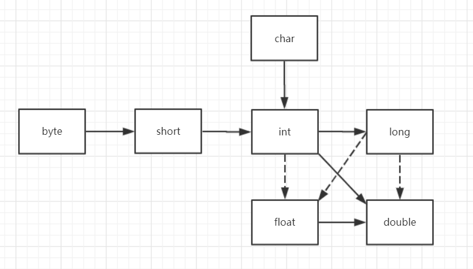

## Java数据类型

`Java` 是强类型语言，对于每一种数据都需要定义明确的数据类型
`Java` 数据类型分为 **基本数据类型** 和 **引用数据类型** 

```
基本数据类型：8种
	整型：
		byte
		short
		int
		long
	浮点型：
		float
		double
	字符型：
		char
	布尔型：
		boolean
引用数据类型：
	类
	数组
	接口
	...
```

在 `Java` 中，基本数据类型变量存的是 **数据本身** 。引用类型变量存的是 **保存数据空间的地址** 。

### 基本数据类型

#### 整型

用于表示没有小数部分的数值，它允许为负数

```
byte:字节型
	存储空间：1个字节，8位，有符号
	取值范围：-128 ~ 127
	默认值：0
byte类型用在大型数组中节约空间，主要代替整数，因为byte变量占用的空间只有int类型的四分之一
example：
	byte a = 100;
	byte b = -50;

short：短整型
	存储空间：2个字节，16位，有符号
	取值范围：-32768 ~ 32767
	默认值：0
short数据类型也可以向 byte 那样节省空间，一个short变量是int变量所占空间的二分之一
example:
	short s = 1000;
	short r = -20000;

int:整型
	存储空间：4个字节，32位，有符号
	取值范围：-2147483648 ~ 2147483647
	默认值：0
int为整型的默认类型
example
	int a = 1000000
	int b = -20000000
	
long:长整型
	存储空间：8个字节，64位，有符号
	取值范围：-9223372036854775808 ~ 9223372036854775807
	默认值：0L
long类型主要使用在需要比较大整数的系统上
在声明long类型变量时，需要数字末尾加上L/l
example：
	long a = 10000000L;
	long b = -2000000L;
```

#### 浮点型

用于表示有小数部分的数值

```
float:单精度浮点数
	存储空间：4个字节，32位
	取值范围：大约 ± 3.40282347E+38F(有效位数6 ~ 7位)
	默认值：0.0f
float在储存大型浮点数数组的时候可节省内存空间
在声明float类型变量时，需要在数字末尾加上F/f
example:
	float f1 = 234.5F;
	
double：双精度浮点数
	存储空间：8个字节，64位
	取值范围：大约 ± 1.79769313486231570E+308(有效位数为15位)
	默认值：0.0d
double为浮点型的默认类型
example:
	double d1 = 7D;
	double d2 = 7.;
	double d3 = 8.0;
	double d4 = 8.D;
	double d5 = 12.9999;
7是一个int字面量，而7D，7.和8.0是double字面量
```

#### 字符型

用来表示通常意义上“字符”

```
char:字符型，是一个单一的16位的 Unicode 字符
	存储空间：2个字节
	默认值：'\u0000' 十进制0
	最大值：'\uffff' 十进制65535
char数据类型可以存储任何字符
Java字符采用Unicode编码，每个字符占两个字节，因此可用十六进制编码形式表示
不建议在程序中使用char类型
example:
	char letter = 'A';
```

##### 转义字符

```
Java中还允许使用转义字符'\'来将其后的字符转变为其他的含义
example：
	'\n'：表示换行符	0x0a
	'\t'：表示横向跳格，作用同Tab键
	'\b'：表示退格	0x08
	'\r'：表示回车	0x0d
	'\f'：表示走纸换页	0x0c
	'\\'：表示反斜杠字符
	'\''：表示单引号字符
	'\"'：表示双引号字符
	'\d'：表示八进制字符
	'\s'：表示空格	0x20
	'\0'：表示空字符	0x0
	'\xd'：表示十六进制字符
	'\ud'：表示Unicode字符
```

#### 布尔型

适用于逻辑运算，一般用于程序流程控制

```
boolean:
	存储空间：1个字节
	默认值：false
boolean只有true 和 false 两种取值。
整型和布尔型之间不可以相互转换
example:
	boolean flag = true;
	if (flag){
		// do something
	}
```

#### 类型的默认值

```
public class Test {
    static boolean bool;
    static byte by;
    static char ch;
    static double d;
    static float f;
    static int i;
    static long l;
    static short sh;
    static String str;
 
    public static void main(String[] args) {
        System.out.println("Bool :" + bool);
        System.out.println("Byte :" + by);
        System.out.println("Character:" + ch);
        System.out.println("Double :" + d);
        System.out.println("Float :" + f);
        System.out.println("Integer :" + i);
        System.out.println("Long :" + l);
        System.out.println("Short :" + sh);
        System.out.println("String :" + str);
    }
}
```

```
输出结果：
Bool     :false
Byte     :0
Character:
Double   :0.0
Float    :0.0
Integer  :0
Long     :0
Short    :0
String   :null
```

#### tips

```
数据范围与字节数不一定相关
	例如float数据范围比 long 更加广泛，但是float是4字节，1ong是8字节
```

```
关于基本数据类型的取值范围，都以常量的形式在对应的包装类中了

public class PrimitiveTypeTest {  
    public static void main(String[] args) {  
        // byte  
        System.out.println("基本类型：byte 二进制位数：" + Byte.SIZE);  
        System.out.println("包装类：java.lang.Byte");  
        System.out.println("最小值：Byte.MIN_VALUE=" + Byte.MIN_VALUE);  
        System.out.println("最大值：Byte.MAX_VALUE=" + Byte.MAX_VALUE);  
        System.out.println();  
  
        // short  
        System.out.println("基本类型：short 二进制位数：" + Short.SIZE);  
        System.out.println("包装类：java.lang.Short");  
        System.out.println("最小值：Short.MIN_VALUE=" + Short.MIN_VALUE);  
        System.out.println("最大值：Short.MAX_VALUE=" + Short.MAX_VALUE);  
        System.out.println();  
  
        // int  
        System.out.println("基本类型：int 二进制位数：" + Integer.SIZE);  
        System.out.println("包装类：java.lang.Integer");  
        System.out.println("最小值：Integer.MIN_VALUE=" + Integer.MIN_VALUE);  
        System.out.println("最大值：Integer.MAX_VALUE=" + Integer.MAX_VALUE);  
        System.out.println();  
  
        // long  
        System.out.println("基本类型：long 二进制位数：" + Long.SIZE);  
        System.out.println("包装类：java.lang.Long");  
        System.out.println("最小值：Long.MIN_VALUE=" + Long.MIN_VALUE);  
        System.out.println("最大值：Long.MAX_VALUE=" + Long.MAX_VALUE);  
        System.out.println();  
  
        // float  
        System.out.println("基本类型：float 二进制位数：" + Float.SIZE);  
        System.out.println("包装类：java.lang.Float");  
        System.out.println("最小值：Float.MIN_VALUE=" + Float.MIN_VALUE);  
        System.out.println("最大值：Float.MAX_VALUE=" + Float.MAX_VALUE);  
        System.out.println();  
  
        // double  
        System.out.println("基本类型：double 二进制位数：" + Double.SIZE);  
        System.out.println("包装类：java.lang.Double");  
        System.out.println("最小值：Double.MIN_VALUE=" + Double.MIN_VALUE);  
        System.out.println("最大值：Double.MAX_VALUE=" + Double.MAX_VALUE);  
        System.out.println();  
  
        // char  
        System.out.println("基本类型：char 二进制位数：" + Character.SIZE);  
        System.out.println("包装类：java.lang.Character");  
        // 以数值形式而不是字符形式将Character.MIN_VALUE输出到控制台  
        System.out.println("最小值：Character.MIN_VALUE="  
                + (int) Character.MIN_VALUE);  
        // 以数值形式而不是字符形式将Character.MAX_VALUE输出到控制台  
        System.out.println("最大值：Character.MAX_VALUE="  
                + (int) Character.MAX_VALUE);  
    }  
}
```

```
输出结果：

基本类型：byte 二进制位数：8
包装类：java.lang.Byte
最小值：Byte.MIN_VALUE=-128
最大值：Byte.MAX_VALUE=127

基本类型：short 二进制位数：16
包装类：java.lang.Short
最小值：Short.MIN_VALUE=-32768
最大值：Short.MAX_VALUE=32767

基本类型：int 二进制位数：32
包装类：java.lang.Integer
最小值：Integer.MIN_VALUE=-2147483648
最大值：Integer.MAX_VALUE=2147483647

基本类型：long 二进制位数：64
包装类：java.lang.Long
最小值：Long.MIN_VALUE=-9223372036854775808
最大值：Long.MAX_VALUE=9223372036854775807

基本类型：float 二进制位数：32
包装类：java.lang.Float
最小值：Float.MIN_VALUE=1.4E-45
最大值：Float.MAX_VALUE=3.4028235E38

基本类型：double 二进制位数：64
包装类：java.lang.Double
最小值：Double.MIN_VALUE=4.9E-324
最大值：Double.MAX_VALUE=1.7976931348623157E308

基本类型：char 二进制位数：16
包装类：java.lang.Character
最小值：Character.MIN_VALUE=0
最大值：Character.MAX_VALUE=65535

Float和Double的最小值和最大值都是以科学计数法的形式输出的，结尾的E+数字 表示E之前的数字要乘以10的多少次方
example:
	3.14E3 === 3.14 x 10的三次方 
	3.14E-3 === 3.14 x 10的负三次方
```

### 引用数据类型

```
在Java中，引用类型的变量非常类似于C/C++的指针。引用类型指向一个对象，指向对象的变量是引用变量。这些变量在声明时被指定为一个特定的类型。比如Employee、Puppy等。变量一旦声明后，类型就不能被改变了。
类class、接口interface、数组都是引用数据类型
引用类型默认值为null
一个引用类型变量可以用来引用任何与之兼容的类型
example:
	Person person = new Person("张三");
```

### 自动类型转换与强制类型转换

#### 自动类型转换

精度小的数据类型到精度大的数据类型为自动类型转换

```
整型、实型（常量）、字符型数据可以混合运算。运算中，不同类型的数据先转化为同一类型，然后进行运算

低  ------------------------------------>  高

byte,short,char—> int —> long—> float —> double 
```



```
图中实线箭头表示无信息丢失的转换
图中虚线箭头表示可能有精度损失的转换

当两个数值在进行二元计算时：
两个操作数中有一个是double类型，另一个操作数就会转为double类型
两个操作数中有一个是float类型，另一个操作数就会转为float类型
两个操作数中有一个是long类型，另一个操作数就会转为long类型
其余情况，都转为int类型计算
```

```
char <-> int 字符型可与整型互相转换
boolean不参与自动类型转换
不能把对象类型转为不相关类的对象
转换过程中可能出现精度损失，浮点数到整数通过舍弃小数得到，而不是四舍五入

```

##### example

```
public class ZiDongLeiZhuan{
        public static void main(String[] args){
            char c1='a';//定义一个char类型
            int i1 = c1;//char自动类型转换为int
            System.out.println("char自动类型转换为int后的值等于"+i1);
            char c2 = 'A';//定义一个char类型
            int i2 = c2+1;//char 类型和 int 类型计算
            System.out.println("char类型和int计算后的值等于"+i2);
        }
}

运行结果：
char自动类型转换为int后的值等于97
char类型和int计算后的值等于66

c1的值为字符a,查 ASCII 码表可知对应的int类型值为97，A对应值为65，所以i2=65+1=66。
```

#### 强制类型转换

把容量大的类型转为容量小的类型

```
1).转换的类型必须是兼容的
2).不建议强制类型转换，因为会损失精度、数据溢出
3).从浮点型强制转为整型，会截断小数部分，仅保留整数部分(不是四舍五入)
	double x = 9.97;
	int nx = (int)x; // nx = 9
```

```
 public class TestConvert {
     public static void main(String arg[]) {
         int i1 = 123; 
         int i2 = 456;
         double d1 = (i1+i2)*1.2;//系统将转换为double型运算
         float f1 = (float)((i1+i2)*1.2);//需要加强制转换符
         byte b1 = 67; 
         byte b2 = 89;
         byte b3 = (byte)(b1+b2);//系统将转换为int型运算，需要强制转换符
         System.out.println(b3);
         double d2 = 1e200;
         float f2 = (float)d2;//会产生溢出
         System.out.println(f2);
         float f3 = 1.23f;//必须加f
         long l1 = 123;
         long l2 = 30000000000L;//必须加l
         float f = l1+l2+f3;//系统将转换为float型计算
         long l = (long)f;//强制转换会舍去小数部分（不是四舍五入）
     }
 }
```

