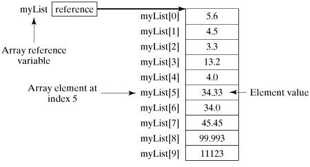

## Java数组

数组是一种数据结构，存储相同类型数据的集合。储存在堆上的对象。

### 声明数组变量

```
dataType[] array;		// 首选的方法
或
dataType array[];		// 效果相同，但不是首选方法
```

### 初始化

```
数据类型[] 数组名 = new 数据类型[长度]

静态初始化：
		int[] numbers = {1,2,3,4,5};
		int[] numbers = new int[] {1,2,3,4,5};
动态初始化：
		int[] numbers = new int[5]; //定义一个长度为5的int类型的数组
```

### 数组的访问

```
在数组中，可以采用数组名[下标|索引]的方式来访问数组中的元素
所有数组的下标都从0开始，最后一个元素为数据的长度-1.
Java中用length属性来获取数据的长度。
int len = numbers.length;
```

### 数组的赋值

```
我们可以为数组中的每一位进行赋值
numbers[0]=0;
numbers[4]=4;
当数组长度太多时，可以通过循环来进行赋值
for(int i = 0; i < 100; i++) { 
	numbers[i] = i; 
}
```

### 数组的遍历

```
int[] numbers = new int[] {1,2,3,4,5};
for (int i  : numbers) {
	System.out.println(i);
}

example：
public class TestArray {
   public static void main(String[] args) {
      double[] myList = {1.9, 2.9, 3.4, 3.5};
 
      // 打印所有数组元素
      for (int i = 0; i < myList.length; i++) {
         System.out.println(myList[i] + " ");
      }
      // 计算所有元素的总和
      double total = 0;
      for (int i = 0; i < myList.length; i++) {
         total += myList[i];
      }
      System.out.println("Total is " + total);
      // 查找最大元素
      double max = myList[0];
      for (int i = 1; i < myList.length; i++) {
         if (myList[i] > max) max = myList[i];
      }
      System.out.println("Max is " + max);
   }
}
结果：
1.9
2.9
3.4
3.5
Total is 11.7
Max is 3.5
```



### For-Each循环

```
Java5引进了一种新的循环类型，被称为For-Each循环，或者加强型循环。它能在不使用下标的情况下遍历数组
for(type element: array) {
    System.out.println(element);
}

example：
public class TestArray {
   public static void main(String[] args) {
      double[] myList = {1.9, 2.9, 3.4, 3.5};
 
      // 打印所有数组元素
      for (double element: myList) {
         System.out.println(element);
      }
   }
}
结果：
1.9
2.9
3.4
3.5
```

### 数组作为函数的参数

```
数组可以作为参数传递给方法

example：
public static void printArray(int[] array) {
  for (int i = 0; i < array.length; i++) {
    System.out.print(array[i] + " ");
  }
}
printArray(new int[]{3, 1, 2, 6, 4, 2});

结果：
3 1 2 6 4 2
```

数组作为函数的返回值

```
public static int[] reverse(int[] list) {
  int[] result = new int[list.length];
 
  for (int i = 0, j = result.length - 1; i < list.length; i++, j--) {
    result[j] = list[i];
  }
  return result;
}
```

### 数组拷贝

```
在Java中，允许将一个数组变量拷贝给另一个数组变量，这时两个变量都引用同一个数组
example:
    int[] numbers = {1,2,3,4,5};
    int[] nums = numbers;

Arrays.copyOf();也能实现，后续会说~
```

### 多维数组

以二位数组为例

```
1.直接为每一维分配空间
type[][] typeName = new type[typeLength1][typeLength2];

type可以为基本数据类型和引用数据类型，typeLength1 和 typeLength2 必须为正整数，typeLength1 为行数，typeLength2 为列数

example：
int[][] a = new int[2][3];
解析：
二维数组 a 可以看成一个两行三列的数组

2.从最高维开始，分别为每一维分配空间
String[][] s = new String[2][];
s[0] = new String[2];
s[1] = new String[3];
s[0][0] = new String("Good");
s[0][1] = new String("Luck");
s[1][0] = new String("to");
s[1][1] = new String("you");
s[1][2] = new String("!");
解析：
s[0]=new String[2]和s[1]=new String[3]是为最高维分配引用空间，也就是为最高维限制其能保存数据的最长的长度，然后再为其每个数组元素单独分配空间s[0][0]=new String("Good") 等操作

多维数组的引用
对二维数组中的每个元素，引用方式arrayName[index1][index2]
example：
num[1][0];
```

### Arrays类

```
java.util.Arrays 类能方便地操作数组，它提供的所有方法都是静态的

给数组赋值：通过fill方法
对数组排序：通过sort方法。按升序。
比较数组：通过equals方法比较数组中元素值是否相等
查找数组元素：通过binarySearch方法能对排序好的数组进行二分查找法操作

public static int binarySearch(Object[] a, Object key)
用二分查找算法在给定数组中搜索给定值的对象(Byte,Int,double等)。数组在调用前必须排序好的。如果查找值包含在数组中，则返回搜索键的索引；否则返回 (-(插入点) - 1)

public static boolean equals(long[] a, long[] a2)
如果两个指定的long型数组彼此相等，则返回 true。如果两个数组包含相同数量的元素，并且两个数组中的所有相应元素对都是相等的，则认为这两个数组是相等的。换句话说，如果两个数组以相同顺序包含相同的元素，则两个数组是相等的。同样的方法适用于所有的其他基本数据类型（Byte，short，Int等）

public static void fill(int[] a, int val)
将指定的 int 值分配给指定 int 型数组指定范围中的每个元素。同样的方法适用于所有的其他基本数据类型（Byte，short，Int等）

public static void sort(Object[] a)
对指定对象数组根据其元素的自然顺序进行升序排列。同样的方法适用于所有的其他基本数据类型（Byte，short，Int等）
```

```
public class Demo3 {

    public static void main(String[] args) {
        demo2();
    }

    /**
     * 使用 Arrays 类操作数组
     */
    public static void demo2() {
        double[] array1 = {1.9, 2.9, 3.4, 3.5};
        double[] array2 = {1.9, 2.9, 3.5, 3.4};
        double[] array3 = {9.9, 3.3, 6.6, 2.2};
        double[] array4 = new double[4];
        double[] array5 = {1.9, 2.9, 3.4, 3.5};

        // fill 填充数组 为 array4 数组填充 元素 5.5
        System.out.println("array4填充前为：");
        showArray(array4);
        Arrays.fill(array4, 5.5);
        System.out.println("array4填充后为：");
        showArray(array4);

        // binarySearch 在 array3 中查找 3.3 和 5.5
        int num1 = Arrays.binarySearch(array3, 3.3);
        int num2 = Arrays.binarySearch(array3, 5.5);
        System.out.println("在array3中查找3.3的位置为： " + num1);
        System.out.println("在array3中查找5.5的位置为： " + num2);

        // equals 方法比较 array1 和 array2 以及 array1 和 array3
        boolean compare1 = Arrays.equals(array1, array2);
        boolean compare2 = Arrays.equals(array1, array3);
        boolean compare3 = Arrays.equals(array1, array5);
        System.out.println("array1 和 array2 比较结果为 " + compare1);
        System.out.println("array1 和 array3 比较结果为 " + compare2);
        System.out.println("array1 和 array5 比较结果为 " + compare3);

        // sort 对array3 数组进行排序
        System.out.println("排序前数组为：");
        showArray(array3);
        Arrays.sort(array3);
        System.out.println("排序后数组为：");
        showArray(array3);
    }

    public static void showArray(double[] array) {
        for (double num : array) {
            System.out.print(num + " ");
        }
        System.out.println();
    }
}
结果：
array4填充前为：
0.0 0.0 0.0 0.0 
array4填充后为：
5.5 5.5 5.5 5.5 
在array3中查找3.3的位置为： 1
在array3中查找5.5的位置为： -3
array1 和 array2 比较结果为 false
array1 和 array3 比较结果为 false
array1 和 array5 比较结果为 true
排序前数组为：
9.9 3.3 6.6 2.2 
排序后数组为：
2.2 3.3 6.6 9.9 
```

