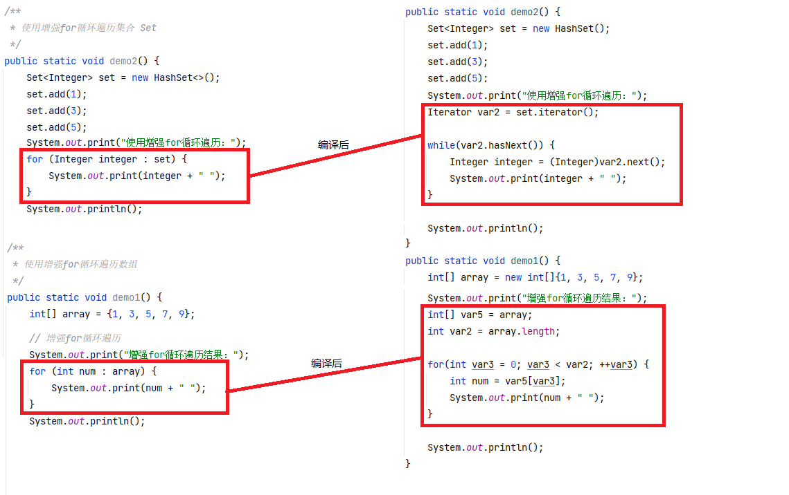
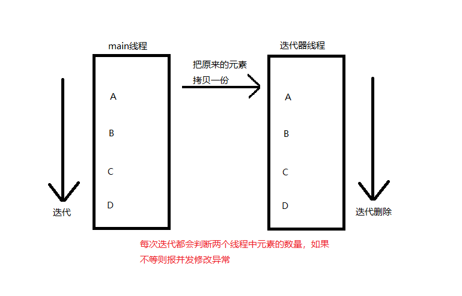

## Java流程控制

### 顺序结构

自定向下依次执行

```
public static void main(String[] args) {
	int a = 10;
	a = a + 1;
	System.out.println(a);
}
```

### 选择结构

也叫分支结构

#### switch-case

```
switch-case[-default] 用于处理多个选项的操作
	switch() 表达式可为char byte short int 等常量表达式，字符串(JDK1.7引入)，枚举类型(JDK1.5引入)等
	case子句必须为常量，数据类型必须与变量的数据类型相同
	default在没有对应case的情况下来执行的。为可选项
	case 和 default 后的语句可加break，用来跳出当前分支，执行后续语句，
	如没有break，则从匹配项开始以下向下执行，途中遇到break也会跳出当前分支。

switch(expression){
    case value :
       //语句
       break; //可选
    case value :
       //语句
       break; //可选
    //你可以有任意数量的case语句
    default : //可选
       //语句
}
switch case 执行时，一定会先进行匹配，匹配成功返回当前 case 的值，再根据是否有 break，判断是否继续输出，或是跳出判断

example1：
public class Test {
   public static void main(String args[]){
      //char grade = args[0].charAt(0);
      char grade = 'C';
 
      switch(grade)
      {
         case 'A' :
            System.out.println("优秀"); 
            break;
         case 'B' :
         case 'C' :
            System.out.println("良好");
            break;
         case 'D' :
            System.out.println("及格");
            break;
         case 'F' :
            System.out.println("你需要再努力努力");
            break;
         default :
            System.out.println("未知等级");
      }
      System.out.println("你的等级是 " + grade);
   }
}
结果：
良好
你的等级是 C

example2：
如果 case 语句块中没有 break 语句时，JVM 并不会顺序输出每一个 case 对应的返回值，而是继续匹配，匹配不成功则返回默认 case
public class Test {
   public static void main(String args[]){
      int i = 5;
      switch(i){
         case 0:
            System.out.println("0");
         case 1:
            System.out.println("1");
         case 2:
            System.out.println("2");
         default:
            System.out.println("default");
      }
   }
}
结果：
default

example3：
如果case语句块中没有break语句时，匹配成功后，从当前 case 开始，后续所有 case 的值都会输出
public class Test {
   public static void main(String args[]){
      int i = 1;
      switch(i){
         case 0:
            System.out.println("0");
         case 1:
            System.out.println("1");
         case 2:
            System.out.println("2");
         default:
            System.out.println("default");
      }
   }
}
结果：
1
2
default

example4：
如果当前匹配成功的 case 语句块没有 break 语句，则从当前 case 开始，后续所有 case 的值都会输出，如果后续的 case 语句块有 break 语句则会跳出判断
public class Test {
   public static void main(String args[]){
      int i = 1;
      switch(i){
         case 0:
            System.out.println("0");
         case 1:
            System.out.println("1");
         case 2:
            System.out.println("2");
         case 3:
            System.out.println("3"); break;
         default:
            System.out.println("default");
      }
   }
}
结果：
1
2
3
```

#### if - [else if] -else

```
if, if-else, if-else if[-else]
    if - else if - else 中的条件最好由 范围大 到 范围小 去书写
   
example: 
    int grade  = 80;
    if(grade > 80) {
    System.out.println("优秀");
    } else if (grade >= 60 && grade < 80) {
    System.out.println("中等");
    } else {
    System.out.println("不及格");
    }
```

##### if

```
一个if语句包含一个条件表达式和一条或多条语句

if (布尔表达式) {
	// 如果表达式为true将执行语句
}
如果布尔表达式的值为true，则执行if语句中的代码块，否则执行if语句块后面的代码

example：
public class Test {
 
   public static void main(String args[]){
      int x = 10;
 
      if( x < 20 ){
         System.out.print("这是 if 语句");
      }
   }
}
结果：
这是 if 语句
```

##### if...else

```
if 语句后面可以跟 else 语句，当 if 语句的布尔表达式值为 false 时，else 语句块会被执行

if(布尔表达式){
   //如果布尔表达式的值为true
}else{
   //如果布尔表达式的值为false
}

example：
public class Test {
 
   public static void main(String args[]){
      int x = 30;
 
      if( x < 20 ){
         System.out.print("这是 if 语句");
      }else{
         System.out.print("这是 else 语句");
      }
   }
}
结果：
这是 else 语句
```

##### if...else if...else

```
if 语句后面可以跟 else if…else 语句，这种语句可以检测到多种可能的情况
if 语句至多有 1 个 else 语句，else 语句在所有的 else if 语句之后
if 语句可以有若干个 else if 语句，它们必须在 else 语句之前
一旦其中一个 else if 语句检测为 true，其他的 else if 以及 else 语句都将跳过执行

if(布尔表达式 1){
   //如果布尔表达式 1的值为true执行代码
}else if(布尔表达式 2){
   //如果布尔表达式 2的值为true执行代码
}else if(布尔表达式 3){
   //如果布尔表达式 3的值为true执行代码
}else {
   //如果以上布尔表达式都不为true执行代码
}

example：
public class Test {
   public static void main(String args[]){
      int x = 30;
 
      if( x == 10 ){
         System.out.print("Value of X is 10");
      }else if( x == 20 ){
         System.out.print("Value of X is 20");
      }else if( x == 30 ){
         System.out.print("Value of X is 30");
      }else{
         System.out.print("这是 else 语句");
      }
   }
}
结果：
Value of X is 30
```

##### 嵌套的if...else 语句

```
使用嵌套的 if…else 语句是合法的。也就是说你可以在另一个 if 或者 else if 语句中使用 if 或者 else if 语句

if(布尔表达式 1){
   ////如果布尔表达式 1的值为true执行代码
   if(布尔表达式 2){
      ////如果布尔表达式 2的值为true执行代码
   }
}

example:
public class Test {
 
   public static void main(String args[]){
      int x = 30;
      int y = 10;
 
      if( x == 30 ){
         if( y == 10 ){
             System.out.print("X = 30 and Y = 10");
          }
       }
    }
}
结果：
X = 30 and Y = 10
```

### 循环结构

#### while

```
while(布尔表达式) {
	// 循环内容
}
先判断是否符合条件，符合后执行循环体，如果开始不符合条件，则一次也不执行

example：
public class Test {
   public static void main(String[] args) {
      int x = 10;
      while( x < 20 ) {
         System.out.print("value of x : " + x );
         x++;
         System.out.print("\n");
      }
   }
}
结果：
value of x : 10
value of x : 11
value of x : 12
value of x : 13
value of x : 14
value of x : 15
value of x : 16
value of x : 17
value of x : 18
value of x : 19
```

#### do-while

```
do-while(布尔表达式); 注意分号
do {
	// 循环内容
} while(布尔表达式);
先执行一次，在判断是否符合条件，符合后执行循环体，不管是否符合条件都会执行一次循环体

example:
public class Test {
   public static void main(String[] args){
      int x = 10;
 
      do{
         System.out.print("value of x : " + x );
         x++;
         System.out.print("\n");
      }while( x < 20 );
   }
}
结果：
value of x : 10
value of x : 11
value of x : 12
value of x : 13
value of x : 14
value of x : 15
value of x : 16
value of x : 17
value of x : 18
value of x : 19
```

#### for

```
for(表达式1, 表达式2, 表达式3) {
	语句;
}
首先计算表达式1
接着执行表达式2
若表达式2的值为true
	执行语句
	接着计算表达式3
再判断表达式2的值是否为true
如果为true就重复下去，直接表达式2的值为false

example:
public class Test {
   public static void main(String[] args) {
 
      for(int x = 10; x < 20; x = x+1) {
         System.out.print("value of x : " + x );
         System.out.print("\n");
      }
   }
}
结果：
value of x : 10
value of x : 11
value of x : 12
value of x : 13
value of x : 14
value of x : 15
value of x : 16
value of x : 17
value of x : 18
value of x : 19
```

#### 增强for循环

```
Java5引入一种主要用于数组的增强型for循环
for(声明语句 : 表达式) {
   //代码句子
}
声明语句：声明新的局部变量，该变量的类型必须和数组元素的类型匹配。其作用域限定在循环语句块，其值与此时数组元素的值相等
表达式：表达式是要访问的数组名，或者是返回值为数组的方法。

example: 
public class Test {
   public static void main(String[] args){
      int [] numbers = {10, 20, 30, 40, 50};
 
      for(int x : numbers ){
         System.out.print( x );
         System.out.print(",");
      }
      System.out.print("\n");
      String [] names ={"James", "Larry", "Tom", "Lacy"};
      for( String name : names ) {
         System.out.print( name );
         System.out.print(",");
      }
   }
}
结果：
10,20,30,40,50,
James,Larry,Tom,Lacy,
```

##### Tips

```
增强for循环的作用：
	简化迭代器的书写格式。增强for循环底层采用还是使用迭代器遍历

增强for循环的使用范围：
	如果是实现了Iterator接口的对象或者是数组都可以使用增强for循环

增强for循环的缺点：
	增强for循环和iterator遍历的效果是一样的，也就是说增强for循环的内部就是调用iterator实现的，但是增强for循环有些缺点，例如不能在增强循环里动态的删除集合内容，不能获取下标等。
```

##### 遍历数组

```
	/**
     * 使用增强for循环遍历数组
     */
    public static void demo1() {
        int[] array = {1, 3, 5, 7, 9};

        // 普通for循环
        System.out.print("普通for循环遍历结果：");
        for (int i = 0; i < array.length; i++) {
            System.out.print(array[i] + " ");
        }
        System.out.println();

        // 增强for循环遍历
        System.out.print("增强for循环遍历结果：");
        for (int num : array) {
            System.out.print(num + " ");
        }
        System.out.println();

        /*
            result:
            普通for循环遍历结果：1 3 5 7 9
            增强for循环遍历结果：1 3 5 7 9
         */
    }
```

##### 遍历集合Set

```
	/**
     * 使用增强for循环遍历集合 Set
     */
    public static void demo2() {
        Set<Integer> set = new HashSet<>();
        set.add(1);
        set.add(3);
        set.add(5);

        System.out.print("使用Iterator遍历：");
        Iterator<Integer> iterator = set.iterator();
        while (iterator.hasNext()) {
            System.out.print(iterator.next() + " ");
        }
        System.out.println();

        System.out.print("使用增强for循环遍历：");
        for (Integer integer : set) {
            System.out.print(integer + " ");
        }
        System.out.println();

        /*
            result:
            使用Iterator遍历：1 3 5
            使用增强for循环遍历：1 3 5
         */
    }
```

##### 遍历Map通过Collection方式

```
	/**
     * 遍历Map，通过Collection来实现
     */
    public static void demo3() {
        Map<Integer, Integer> map = new HashMap<>();
        map.put(1, 1);
        map.put(2, 2);
        map.put(3, 3);

        Set<Map.Entry<Integer, Integer>> entrySet = map.entrySet();
        for (Map.Entry<Integer, Integer> entry : entrySet) {
            System.out.println("key=" + entry.getKey() + ", value=" + entry.getValue());
        }

        /*
            result:
            key=1, value=1
            key=2, value=2
            key=3, value=3
         */
    }
```

##### 底层原理

```
使用增强for循环遍历对象数组时，将增强for转为普通的for进行执行
使用增强for循环遍历集合时，使用Iterator获取集合的iterator然后进行while循环遍历
```



如果我们一边想迭代，一般删除集合中的元素

```
	/**
     * 使用增强for循环修改元素时会报错
     */
    public static void demo4() {
        Set<Integer> set = new HashSet<>();
        set.add(1);
        set.add(3);
        set.add(5);

        for (Integer integer : set) {
//            set.add(2);
            System.out.println(integer);
            set.remove(integer);
        }
    }
    
result:
1
Exception in thread "main" java.util.ConcurrentModificationException
	at java.util.HashMap$HashIterator.nextNode(HashMap.java:1445)
	at java.util.HashMap$KeyIterator.next(HashMap.java:1469)
	at base.Demo5.demo4(Demo5.java:104)
	at base.Demo5.main(Demo5.java:14)
	
当我们在增强for循环中增加或者删除元素时，会抛出并发修改异常的错误

原因：当迭代器运行的时候，在当前线程 A 中，会单独的创建一个线程 B。A 负责继续迭代，B 线程负责删除。B 线程每次都会去检查 A 线程中的元素是否相同，如果不是就会报错

因为上面删除的方法是 使用 Collection（父类） 集合中的 remove（）方法。该方法只能从集合中删除元素，不能把迭代器中的元素也删除了。
解决办法：使用 iterator 迭代器中的remove()方法

        Iterator<Integer> iterator = set.iterator();
        while (iterator.hasNext()) {
            Integer integer = (Integer) iterator.next();
            if (integer.equals(1)) {
                iterator.remove();
            }
        }
```



#### break关键字

```
break 主要用在循环语句 或者 switch 语句中，用来跳出整个语句块
break 跳出最里层的循环，并且继续执行该循环下面的语句

语法：
	break;

example：
public class Test {
   public static void main(String[] args) {
      int [] numbers = {10, 20, 30, 40, 50};
 
      for(int x : numbers ) {
         // x 等于 30 时跳出循环
         if( x == 30 ) {
            break;
         }
         System.out.print( x );
         System.out.print("\n");
      }
   }
}
结果：
10
20
```

#### continue关键字

```
continue 适用于任何循环控制结构中。作用是让程序立刻跳转到下一次循环的迭代

语法：
	continue;

example：
public class Test {
   public static void main(String[] args) {
      int [] numbers = {10, 20, 30, 40, 50};
 
      for(int x : numbers ) {
         if( x == 30 ) {
        continue;
         }
         System.out.print( x );
         System.out.print("\n");
      }
   }
}
结果：
10
20
40
50
```

#### tips

```
循环结构中，往往都会有循环变量，用来控制循环的次数
一般循环结构为：循环变量初始化，循环条件判断，循环变量自增
循环条件为boolean类型

break：用于结束当前循环(多重循环结束本层)
continue：用于结束本次循环，开始下一次循环
```

